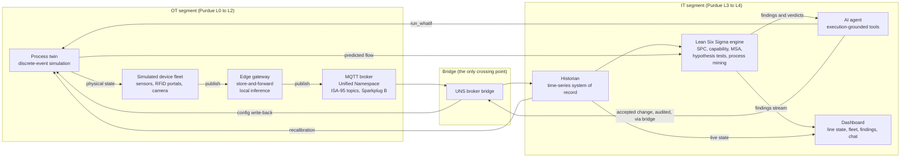

# twinflow

A digital twin of a warehouse operation. A discrete-event model of receiving and putaway runs coupled to a simulated IoT device fleet over MQTT, a Lean Six Sigma engine judges both the live telemetry and the model's own predictions, and an AI agent answers what-if questions with a statistical verdict instead of a paragraph.

**Status: designed in full, built from the bottom up.** Phase P0 fixes the determinism, schema, and config contracts, and phase P1 takes one station end to end. Both are in progress and nothing later has started, so read this as a plan with published evidence rules, not as a shipped product. [ROADMAP.md](ROADMAP.md) holds every milestone with its phase and dependencies, and nothing is ever deleted from it: milestones are reordered, never dropped. [ARCHITECTURE.md](ARCHITECTURE.md) holds the decisions and their rationale.

[](https://github.com/johnragonhall/twinflow/actions)
[](LICENSING.md)
[](https://github.com/johnragonhall/twinflow)
[](https://github.com/johnragonhall/twinflow/tree/main/docs)

Milestone E1 records a simulated shift and ships a static replay viewer to GitHub Pages, so the system can be watched without installing anything. It closes phase P2, at v0.3.0, and no URL is linked here until it serves a page.

<!--
METRIC MARKER CONVENTION

Every quantitative result in this file sits inside a pair of HTML comment markers:
an opening marker naming the metric, the value, then a closing marker. TBD means
the number has not been measured.

Nothing here has been measured, so every marker reads TBD. That is the intended
state, not an oversight.

  1. A marker value is only ever replaced by a number from a recorded run, with
     the seed and the commit that produced it.
  2. No estimate, no round figure, no plausible guess goes in a marker.
  3. scripts/checks/metric-marker-gate.sh reports unfilled markers on every lint
     run and fails on any that is malformed. Its --release mode fails the build
     on any marker still holding TBD, and that mode is wired when the release
     workflow lands under milestone C9.
  4. A number stated outside a marker is a configuration value, a gate budget, or
     a published reference value, never a result claimed for this system.
-->

**Headline numbers, unmeasured.** The agent scores <!--METRIC:agent_eval_accuracy-->TBD<!--/METRIC--> on the versioned operational eval suite, with <!--METRIC:grounding_pass_rate-->TBD<!--/METRIC--> of released numeric sentences traced to a logged query result and <!--METRIC:calibrated_abstention_rate-->TBD<!--/METRIC--> calibrated abstention.

## Architecture



The broker bridge is the only crossing point between the two segments, which puts the Purdue Model in the compose topology rather than only in a diagram. Milestone RA-b lands the test that asserts no device container is reachable from the IT segment. The full layer map, with an ISA-95 level, a Purdue level, and a real-world counterpart for every component, is section 4 of [ARCHITECTURE.md](ARCHITECTURE.md).

## What it does

Each row is a separately installable package, so taking one brick does not drag in the rest.

| Part                  | What it does                                                                                                                                                                     | Package              | Lands in               |
|-----------------------|----------------------------------------------------------------------------------------------------------------------------------------------------------------------------------|----------------------|------------------------|
| Process twin          | Discrete-event model of receiving and putaway on SimPy, with takt, cycle time, WIP, utilization, OEE, and the bottleneck, all from `facility.yaml`                               | `twinflow-twin`      | P1, flow metrics at P2 |
| Simulated IoT fleet   | Edge devices publishing Sparkplug B into an ISA-95 unified namespace, from a YAML sensor catalog with declared failure modes                                                     | `twinflow-sensors`   | P1, breadth at P3      |
| Fleet health          | Device registry, severity-occurrence-detection scoring, and trend detection on motor temperature, vibration, and current                                                         | `twinflow-fleet`     | P3                     |
| Lean Six Sigma engine | SPC charts with typed Western Electric and Nelson violations, process capability, Gage R and R, and hypothesis tests with an assumption checker                                  | `twinflow-lss`       | P2                     |
| Process mining        | Discovery, conformance, variant analysis, and rework-loop detection, scored against the twin as the known reference model                                                        | `twinflow-procmine`  | P3c                    |
| AI agent              | Tools for fleet health, findings, what-if runs, and capability reports, on the accuracy stack below                                                                              | `twinflow-agent`     | P1, core at P2         |
| Dashboard             | One HTML file, no build step and no package manager. Severity is encoded by shape and text, not by color alone, because color-only alarm severity is a control-room failure mode | `twinflow-dashboard` | P1                     |

`compare_scenarios`, which ranks candidate changes by throughput gained per dollar of assumed cost, lands at P3b.

## Why this is a twin and not a simulation

A simulation runs a model of a process. A twin stays coupled to what it mirrors. The design specifies three couplings:

1. **The twin recalibrates from telemetry.** Service-time distributions, failure rates, and resource capacities are re-estimated from what the historian recorded.
2. **Divergence is itself a finding.** When predicted flow and observed flow separate beyond a control limit, the engine raises a typed finding with its evidence window. A twin that is wrong is required to say so.
3. **Accepted changes flow back as config.** An approved what-if is written back through the bridge with an audit trail of what changed, who or what approved it, and why. Autonomy is tiered: advise, recommend with approval, or auto-apply within guardrails.

Remove any of the three and this is a simulation with a dashboard.

## Statistical validation

No statistic merges without a validation gate that checks it against a published reference value. The registry that holds those gates lands at P0, ahead of the first statistic, and each family goes to the reference that covers it.

| Statistic family                                              | Reference                                                  | Coverage, as the source states it                                                          |
|---------------------------------------------------------------|------------------------------------------------------------|--------------------------------------------------------------------------------------------|
| Univariate statistics, ANOVA, linear and nonlinear regression | NIST Statistical Reference Datasets                        | "univariate statistics, linear regression, nonlinear regression, and analysis of variance" |
| Control charts, process capability, acceptance sampling       | NIST/SEMATECH e-Handbook of Statistical Methods, chapter 6 | Chapter 6 is "Process or Product Monitoring and Control", covering all three               |
| Gage R and R                                                  | The CRAN documentation for the R SixSigma package          | Both published F-test error terms for the operator effect                                  |

StRD is a numerical-accuracy benchmark. Its stated scope names no control chart and no capability index, so those expected values come from the e-Handbook, and each test names the reference its own expected value came from.

The Gage R and R F-test needs a stated convention, because the published ones disagree. The CRAN documentation for the R SixSigma package 0.11.1 puts appendix A of the AIAG MSA manual, Montgomery (2009), and Minitab on the interaction error term, and then records that "in the example provided in page 127 of the AIAG MSA Manual, the F test is performed as `$MS_factor/MS_equipment$`, i.e., repeatability". The AIAG manual is sold rather than published and was not read for this file, so the split is reported here as the SixSigma documentation states it. twinflow builds both error terms, tests each against its own published example, and names the convention in every generated report.

Every claim in this README was checked against the primary text of its source. Where a claim rests on a single source that could not be verified directly, the source is named in the sentence that makes it.

## Agent accuracy

The target: the agent never states a number it did not get from an execution. Seven layers enforce it, specified in [docs/design/ai-layer.md](docs/design/ai-layer.md), with the core landing at P2.

1. **Execution-grounded answers.** A quantitative question becomes generated SQL or Python, run against the historian in a sandbox. The reported number is the execution result.
2. **Governed semantic metrics.** Fill rate, OTIF, OEE, and landed cost are defined once in YAML with exact SQL, so the model picks a metric rather than writing its own aggregation.
3. **Execution-based verification.** Every generated query runs before an answer ships, and errors, empty results, and out-of-range magnitudes feed back for bounded retries.
4. **Schema-constrained outputs.** Tool calls are constrained by schema, on the local model path through constrained decoding.
5. **Self-consistency.** Hard questions sample several query programs and execute all of them. The modal result answers, and no majority flags the question.
6. **Grounding checker.** A sentence carrying a number that matches no logged query result ID does not ship.
7. **Calibrated abstention.** Below the calibrated agreement threshold the agent says the twin lacks the data to answer reliably.

Rates, unfilled until the eval harness runs: eval-suite accuracy <!--METRIC:agent_eval_accuracy-->TBD<!--/METRIC-->, abstention <!--METRIC:calibrated_abstention_rate-->TBD<!--/METRIC-->, grounding pass <!--METRIC:grounding_pass_rate-->TBD<!--/METRIC-->, retry resolution <!--METRIC:retry_resolution_rate-->TBD<!--/METRIC-->. Layers 3 to 7 ship as `twinflow-accuracy`, which installs with no LLM SDK, so a team that already has an agent can take the grounding checker alone.

## Determinism, and what it does not mean

One run seed governs every stochastic stream through per-subsystem child seeds, so the same seed and the same config produce a byte-identical event log. That is what makes counterfactual replay and reproducible chaos testing possible at all. The repeated-run hash check that asserts it sits in CI now and reports SKIP until the kernel and its CLI land.

Determinism of the run is not predictability of the operation. No distribution is truncated at any sigma anywhere in the codebase, because telling a rare common-cause tail from a genuine special cause is the judgment the engine exists to make. Reproducing a run byte for byte and forecasting the next hour are different properties, and only the first is claimed here.

## Quickstart

Planned. The commands below are the committed interface, and each is kept honest as it lands.

```bash
just demo            # zero-container: twin, in-process broker, dashboard, agent
docker compose up    # full stack, OT and IT segments bridged at one crossing point
```

Gate `VAL-GATE-QS-001` holds the first path to under 300 seconds from a clean container on the CI reference runner, ending on a live dashboard serving non-empty state. Both paths run locally with no cloud account, and the default agent path uses a local model with constrained decoding, so the demo runs with no API key.

## Limitations

- **All data is synthetic.** Every reading, event, image, order, and lot is generated by this repository. Nothing here is evidence about any real facility.
- **The computer vision runs on rendered synthetic frames.** Detection on clean synthetic imagery is easy, and no claim is made otherwise. The audit logic is the part worth reading: what counts as a standard-work violation, and how a vision count that disagrees with the RFID count is adjudicated.
- **Laptop scale, not plant scale.** Scaling evidence, when it exists, is a published curve with stated hardware and a stated knee, not an adjective.
- **No real PLC or OPC UA hardware in the default path.** The OT layer is simulated. An OPC UA bridge and a hardware-in-the-loop mode are roadmap milestones, not current capability.
- **The statistical engine is validated, not certified.** Checking outputs against published reference values is reproducible evidence of correctness on the covered cases. It is not an independent certification, and it does not make this software fit for regulated measurement or release decisions.

## Why I built this

I deploy IoT tracking fleets in industrial settings and apply Lean Six Sigma to the processes those fleets measure. The gap I keep meeting is that the telemetry, the statistical judgment, and the decision live in three different places, so improvements get argued rather than tested. This is that loop built as one system: fully synthetic, fully public, and honest about what has been measured.

## Documentation

| Document                           | Contents                                                                                        |
|------------------------------------|-------------------------------------------------------------------------------------------------|
| [ARCHITECTURE.md](ARCHITECTURE.md) | Layer map, ISA-95 and Purdue assignments, real-world counterparts, and decisions with rationale |
| [ROADMAP.md](ROADMAP.md)           | Living backlog: every milestone with its phase, dependencies, and validation gates              |
| [docs/design/](docs/design/)       | The section specifications the roadmap is built from, plus the doctrine rulings                 |
| [CONTRIBUTING.md](CONTRIBUTING.md) | Development setup, test tiers, and commit and review conventions                                |
| [LICENSING.md](LICENSING.md)       | The Apache-2.0 obligations, the commercial option, and the dependency license policy            |
| [SECURITY.md](SECURITY.md)         | Private disclosure channel, supported versions, and the MCP and REST threat model               |
| [CHANGELOG.md](CHANGELOG.md)       | Release notes and the compatibility table for recorded runs and configs                         |

ADOPTION.md lands with milestone A5 and CONFIGURING.md with A2.

## Provenance and license

Built on the author's own time and own equipment, from public knowledge. It contains no client artifacts, no employer code, no internal documents, and no proprietary data. No real company, facility, product, customer, or person is depicted, and no client or employer is named anywhere in this repository. Clean ownership is what makes the dual license possible.

Apache-2.0, see [LICENSE](LICENSE), with a commercial license available for anyone the attribution obligations do not suit. [LICENSING.md](LICENSING.md) covers both options, and [CLA.md](CLA.md) is why an outside contribution needs an agreement. The process mining engine is written here under Apache-2.0 rather than taken from PM4Py, which is AGPL-3.0 and whose section 13 would place this whole work under AGPL; see ruling D-14 in [docs/design/DOCTRINE.md](docs/design/DOCTRINE.md).

Citation metadata is in [CITATION.cff](CITATION.cff).
