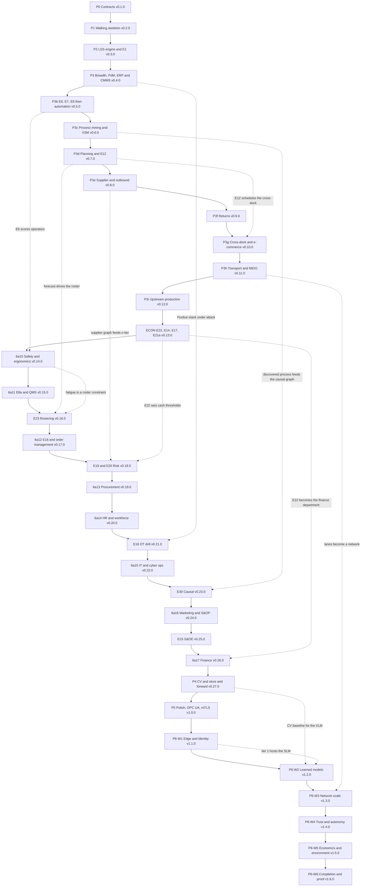

# Roadmap

The living backlog. Every idea is recorded here as a milestone with its dependencies, and ideas
are only ever reordered, never deleted.

Reading the full plan while Phase 1 is being built is the intended experience. What each
component is, and why it is built the way it is, belongs to
[ARCHITECTURE.md](ARCHITECTURE.md). This file owns sequencing and nothing else.

## Contents

1. [How to read this file](#1-how-to-read-this-file)
2. [The phase invariant](#2-the-phase-invariant)
3. [Phase table](#3-phase-table)
4. [Phase detail](#4-phase-detail)
5. [The resequencing record](#5-the-resequencing-record)
6. [Dependency graph](#6-dependency-graph)
7. [Validation gate index](#7-validation-gate-index)
8. [How milestones become issues](#8-how-milestones-become-issues)
9. [Milestone index](#9-milestone-index)

## 1. How to read this file

A milestone id names one idea. The id never changes and the idea is never removed. Five tiers
share the id space.

| Tier                   | Id form             | What it holds                                                                                |
|------------------------|---------------------|----------------------------------------------------------------------------------------------|
| Component              | 1, 1b, 2b, 6a10, 6c | The core system, numbered as in the system spec                                              |
| Bleeding edge          | E1 to E48           | The tier that makes an industry reader call this a real Industry 4.0 to 5.0 system           |
| Engineering craft      | C1 to C13           | Determinism, schemas, test tiers, config validation, releases, accessibility, agreement CI   |
| Adoption and scale     | A1 to A6            | Brick modularity, facility profiles, deployment tiers, scaling evidence, integration surface |
| Reference architecture | RA-a to RA-e, RA-3D | ISA-95 and Purdue fidelity items, plus the browser-native 3D view                            |

Where one milestone lands across more than one phase, it splits into lettered halves that keep
the root id. E4a and E4b are both E4, and both are tracked. A split moves no scope. It names the
two points at which one idea lands, and the later half is a work package like any other.

Three rules govern this file.

1. Nothing is removed. The status vocabulary has no canceled value, the `wontfix` label does
   not exist in this repository, and no issue carrying a `req:` label is closed as not planned.
   An idea that turns out to belong somewhere else is reordered, and section 5 records the move
   with the clause that forced it.
2. Every milestone carries its dependencies. A milestone with no recorded dependency is a
   milestone nobody has read yet.
3. Sequencing is all this file decides. Where this file and ARCHITECTURE.md disagree about when
   something lands, this file wins. Where they disagree about what something is,
   ARCHITECTURE.md wins.

Status words in the phase table are plain: `not started`, `in progress`, `done`.

Gate ids are written in full as `VAL-GATE-QS-001` in section 7. Section 4 abbreviates them to
the suffix, so `QS-001` in a phase entry means `VAL-GATE-QS-001` in the registry.

Section 9 lists every milestone id in id order with the phase that holds it. That table is the
coverage proof: an id with no row is a silent cut, and this project has no cut list.

## 2. The phase invariant

Every phase from P1 onward ends at a tagged release, and the tag is refused unless all of the
following pass. These gates are standing: each one re-runs at every later phase exit, not only
at the phase that introduced it.

| Gate                | Assertion                                                                                                                                                                                                                                                                                                                                                                                          |
|---------------------|----------------------------------------------------------------------------------------------------------------------------------------------------------------------------------------------------------------------------------------------------------------------------------------------------------------------------------------------------------------------------------------------------|
| `VAL-GATE-QS-001`   | The five-minute quickstart runs from a clean container against the published instructions in under 300 seconds on the CI reference runner, ending on a live dashboard serving non-empty state                                                                                                                                                                                                      |
| `VAL-GATE-DEMO-001` | The ten-minute scripted demo runs headless and green in under 600 seconds, with each scripted beat asserting on an observable rather than on a sleep                                                                                                                                                                                                                                               |
| `VAL-GATE-DET-001`  | Doctrine D-05 tier one. Two runs at the same run seed, the same config, the same platform, and the same pinned dependency set produce byte-identical event logs. One differing byte fails it                                                                                                                                                                                                       |
| `VAL-GATE-DET-002`  | Doctrine D-05 tier two. Two runs at the same run seed and config on different platforms produce identical business events, and every continuous field agrees within the tolerance `gates.yaml` carries from measured divergence. The gate publishes the observed maximum divergence on every run, and when that exceeds the recorded tolerance it names whether the tolerance or the code is wrong |
| `VAL-GATE-ENV-001`  | Doctrine D-07. Every event carries `producer_id`, the sequence number is dense per `(run_id, producer_id)`, and `(sim_ts, producer_id, seq)` is a total order over the log. A gap, a duplicate, or a tie fails it                                                                                                                                                                                  |
| `VAL-GATE-SCH-001`  | Producer and consumer contract tests pass, and the schema differ reports no field removal and no type narrowing within a major version                                                                                                                                                                                                                                                             |
| `VAL-GATE-CFG-001`  | Every shipped config validates, and every invalid fixture produces a line-numbered error carrying a suggestion                                                                                                                                                                                                                                                                                     |
| `VAL-GATE-A11Y-001` | axe-core reports zero critical and zero serious violations, the demo path is completable by keyboard alone, severity is encoded by shape and by text and not by color alone, and reduced motion is honored                                                                                                                                                                                         |
| `VAL-GATE-SEC-001`  | pip-audit and cargo-audit are clean or waived with an expiry date, every resolved dependency matches a row in the CONTRIBUTING.md allowlist including the MPL-2.0 row scoped to development dependencies, and the SBOM is attached to the release                                                                                                                                                  |
| `VAL-GATE-CLA-001`  | The contributor agreement job passes the three checks CLA.md section 7 names: the pull request author's handle is in the signatories list, every signatory line matches the published expression, and every commit carries a `Signed-off-by` trailer. A pull request failing any of the three does not merge                                                                                       |
| `VAL-GATE-DOC-001`  | The docs link check passes, mkdocs builds, the README opens with the pitch and one measured number, and the prose gate reports no em-dashes                                                                                                                                                                                                                                                        |
| `VAL-GATE-REL-001`  | CHANGELOG has a section for this tag, the semver bump matches the C9 policy for package APIs, REST and MCP contracts, event schemas, and `facility.yaml`, and the C6 compatibility table lists which recorded runs and configs this release loads                                                                                                                                                  |
| `VAL-GATE-RMAP-001` | `roadmap validate`, `roadmap coverage`, and `roadmap drift` all pass, zero milestone ids are unplaced, and no banned label exists                                                                                                                                                                                                                                                                  |
| `VAL-GATE-E1-001`   | From v0.3.0 onward: the E1 replay bundle is re-recorded from this tag's code, the static viewer loads it, and its agent transcript passes the grounding checker                                                                                                                                                                                                                                    |
| `VAL-GATE-AGT-001`  | From v0.3.0 onward: the E27 eval suite runs, accuracy and abstention rate are written into the release notes, and accuracy above the abstention threshold is at least 0.98. That figure is a budget this project sets, because no outside source sets one, and the release notes say so wherever the number appears                                                                                |
| `VAL-GATE-PERF-001` | From v0.4.0 onward: the A4 load harness reproduces the scaling curve inside the published band on the stated hardware, and the knee of the curve is restated in the README                                                                                                                                                                                                                         |

Two consequences shape the whole build.

The demo grows and never breaks. Adding 6a13 procurement does not get to break the P1 receiving
demo, so every phase re-runs every earlier demo beat.

The README headline number is regenerated, never edited. The release pipeline produces it from a
seeded run at tag time and writes it into the README, so it cannot drift away from the code.

P0 is the one phase whose exit condition is weaker, and this file says so rather than pretending
otherwise. There is no product at v0.1.0, so there is no five-minute quickstart and no
ten-minute demo to hold intact. P0 exits when `just check` is green, `just roadmap validate` and
`just roadmap coverage` pass, the determinism harness proves a two-run hash match on a toy
process on the pinned platform, `VAL-GATE-DET-002` has recorded a first measured cross-platform
divergence, and the release pipeline has produced v0.1.0 unattended. From v0.2.0 onward the full
invariant applies with no carve-out.

## 3. Phase table

One minor version per phase. v1.0.0 lands at the end of P5, because that is where the public
artifact set is complete and the package APIs, the REST and MCP contracts, and the event schemas
are stable enough for the C9 compatibility promises to mean something.

| Phase                             | Tag     | Delivers                                                                                                                                                                                                                                           | Depends on            | Status      |
|-----------------------------------|---------|----------------------------------------------------------------------------------------------------------------------------------------------------------------------------------------------------------------------------------------------------|-----------------------|-------------|
| P0 Contracts                      | v0.1.0  | Determinism at both tiers, sim clock, schema registry and the event envelope, test tiers, config validation, release automation, monorepo tooling, package topology, the governed metrics layer, the environment driver seam, and the roadmap tool | nothing               | in progress |
| P1 Walking skeleton               | v0.2.0  | One station, two devices publishing Sparkplug B into the UNS, the event-sourced historian, one agent tool, the dashboard stub, the REST API, the public community documents, and the contributor agreement check                                   | P0                    | in progress |
| P2 The judge                      | v0.3.0  | The Lean Six Sigma engine, twin-vs-reality sync, the what-if tool, the accuracy stack core, the eval harness, and the hosted browser replay demo                                                                                                   | P1                    | not started |
| P3 Breadth and the business loop  | v0.4.0  | Sensor catalog breadth, fleet health and predictive maintenance, the ERP and CMMS loop, RF read-zone physics, the MCP server with its threat model and red-team suite, counterfactual replay, and the docs site                                    | P2                    | not started |
| P3b Automation and robotics       | v0.5.0  | Operator model, energy KPIs, the optimization engine, then the AMR fleet, the palletizer cell, the ASRS, sortation, and slotting                                                                                                                   | P3                    | not started |
| P3c Process mining and VSM        | v0.6.0  | Process discovery, conformance checking, variant analysis, and rework detection in an Apache-2.0 engine written here, current and future state value stream maps, the dataset export framework, and ADOPTION.md v1                                 | P3b                   | not started |
| P3d Planning                      | v0.7.0  | Demand signal, the forecasting arena with its interval contract, inventory optimization, ABC and XYZ segmentation, SIOP feedback into truck scheduling, and yard and dock optimization                                                             | P3c                   | not started |
| P3e Supplier and outbound         | v0.8.0  | Supplier network with reliability profiles and scorecards, and outbound pick, pack, load, carrier tradeoffs, and shared-dock contention                                                                                                            | P3d                   | not started |
| P3f Returns                       | v0.9.0  | Returns and reverse logistics: triage, disposition, the reverse P&L, reason-code Pareto, and restock feedback into inventory                                                                                                                       | P3e                   | not started |
| P3g Cross-dock and e-commerce     | v0.10.0 | The cross-dock flow-versus-store engine, and e-commerce fulfillment with each-picking modes, cartonization, and parcel rate shopping                                                                                                               | P3e, P3d              | not started |
| P3h Transport and MEIO            | v0.11.0 | Transportation network, freight spend analytics, two-echelon inventory optimization, and the transport, fleet, and cold-chain sensor category                                                                                                      | P3g                   | not started |
| P3i Upstream production           | v0.12.0 | Hybrid batch and discrete factory, ISA-88 recipes, golden batch scoring, equipment OEE, SMED, finite-capacity scheduling, source SPC, and the process and chemical sensor category                                                                 | P3h                   | not started |
| ECON Economics prerequisites      | v0.13.0 | The financial twin, the tariff engine, the embedded-carbon ledger, and the decision register with its authority matrix                                                                                                                             | P3i                   | not started |
| 6a10 Safety and ergonomics        | v0.14.0 | Ergonomic scoring, fatigue feedback into the simulation, safety event modeling, and the safety and structural sensor categories                                                                                                                    | ECON, P3b             | not started |
| 6a11 QMS and compliance           | v0.15.0 | The SOP corpus with clause citation ids, then NCR, CAPA, acceptance sampling, CoA, COPQ, the audit trail, and the mock recall drill                                                                                                                | 6a10, P3f             | not started |
| E23 Rostering                     | v0.16.0 | Labor rostering optimization against forecast-derived half-hourly requirements, with the fatigue model as a constraint                                                                                                                             | 6a10, P3d             | not started |
| 6a12 Order management and service | v0.17.0 | ATP and CTP promising, then the order lifecycle, customer segmentation, the service operation, WISMO, and the perfect order KPI                                                                                                                    | E23, P3g, P3i         | not started |
| E19 and E20 Risk                  | v0.18.0 | N-tier supplier illumination and reverse stress testing                                                                                                                                                                                            | P3e, ECON             | not started |
| 6a13 Procurement                  | v0.19.0 | Procure-to-pay, the eRFX analog, contract management, spend analytics, maverick spend detection, and forward-buy under tariff scenarios                                                                                                            | E19 and E20, 6a12     | not started |
| 6a14 HR and workforce             | v0.20.0 | Hiring pipelines, onboarding curves, the skills matrix, cross-training, attrition, and the absenteeism predictor that replaces the E23 stub                                                                                                        | E23, 6a10             | not started |
| E18 OT drill                      | v0.21.0 | Adversarial chaos scenarios run against the Purdue stack, scored on detection latency, blast radius per zone, and recovery against the runbook                                                                                                     | P3                    | not started |
| 6a15 IT and cyber ops             | v0.22.0 | ITSM, SRE observability with error budgets, vulnerability economics, IEC 62443 zones, a SIEM analog, and backup and restore drills                                                                                                                 | E18, ECON             | not started |
| E30 Causal                        | v0.23.0 | The causal graph, effect estimation, refutation, and discovery scored against the known true structure                                                                                                                                             | P3c, ECON             | not started |
| 6a16 Marketing, sales ops, S&OP   | v0.24.0 | Promotions and cannibalization, pipeline and forecast bias, NPI cold start, the five-step S&OP cycle, and the monthly decision packet                                                                                                              | E30, 6a12, 6a14       | not started |
| E15 S&OE                          | v0.25.0 | The weekly execution tick, exception queues, and bounded corrective actions measured against the untouched plan                                                                                                                                    | 6a16                  | not started |
| 6a17 Finance and accounting       | v0.26.0 | The event-driven GL, standard costing with variance decomposition, inventory accounting, ABC cost-to-serve, FP&A, capex governance, the simulated close, and controls                                                                              | ECON, 6a13, 6a14, E15 | not started |
| P4 Vision and edge resilience     | v0.27.0 | CV auditing bound to the SOP clause it breaks, store and forward, QoS levels, and retained messages                                                                                                                                                | 6a17                  | not started |
| P5 Polish and protocol            | v1.0.0  | Final README, the demo GIF, the capability report artifact, the OPC UA bridge, mTLS from the internal CA, final ADOPTION.md, all three facility profiles proven, the Helm chart, and the stable API promise                                        | P4                    | not started |
| P6-W1 Edge and identity           | v1.1.0  | Compute placement tiers, device lifecycle with zero-touch provisioning and OTA campaigns, the edge SLM, hardware in the loop, and the voice interface                                                                                              | P5                    | not started |
| P6-W2 Learned models              | v1.2.0  | RL dispatch, the neural surrogate, the VLM copilot, the forecasting foundation-model bakeoff with conformal calibration, the GNN cascade model, drift monitors and champion-challenger, and agent incident memory                                  | P6-W1                 | not started |
| P6-W3 Network scale               | v1.3.0  | Multi-site with federated learning, the third MEIO echelon, strategic network design, VMI and value-added services, and PLM with engineering change orders                                                                                         | P6-W2                 | not started |
| P6-W4 Trust, autonomy, authoring  | v1.4.0  | The hash-chained ledger with per-party signatures, the verifiable digital product passport, L3 autonomy guardrails, role agents under a supervisor, and generative SOPs                                                                            | P6-W3                 | not started |
| P6-W5 Economics and environment   | v1.5.0  | ESG and CSRD reporting, insurance and risk transfer, AI FinOps, failure runbooks and config compliance audits, the weather driver, the 3D factory view, and the enterprise facility profile                                                        | P6-W4                 | not started |
| P6-W6 Completion and proof        | v1.6.0  | The full labeled dataset corpus with cards, the published scaling curves, the milestone coverage proof, and the capability report regenerated across every subsystem                                                                               | P6-W5                 | not started |

Two phases carry a status other than `not started`. P0 is the contract work now under way. P1 is
open alongside it because the repository is public from Phase 1, so the P1 documents that an
outside visitor reads first, this file, [README.md](README.md),
[ARCHITECTURE.md](ARCHITECTURE.md), [SUPPORT.md](SUPPORT.md), and the issue forms, are already
committed. From v0.1.0 onward exactly one phase is open at a time, because two open phases mean
two release branches and the repository is public.

## 4. Phase detail

### P0 Contracts (v0.1.0)

- Delivers: the contracts that fix what a recorded run is, plus the tooling that produces every
  tag from the same pipeline.
- Milestones: C1 determinism at both tiers of doctrine D-05, C2 sim clock, C3 schema registry
  carrying the doctrine D-07 event envelope, C4 test tiers with the Hypothesis property suite,
  C5 config validation, C9 versioning and automated releases, C10 monorepo tooling, C11
  dependency hygiene, A1 package topology and the import-boundary lint, A2 the `facility.yaml`
  schema, E26(b) the governed metrics layer, E40 the environment driver registry as a null
  driver.
- The D-07 envelope lands here and nowhere later. Every event carries `producer_id`, the
  sequence number is dense per `(run_id, producer_id)`, and `(sim_ts, producer_id, seq)` is the
  canonical total order that the pagination cursor and the replay reader both read. Adding an
  envelope field after P0 is a major version bump on every schema subject, which is the whole
  reason C3 sits in the root phase.
- C11 ships the allowlist with an MPL-2.0 row scoped to development dependencies. Hypothesis is
  MPL-2.0, and requirement C4 names a property-based invariant suite with Hypothesis as the tool,
  so an allowlist without that row refuses a library the spec requires. The row is scoped to
  development dependencies because a test dependency is not redistributed with the product.
- Depends on: nothing. P0 is the root.
- Gates: DET-001, DET-002, ENV-001, SCH-001, CFG-001, SEC-001, REL-001, RMAP-001.
- Unblocks: every later phase.

### P1 Walking skeleton (v0.2.0)

- Delivers: one station end to end, from a device publishing into the UNS to a dashboard tile
  and one agent tool, with the release pipeline producing the tag.
- Milestones: 1 one station, 2 one RFID portal and one temperature sensor on UNS topics, E3
  Sparkplug B payloads, E4a the append-only event-sourced historian, 7 one agent tool, E5a
  autonomy tier metadata and the who-or-what-changed-the-line audit event, E26(d) structured
  outputs, 8 the dashboard stub, C12 dashboard accessibility, 9 the README, C8 the community
  documents, C13 the contributor agreement CI check, A2 the micro-fulfillment profile, A3 the
  garage tier compose with Purdue segmentation, A6 the REST API, RA-a the layer map, RA-b compose
  segmentation, RA-c historian naming.
- C13 lands beside C8 because the documents that claim the check already exist. CLA.md section 7,
  CONTRIBUTING.md, and the pull request template each state that CI checks the signature, and no
  workflow job does. Until C13 ships, those three documents make a claim this repository does not
  carry out, which is the same defect class the validation gate index exists to catch.
- Depends on: P0.
- Gates: QS-001, DEMO-001, SPARK-001, A11Y-001, CLA-001, and every standing gate from section 2.
- Unblocks: everything downstream.

### P2 The judge (v0.3.0)

- Delivers: the Lean Six Sigma engine as the thing that judges both the telemetry and the twin,
  and the browser replay demo that lets a reader watch it without installing anything.
- Milestones: 5 SPC, capability, measurement system analysis, hypothesis testing, the findings
  stream, and the capability report; 6 twin-vs-reality sync; 7 `get_findings`, `run_whatif`,
  `run_capability_report`, `explain_finding`; 1 takt, cycle time, WIP, utilization, OEE, and
  bottleneck; E26(a) execution-grounded answers, E26(c) execution-based verification, E26(f) the
  grounding checker; E27 the eval suite v1; E45 token and cost counters; C6 the migration story;
  C7 SECURITY.md and the MCP and REST threat model; then E1 the hosted replay demo as the
  closing work package.
- Depends on: P1.
- Gates: NIST-001, NIST-002, NIST-003, EHB-001, EHB-002, EHB-005, WE-001, MSA-001, MSA-002,
  SIM-001, MTB-001, MTB-002, MTB-003, AGT-001, E1-001.
- Unblocks: P3 and everything after it, and E2.

### P3 Breadth and the business loop (v0.4.0)

- Delivers: sensor breadth on the catalog pattern, the predictive maintenance layer, the loop
  out to the business systems, and the physical model behind every RFID read.
- Milestones: E2 the MCP server, E43c the AI red-team suite, 2b the industrial and environmental
  sensor categories, 2 the fifty-device fleet with all failure modes and the Rust device agent,
  3 fleet management and predictive maintenance, 6b the ERP and CMMS loop, E46 RF physics and
  read-zone modeling, E43a the model registry, E35a the GS1 EPCIS 2.0 event vocabulary, E10a the
  digital product passport genealogy naming, E4b counterfactual replay and time-travel debugging,
  E26(e) self-consistency and E26(g) calibrated abstention, RA-d alarm prioritization and
  rationalization, A3 the growth tier, A4 the load harness and first curve, A2 CONFIGURING.md, A6
  webhooks and EPCIS export, 7 `get_fleet_health` and `get_bottleneck`, and the mkdocs site.
- Depends on: P2.
- Gates: NIST-004, EHB-003, RF-001, PDM-001, EPCIS-001, SPARK-002, PERF-001, INJ-001.
- Unblocks: P3b through P3i, and E18.

### P3b Automation and robotics (v0.5.0)

- Delivers: the operator model, the energy layer, and the optimizer first, then the automation
  the what-if questions are about.
- Milestones: E6 operators as first-class resources, E7 energy KPIs, E9 the optimization engine,
  1b the AMR fleet, palletizer cell, ASRS, sortation, and slotting, 2b the electrical and power
  and the warehouse and logistics sensor categories, 7 `compare_scenarios`, A2 the mid-market 3PL
  profile.
- Depends on: P3.
- Gates: ENG-001, OPT-001.
- Unblocks: P3c onward, E11, E12, E23, and the 6a10 ergonomic seam.

### P3c Process mining and VSM (v0.6.0)

- Delivers: process mining scored against a known ground-truth process model, and the Lean
  deliverable consultants draw by hand.
- Milestones: 5 process discovery, conformance checking, variant analysis, rework-loop
  detection, and cycle-time contribution per activity, all of them in `twinflow-procmine` written
  here under Apache-2.0; 1 the value stream summary; the auto-generated current and future state
  VSM; E25a the export framework, dataset card schema, and license recording; A5 ADOPTION.md v1.
- Doctrine D-14 governs the implementation. PM4Py and `pm4pyminimal` are AGPL-3.0 at version
  2.7.23.3, section 13 of that license triggers on network interaction, and this project serves a
  dashboard, an MCP server, and an HTTP API, so importing either would place the whole work under
  AGPL and contradict the Apache-2.0 and commercial dual license. Nothing in the capability moves.
  The engine is written here instead: the directly-follows graph, the inductive miner, token-based
  replay, alignment-based conformance as A star search over the synchronous product net, variant
  analysis, rework-loop detection, and per-activity cycle-time contribution.
- The effort and the dependencies change with it. `twinflow-procmine` gains an implementation work
  package per algorithm rather than a wrapper, its runtime dependency set holds no AGPL package,
  and PM4Py moves to a development-only validation oracle that CI compares against and that
  nothing distributes or serves. That oracle is what gives `PM-003` a real external reference
  under doctrine D-11. The arrangement needs a legal reading before release.
- The in-house engine closes a loop no external library closes. The twin is the designed reference
  model, so conformance is measured against a known ground-truth process and the recovery of that
  process is reportable, which is what `PM-001` and `PM-002` assert.
- Depends on: P3b.
- Gates: PM-001, PM-002, PM-003, VSM-001.
- Unblocks: P3d onward, E24, E28, E30, E33.

### P3d Planning (v0.7.0)

- Delivers: the loop from execution back to planning, and the yard schedule as a controllable
  lever.
- Milestones: 6a the demand signal, the forecasting arena with the point-plus-interval contract,
  inventory optimization, ABC and XYZ segmentation, and SIOP feedback into truck scheduling; E12
  yard and dock scheduling optimization as the closing work package.
- Depends on: P3c, and E9 from P3b.
- Gates: FCST-001, FCST-002, INV-001, YARD-001.
- Unblocks: P3e onward, P3g, E15, E16, E23, E31.

### P3e Supplier and outbound (v0.8.0)

- Delivers: the inbound side gets a supply base with behavior, and the outbound side completes
  the end-to-end flow.
- Milestones: 6a2 supplier reliability profiles, scorecards, disruption what-ifs, and defect
  genealogy; 6a3 pick, pack, stage, load, carrier assignment, trailer cubing, shared-dock
  contention, and service-level measurement.
- Depends on: P3d.
- Gates: SUP-001, OTIF-001.
- Unblocks: P3f, P3g, P3h, E19, E41.

### P3f Returns (v0.9.0)

- Delivers: the reverse flow, competing with inbound for the same doors, labor, and staging
  space.
- Milestones: 6a4 return stream generation with reason codes, triage and disposition, the
  reverse P&L, reason-code Pareto, and restock feedback into available inventory.
- Depends on: P3e.
- Gates: RET-001.
- Unblocks: 6a11, E39.

### P3g Cross-dock and e-commerce (v0.10.0)

- Delivers: the flow-through mode and the second order profile, and the contention between them.
- Milestones: 6a5 the flow-versus-store decision engine, staging-lane management, and
  missed-connection rate; 6a6 each-picking modes, cartonization, parcel rate shopping, the peak
  day scenario, and per-channel unit economics.
- Depends on: P3e, and E12 from P3d.
- Gates: XDOCK-001, CART-001.
- Unblocks: 6a12, E45.

### P3h Transport and MEIO (v0.11.0)

- Delivers: the network above the four walls, and the question of where safety stock lives.
- Milestones: 6a7 lanes, modes, carrier contracts, a moving spot market, disruptions, and
  freight spend analytics; 6a8 base-stock policies per echelon, the guaranteed service time
  frontier, and risk pooling, at two echelons; 2b the transport and fleet and the cold-chain
  sensor categories.
- Depends on: P3g.
- Gates: MEIO-001, GLEC-001, COLD-001.
- Unblocks: ECON, E17, E20, E33, E38, and the third echelon at P6-W3.

### P3i Upstream production (v0.12.0)

- Delivers: the chain's origin, modeled from the inside as a hybrid batch and discrete factory.
- Milestones: 6a9 ISA-88 recipes and golden batch scoring, equipment OEE and the six big losses,
  SMED changeover analysis, finite-capacity scheduling with sequence-dependent setups, source
  SPC, and yield through genealogy; 2b the process and chemical sensor category.
- Depends on: P3h.
- Gates: OEE-001, BATCH-001, SMED-001.
- Unblocks: 6a10 onward, E16 capable-to-promise, E37.

### ECON Economics prerequisites (v0.13.0)

- Delivers: the four economic contracts that six of the eight 6a1x layers consume.
- Milestones: E22 the financial twin with AP and AR terms, invoice and payment streams, the cash
  cycle, and working capital per echelon; E14 HS codes, country of origin, tariff schedules with
  scenario overlays, and tariff-adjusted landed cost; E17 cradle-to-gate embedded carbon
  inherited through genealogy with CBAM-style declarations; E21a the decision register, its
  authority tiers, append-only and counterfactual-auditable.
- Depends on: P3i.
- Gates: FIN-001, TAR-001, CBAM-001, GOV-001.
- Unblocks: every 6a1x layer, E19 and E20, E38, E39, E45.

### 6a10 Safety and ergonomics (v0.14.0)

- Delivers: the human layer made measurable in the same units as the machines.
- Milestones: 6a10 ergonomic profiles per manual task, NIOSH and RULA and REBA scoring,
  cumulative strain with fatigue feedback into error and slowdown rates, near-miss detection,
  Heinrich-ratio incident generation, and TRIR-style rate tracking; 2b the safety and compliance
  and the structural sensor categories.
- Depends on: ECON, and E6 from P3b.
- Gates: NIOSH-001, RULA-001, HEIN-001, ERG-SEAM-001.
- Unblocks: E23, 6a14, E38, E39.

### 6a11 QMS and compliance (v0.15.0)

- Delivers: findings turned into managed workflows, and the recall drill that proves the
  genealogy graph is real.
- Milestones: E8a the SOP corpus, retrieval, and clause citation ids as the opening work
  package; 6a11 NCR generation, the CAPA workflow with statistical effectiveness verification,
  acceptance sampling, CoA generation, the COPQ model, audit-trail integrity, layered process
  audits, and the timed mock recall drill.
- Depends on: 6a10, P3f.
- Gates: Z14-001, EHB-004, CAPA-001, RECALL-001.
- Unblocks: E24, E35b, E37, E43.

### E23 Rostering (v0.16.0)

- Delivers: staffing as a solved constraint problem feeding the simulation as actual headcount.
- Milestones: E23 half-hourly labor requirements derived from the forecast, a constraint-solver
  roster over the skills matrix, shift rules, and fairness, scored on understaffing cost against
  overtime, with the fatigue model as a constraint and a configured-rate absenteeism stub behind
  the `AbsenteeismModel` seam.
- Depends on: 6a10, P3d.
- Gates: ROST-001.
- Unblocks: 6a12, 6a14.

### 6a12 Order management and service (v0.17.0)

- Delivers: the front office that experiences everything the operation does.
- Milestones: E16 ATP and CTP promising with quoted-versus-actual promise reliability as the
  opening work package; 6a12 the order lifecycle with its exception paths, customer segmentation
  and differentiated service, service agents as a staffed resource, the WISMO rate, and the
  perfect order KPI.
- Depends on: E23, P3g, P3i.
- Gates: ATP-001, ORDER-001, PERFORD-001.
- Unblocks: 6a13, 6a16, E15, E38.

### E19 and E20 Risk (v0.18.0)

- Delivers: hidden concentration made visible, and the search for the disruption combinations
  that break service or cash.
- Milestones: E19 the multi-tier supplier DAG, the mapping mechanic that reveals edges with
  effort, correlated tier-1 failure, and the ROI of mapping itself; E20 an optimizer searching
  disruption space for minimal breaking combinations, reporting time to survive and time to
  recover per node.
- Depends on: P3e, ECON.
- Gates: NTIER-001, RST-001.
- Unblocks: 6a13, E33, E38.

### 6a13 Procurement (v0.19.0)

- Delivers: the buy side as a managed function, and the sourcing strategy answer as one agent
  response.
- Milestones: 6a13 the procure-to-pay cycle with three-way match exceptions, the eRFX analog with
  weighted award scoring, contract management with tiers, rebates, and expiry-driven
  renegotiation, spend analytics with category taxonomies, maverick spend detection, forward-buy
  against a tariff scenario, and the procurement KPI set including cost avoidance tracked apart
  from cost savings.
- Depends on: E19 and E20, 6a12, and E14, E17, E22 from ECON.
- Gates: P2P-001, SPEND-001.
- Unblocks: 6a17, E37, E41.

### 6a14 HR and workforce (v0.20.0)

- Delivers: people as a lifecycle with returns, not as interchangeable capacity.
- Milestones: 6a14 hiring pipelines with time to fill, onboarding learning curves, the skills
  matrix with certification gating, cross-training as an investment, attrition driven by
  overtime, strain, and understaffing, and the behavioral absenteeism predictor that replaces the
  E23 stub behind the same seam.
- Depends on: E23, 6a10.
- Gates: HR-001, ABSENT-SEAM-001.
- Unblocks: 6a16, 6a17, E39.

### E18 OT drill (v0.21.0)

- Delivers: adversarial chaos, not accidental chaos, against the Purdue stack the compose
  topology already enforces.
- Milestones: E18 historian compromise, MES analog encryption, Sparkplug spoofing, and the DMZ
  isolation drill, measured on detection latency, blast radius per zone, safe degraded
  production, and recovery against the runbook.
- Depends on: P3, and RA-b from P1.
- Gates: OTSEC-001.
- Unblocks: 6a15.

### 6a15 IT and cyber ops (v0.22.0)

- Delivers: the twin's own infrastructure as part of the simulation, and vulnerability management
  with a P&L.
- Milestones: 6a15 ITSM incident, problem, and change management over the twin's own systems, SRE
  observability with golden signals and error budgets, a simulated CVE feed with patch-management
  economics under the OT production-window constraint, IEC 62443 zones with conduit monitoring, a
  SIEM analog with detection rules as versioned code, role-based access feeding the decision
  register, and backup and restore drills measured against RPO and RTO.
- Depends on: E18, ECON.
- Gates: DORA-001, RPO-001, ZONE-001.
- Unblocks: E43, E44.

### E30 Causal (v0.23.0)

- Delivers: effect estimation on observational twin data, scored against the causal structure the
  simulation was built from.
- Milestones: E30 the causal graph over the operation, identification and estimation, the
  refutation battery, and causal discovery scored against the known true graph, with a treatment
  registry seeded by the interventions that already exist.
- Depends on: P3c, ECON.
- Gates: CAU-001, CAU-002.
- Unblocks: 6a16, E33.

### 6a16 Marketing, sales ops, S&OP (v0.24.0)

- Delivers: demand as a lever the company pulls, and the monthly ritual that reconciles the whole
  enterprise into one number.
- Milestones: 6a16 promotions with lift curves, forward-buy distortion, and cannibalization; the
  sales pipeline with rep-forecast bias and quota-driven quarter-end patterns; NPI cold start;
  the five-step S&OP cycle as system events; and the executive decision packet logged to the
  decision register.
- Depends on: E30, 6a12, 6a14, and E21a from ECON.
- Gates: SOP-001, FVA-001, PROMO-001.
- Unblocks: E15, 6a17.

### E15 S&OE (v0.25.0)

- Delivers: the control-tower loop between the monthly plan and the week that happened.
- Milestones: E15 the weekly execution tick diffing plan against simulated actuals, exception
  queues with quantified revenue and service impact, and bounded corrective actions measured
  against the untouched plan.
- Depends on: 6a16.
- Gates: SOE-001.
- Unblocks: 6a17.

### 6a17 Finance and accounting (v0.26.0)

- Delivers: financial statements as derived artifacts, and every variance traced to the physical
  events that produced it.
- Milestones: 6a17 the event-driven general ledger and chart of accounts, standard costing with
  full variance decomposition, inventory accounting with valuation methods and excess and
  obsolete reserves, activity-based cost-to-serve, driver-based FP&A with rolling reforecasts,
  capex governance with NPV, IRR, payback, and post-investment audit, the simulated month-end
  close, and the SOX-style controls library.
- Depends on: E22 from ECON, 6a13, 6a14, E15.
- Gates: GL-001, VAR-001, ABC-001, NPV-001.
- Unblocks: E37, E38, E41, E45.

### P4 Vision and edge resilience (v0.27.0)

- Delivers: the second sensing channel that can disagree with the first, and the outage the demo
  survives.
- Milestones: 4 the camera device on synthetic rendered frames, SOP compliance auditing, and
  independent throughput counting; E8b the CV violation bound to the SOP clause it breaks; 6c
  store and forward across a broker outage, QoS levels, and retained messages.
- Depends on: 6a17.
- Gates: CV-001, SNF-001.
- Unblocks: E29, E36.

### P5 Polish and protocol (v1.0.0)

- Delivers: the public artifact set complete, and the compatibility promises that make v1.0.0
  mean something.
- Milestones: 9 the final README with the demo GIF; 5 the capability report as a published
  artifact; RA-e the OPC UA to MQTT bridge; mTLS from the internal CA on the OT broker; A5 final
  ADOPTION.md; A2 all three facility profiles proven against the demo; A3 the enterprise Helm
  chart with the adapter stubs; A6 GraphQL; C9 the stable API promise; 8 the dashboard polish
  pass.
- Depends on: P4.
- Gates: MTLS-001, OPCUA-001, ADOPT-001.
- Unblocks: P6-W1.

### P6-W1 Edge and identity (v1.1.0)

- Delivers: compute placement as a measured architecture, and device identity as a lifecycle.
- Milestones: E36 the four compute tiers with bandwidth saved and decision latency per tier; E44
  zero-touch certificate enrollment, the desired-versus-reported device twin with drift
  reconciliation, and OTA campaigns with canary rings and automatic rollback; E32 the
  plant-distilled small language model at tier 1; E47 hardware in the loop for one real edge
  device; E34 the local speech interface.
- Depends on: P5.
- Gates: EDGE-001, OTA-001, SLM-001, HIL-001.
- Unblocks: P6-W2, E45.

### P6-W2 Learned models (v1.2.0)

- Delivers: the learned layer, each model benchmarked against the baseline it claims to beat, and
  the comparison published either way.
- Milestones: E11 the RL dispatcher against the rule-based dispatcher on identical scenarios; E28
  the neural surrogate with its error distribution published; E29 the VLM copilot benchmarked
  against the classical CV channel on the same events; E31 the forecasting foundation-model
  bakeoff with conformal calibration populating the P3d interval contract; E33 the GNN cascade
  model against the simulation's true propagation; E43b drift monitors and champion-challenger
  promotion; E27 the case-based incident memory with its improvement curve.
- Depends on: P6-W1.
- Gates: RL-001, SURR-001, VLM-001, CONF-001, GNN-001, DRIFT-001.
- Unblocks: P6-W3.

### P6-W3 Network scale (v1.3.0)

- Delivers: more than one site, which is what turns the facility twin into a network twin.
- Milestones: E13 the second facility with broker-to-broker UNS bridging, network-level KPIs, and
  federated PdM training; 6a8 the third echelon with forward positions; E42 network design with
  candidate sites instantiated as `facility.yaml` configs and stress-tested operationally; E41 VMI
  and consignment plus kitting, postponement, and value-added services; E37 versioned BOMs and
  recipes with engineering change orders and effectivity dates; A2 the enterprise network profile.
- Depends on: P6-W2.
- Gates: MULTI-001, FED-001, NETDES-001, VMI-001, ECO-001.
- Unblocks: P6-W4.

### P6-W4 Trust, autonomy, authoring (v1.4.0)

- Delivers: the trust layer that lets a customer check a lot's chain of custody without trusting
  this system's database.
- Milestones: E35b the hash-chained Merkle ledger with per-party signatures and customer-side
  verification; E10b the digital product passport upgraded to cryptographically verifiable; E5b
  L3 auto-apply inside guardrails with rollback; E21b role agents negotiating under a supervisor
  with budgets; E24 telemetry-grounded generative SOPs with simulated adherence effects.
- Depends on: P6-W3.
- Gates: LEDGER-001, AUTON-001, MAS-001, SOPGEN-001.
- Unblocks: P6-W5.

### P6-W5 Economics and environment (v1.5.0)

- Delivers: the regulatory and economic artifacts the system can generate from data it already
  holds, and the one correlated shock that moves five subsystems at once.
- Milestones: E39 the ESG and CSRD report against ESRS-style headings; E38 cargo claims, business
  interruption cover, and premiums as a function of the twin's own loss history; E45 cost-aware
  model routing and the monthly AI P&L; E48 auto-generated failure runbooks and scheduled fleet
  config compliance audits; E40 the weather process wired to the sensitivity hooks each phase
  registered; RA-3D the browser-native 3D factory view; 8 the 3D panel on the live state feed; A2
  final profile pass.
- Depends on: P6-W4.
- Gates: ESG-001, INS-001, FINOPS-001, RUNBOOK-001, WX-001.
- Unblocks: P6-W6.

### P6-W6 Completion and proof (v1.6.0)

- Delivers: the closing proof that every recorded idea shipped.
- Milestones: E25b the full labeled dataset corpus with cards across every labeled phenomenon; A4
  the final published scaling curves with the stated knee; 5 the capability report regenerated
  across every subsystem; the full milestone coverage proof.
- Depends on: P6-W5.
- Gates: DATA-001, COVER-001.
- Unblocks: nothing. This is the last phase.

## 5. The resequencing record

The author's stated order runs P1 walking skeleton, P2 the LSS engine with its
reference-validated tests, P3 sensor breadth with predictive maintenance and the ERP and CMMS
loop, P3b through P3i, then 6a10 through 6a17 in that order, P4 CV auditing and store and
forward, P5 polish, and P6 the full bleeding-edge list in its stated order. Sensor categories
grow with the subsystems they feed.

Five changes to that order were agreed. The first four move an item earlier, and the fifth
carries the cross-cutting doctrine rulings. None removes anything, and each move below names the
clause that forces it.

### Change 1: Phase 0 exists

C1 determinism, C2 sim clock, C3 schema registry, C5 config validation, C10 monorepo tooling, and
A1 package topology move ahead of the walking skeleton into a new P0.

These six are contracts, not features. They fix the byte content of an event log, the semantics
of a timestamp, the shape of every cross-package message, the validity of every config, the
layout of the workspace, and the boundaries between installable packages. P1 produces the first
recorded run. Introduce any of the six after that run exists and it invalidates the artifacts
already produced: every recorded run, every golden file, the P1 README number, the E1 replay
bundle, and every determinism claim this repository makes. C1's own words are "identical seed
plus config yields byte-identical event logs", and C3's are "additive-only evolution within a
major version". Both become false claims if the mechanism arrives after the data does.

The cost argument runs the same way. The CI lint that bans `time.time`, `datetime.now`,
`random.*`, and raw sockets outside the kernel package is cheap at 2000 lines and needs an audit
of every module at 20000. A license allowlist is a five-minute job at six dependencies and a
triage session at sixty.

Six more milestones join P0 on the identical argument. Three are craft items the agreed change
did not name, and three are the contracts a later phase cannot retrofit.

| Milestone                     | Why it cannot wait                                                                                                                                                                                                                                                                                                                                         |
|-------------------------------|------------------------------------------------------------------------------------------------------------------------------------------------------------------------------------------------------------------------------------------------------------------------------------------------------------------------------------------------------------|
| C4 test tiers                 | Golden files starting at P2 means no goldens for the P1 capability report or dashboard state, so the first regression in P1 code is invisible                                                                                                                                                                                                              |
| C9 automated releases         | The v0.1.0 tag comes out of the same pipeline as v1.0.0, or the release history is inconsistent under exactly the inspection a reviewer performs                                                                                                                                                                                                           |
| C11 dependency hygiene        | pip-audit, cargo-audit, the license allowlist, and the SBOM cost nothing at six dependencies                                                                                                                                                                                                                                                               |
| E26(b) governed metrics layer | C5 names the metrics layer among the configs that validate at load, and component 1 computes takt, cycle time, WIP, utilization, and OEE from P1. Compute them inline and move them into governed YAML later, and every published number changes definition                                                                                                |
| E40 environment driver seam   | One correlated weather state moving demand, lane transit, yard operations, HVAC load, and slip risk together is one shared state and one RNG child stream, which is a C1 concern. The registry ships in P0 with a null driver, each later phase registers its sensitivity hook, and E40's P6-W5 work package wires the process to hooks that already exist |
| A2 `facility.yaml` schema     | The config schema is a contract in the same sense as the event schema                                                                                                                                                                                                                                                                                      |

### Change 2: E1 moves to the close of P2

E1, the hosted browser replay demo, is the single highest-visibility milestone in the whole plan.
Most people who judge this repository will never run docker, and E1 is what lets them watch the
factory run, the alarms fire, and the agent answer questions without installing anything.

It is also cheap once P2 exists. E1 needs a recorded event log, which P1 delivers, a findings
stream and an agent transcript, which P2 delivers, and a static viewer. Nothing else. Holding it
until P6 pays the full cost of building it and collects none of the visibility for a year of
phases, on a repository that is public the entire time.

The move creates one standing obligation, and `VAL-GATE-E1-001` enforces it: from v0.3.0 onward
every tag re-records the replay bundle from that tag's code, loads it in the viewer, and runs the
transcript through the grounding checker. A stale public demo is worse than no public demo.

### Change 3: four layers move ahead of the layers that consume them

Each of these four is named by the later layer's own definition text. The source contains its own
dependency graph in prose, and these are the clearest four cases.

| Move                                                | Forcing clause in the source                                                                                                                 |
|-----------------------------------------------------|----------------------------------------------------------------------------------------------------------------------------------------------|
| E6 operator model to the head of P3b, ahead of 6a10 | 6a10 scores ergonomic risk for operators who must already exist, and 1b's automation what-ifs must answer with "operator-impact deltas"      |
| E23 rostering to v0.16.0, ahead of 6a14             | 6a14 lists "absenteeism and no-show prediction feeding the rostering optimizer (E23)", so the optimizer is the consumer and must exist first |
| E14 tariffs to ECON, ahead of 6a13                  | 6a13's forward-buy decision is "ahead of an announced price increase or tariff scenario (E14 integration)"                                   |
| E30 causal layer to v0.23.0, ahead of 6a16          | 6a16 requires "marketing-mix ROI measured honestly by the causal layer (E30)"                                                                |

E23 also moves ahead of 6a12, because 6a12 staffs "service agents as a staffed resource with
queues, handle times, and their own rostering".

### Change 4: the remaining forward dependencies

Reading the source for the same pattern turns up more of them. Each row names the clause. `->`
means moved to.

Named by the source, in the same way as change 3:

| Id  | Move                                                      | Forcing clause                                                                                                                                                                                                                                   |
|-----|-----------------------------------------------------------|--------------------------------------------------------------------------------------------------------------------------------------------------------------------------------------------------------------------------------------------------|
| R12 | E12 -> tail of P3d, ahead of 6a5 in P3g                   | 6a5 states that "the yard optimization of E12 becomes load-bearing here"                                                                                                                                                                         |
| R13 | E22 -> ECON, ahead of 6a11, 6a12, 6a13, 6a17, E20, E38    | 6a17 is "the layer that graduates the financial twin (E22) from an overlay into a functioning finance department"; 6a13's payment feeds "the financial twin's cash cycle"; E20 searches for combinations that "break service or cash thresholds" |
| R15 | E21a decision register -> ECON, ahead of 6a15, 6a16, 6a17 | 6a15 has "the audit trail feeding the decision-governance register", 6a16 logs the decision "to the governance register", and E43 needs "human approval at the governance register"                                                              |
| R17 | E16 -> head of 6a12                                       | 6a12 allocates "against ATP/CTP"                                                                                                                                                                                                                 |
| R18 | E19 and E20 -> v0.18.0, ahead of 6a13                     | 6a13's sourcing what-if quotes "the concentration risk from the n-tier map, the resilience cost from reverse stress testing"                                                                                                                     |
| R19 | E18 -> v0.21.0, ahead of 6a15                             | 6a15 "makes the OT-cyber drill (E18) a continuously exercised capability rather than a one-off"                                                                                                                                                  |
| R22 | E8a SOP corpus -> head of 6a11                            | 6a11 maps "audit checklists as versioned code mapped to ISO 9001-class clauses", and E24 revises SOPs "version-controlled in the QMS analog"                                                                                                     |
| R23 | E35a EPCIS vocabulary -> P3, at genealogy creation        | E35 requires "the events in GS1 EPCIS 2.0 format". A private vocabulary translated later changes every recorded genealogy event and the recall drill's shape                                                                                     |
| R26 | E36 compute tiers -> P6-W1, ahead of E32                  | E36 states that "the edge SLM milestone (E32) deploys at tier 1"                                                                                                                                                                                 |
| R27 | E13 -> P6-W3, ahead of E42                                | E42's candidate designs are "INSTANTIATED as facility.yaml configs and stress-tested operationally", which needs more than one site, and 6a8 wants "forward positions once E13 adds sites"                                                       |
| R41 | E44 -> ahead of E47                                       | E47's physical device joins by "enrolling through the same zero-touch provisioning"                                                                                                                                                              |

Found by output type, where one milestone's output is the other's input even though the source
does not name it:

| Id   | Move                                                              | Argument                                                                                                                                                                                                                                                                                                      |
|------|-------------------------------------------------------------------|---------------------------------------------------------------------------------------------------------------------------------------------------------------------------------------------------------------------------------------------------------------------------------------------------------------|
| R02  | E3 Sparkplug B -> P1                                              | It is the wire format. Introduce it later and every run recorded before then is in a different format, which breaks the E1 bundles, E4b replay, E25 exports, and the C6 compatibility table                                                                                                                   |
| R03  | E4a event-sourced historian -> P1                                 | An append-only log with per-run config capture is a storage contract. Build the historian as current-state tables and E4b, E1, E25, and 6a11's audit trail all need every run re-recorded                                                                                                                     |
| R05  | E26(d) structured outputs -> P1                                   | Free under the Pydantic AI decision recorded in ARCHITECTURE.md. Every tool call schema-constrained from the first tool means no tool ever has an unvalidated call path                                                                                                                                       |
| R06  | E26(a), E26(c), E26(f) -> P2                                      | E1 publishes an agent transcript to the public web at v0.3.0. A public transcript carrying an ungrounded number is the exact failure the accuracy stack exists to prevent                                                                                                                                     |
| R07  | E27 eval suite -> ahead of E26(e) and E26(g)                      | The abstention threshold is found by measuring "self-consistency agreement on the eval suite", so the measurement exists before the threshold does                                                                                                                                                            |
| R09  | E2 MCP, C7 SECURITY.md, E43c red team -> P2 and P3, in that order | C7 requires "a threat-model note for the MCP/REST surface", so it precedes the surface. E43's red team covers "an instruction smuggled into a device name, SOP document, or supplier record", which is the risk MCP exposure creates                                                                          |
| R10b | E7 energy KPIs -> head of P3b                                     | 1b's what-ifs answer with "throughput, cost, energy, and operator-impact deltas". Ship 1b first and the what-if output schema gains a field later, which changes every recorded scenario comparison                                                                                                           |
| R11  | E9 optimizer -> head of P3b                                       | Slotting is "optimized on velocity, cube, affinity, and ergonomics", which is a search over assignments, and `compare_scenarios` ranking is the same harness. One optimizer package rather than two ad hoc searches                                                                                           |
| R24  | E46 RF physics -> P3                                              | RFID reads are the twin's primary observation from P1. P2 runs a Gage R and R on a measurement process, and without a physical read model that study measures an abstraction. 6b reconciles ASN counts against observed reads, and the discrepancy is only interesting if missed and cross reads have a cause |
| R25  | E43a model registry -> P3                                         | The source allows "a learned model only if it beats the baseline on labeled synthetic incidents, and report both", which is a champion-challenger comparison with recorded lineage. The first one happens in P3, so the registry exists there or the comparison is a notebook                                 |
| R29  | C12 dashboard accessibility -> P1                                 | Retrofitting keyboard order, ARIA live regions, and shape-plus-text severity encoding is a dashboard rewrite. Color-only alarm severity is a control-room failure, which makes this a design constraint                                                                                                       |
| R30  | C6 migration story -> P2                                          | From v0.3.0 the CHANGELOG compatibility table has published recordings to promise compatibility with, so the migration framework exists at the same tag                                                                                                                                                       |
| R32  | A6a REST -> P1                                                    | The dashboard reads through it. Build the dashboard against internal calls and inserting an API later rewrites every dashboard test, and 6a12's first-contact resolution depends on "the twin's own API" being the real one                                                                                   |
| R33  | Rust device agent -> P3, production mode only                     | The dual-mode design in ARCHITECTURE.md makes simulation mode one Python process with a deterministic scheduler, which a Rust binary cannot join. The agent runs in production mode and is contract-tested against the Python device model on shared golden vectors generated from the schema registry        |
| R37  | Forecast interval contract -> P3d, E31 challengers stay in P6-W2  | Conformal intervals are consumed by "the inventory optimizer". Build the optimizer against point forecasts and its interface changes at E31. The interface carries point, interval, and coverage metadata from P3d, populated by the classical models, and E31 swaps the producer                             |
| R38  | E45 token and cost counters -> P2, router and P&L stay in P6-W5   | Cost per answered question is trended on a control chart. A trend needs history, so the counters start with the first agent that answers a question                                                                                                                                                           |
| R42  | E25a export framework -> P3c, with a standing registration rule   | The first named data product is "event logs with injected anomalies for process-mining benchmarks", which needs P3c. From P3c onward every phase that introduces a labeled phenomenon registers an exporter and a dataset card in the same work package, so the corpus grows continuously                     |
| R21  | E15 -> after 6a16 and before 6a17                                 | E15 diffs plan against simulated actuals, and the plan of record is 6a16's consensus number. It lands before 6a17 so variance decomposition can attribute a variance to an S&OE corrective action                                                                                                             |

One milestone moves earlier on the author's own permission to "pull one forward when it is nearly
free during an earlier phase". E34, the voice interface, needs the agent and a local speech pair
and nothing else, so it sits in P6-W1 beside the air-gapped edge work where its offline argument
is strongest, rather than at position 34 in the list.

### Change 5: the doctrine rulings that changed this file

[docs/design/DOCTRINE.md](docs/design/DOCTRINE.md) holds the rulings that apply across every
design section. Four of them change what this file says. None of them cuts a milestone, and two
of them add one.

| Ruling | What it changes here                                                                                                                                                                                                                                                                                                                |
|--------|-------------------------------------------------------------------------------------------------------------------------------------------------------------------------------------------------------------------------------------------------------------------------------------------------------------------------------------|
| D-05   | The determinism claim is two-tier. `VAL-GATE-DET-001` asserts byte identity on a pinned platform and pinned dependency set. `VAL-GATE-DET-002` asserts value equivalence across platforms against a tolerance derived from measured divergence. No gate in this file asserts cross-platform byte identity                           |
| D-07   | The event envelope carries `producer_id` and a sequence number dense per producer, settled in P0 before schemas freeze, and asserted by `VAL-GATE-ENV-001`                                                                                                                                                                          |
| D-11   | Every validation gate names an external published reference with edition and locator, sets no tolerance tighter than the precision that reference prints, states a measured noise floor where the quantity is stochastic, and states what would falsify it. Section 7 records the rows that failed those tests and what each became |
| D-14   | Process mining is written here under Apache-2.0 rather than taken from an AGPL-3.0 library. The capability is unchanged, the algorithm list is now a set of implementation work packages inside P3c, the runtime dependency set holds no AGPL package, and PM4Py becomes a development-only oracle behind `PM-003`                  |

Two milestones join the file on the same reading. C13 is the contributor agreement CI check that
CLA.md, CONTRIBUTING.md, and the pull request template each describe as existing. `PM-003` is the
external conformance reference that D-14 makes available.

### Splits: one milestone, two phases, no scope moved

| Id  | Milestone | Split                                                                                                                                                              |
|-----|-----------|--------------------------------------------------------------------------------------------------------------------------------------------------------------------|
| R39 | E4        | E4a the append-only historian contract and per-run config snapshot (P1); E4b the counterfactual replay engine and time-travel debugging of a finding (P3)          |
| R40 | E5        | E5a autonomy tier metadata on every tool plus the change-attribution audit event (P1); E5b L3 auto-apply inside guardrails with rollback (P6-W4)                   |
| R43 | E8        | E8a the SOP corpus, retrieval, and clause citation ids (6a11); E8b the CV violation bound to the clause it breaks (P4)                                             |
| R35 | E10       | E10a genealogy fields named against the EU ESPR digital product passport vocabulary (P3); E10b the passport upgraded to cryptographically verifiable (P6-W4)       |
| R44 | E21       | E21a the decision register, authority tiers, append-only and counterfactual-auditable (ECON); E21b role agents negotiating under a supervisor with budgets (P6-W4) |
| R45 | E25       | E25a the export framework, dataset card schema, and license recording (P3c); E25b the full corpus across every labeled phenomenon (P6-W6, fed continuously)        |
| R46 | E26       | (b) P0; (d) P1; (a), (c), (f) P2; (e), (g) P3, with recalibration standing at every later tag                                                                      |
| R47 | E35       | E35a the EPCIS 2.0 event vocabulary at genealogy creation (P3); E35b the hash chain, Merkle tree, per-party signatures, and customer-side verification (P6-W4)     |
| R48 | E43       | E43a the model registry with versions and lineage (P3); E43b drift monitors and champion-challenger promotion (P6-W2); E43c the AI red-team suite (P3, with E2)    |

### Circular dependencies and the seams that break them

Where two milestones genuinely need each other, nothing is reordered. The earlier milestone ships
a trivial implementation behind a named interface and the later one replaces it. Both halves are
tracked as work packages, so the temporary implementation cannot be forgotten, and in two cases a
gate asserts that swapping the implementation changes the answer.

| Id  | Cycle                                                                            | Seam                        | Early half                                                                                            | Late half                                                                                                                                                                                |
|-----|----------------------------------------------------------------------------------|-----------------------------|-------------------------------------------------------------------------------------------------------|------------------------------------------------------------------------------------------------------------------------------------------------------------------------------------------|
| CD1 | E23 rostering needs predicted absenteeism; 6a14 produces it                      | `AbsenteeismModel` protocol | E23 reads a configured rate from `facility.yaml`                                                      | 6a14 supplies the behavioral model, and `ABSENT-SEAM-001` asserts the roster changes                                                                                                     |
| CD2 | 1b slotting optimizes on ergonomics; 6a10 defines the ergonomic index            | `ErgonomicScore` protocol   | P3b ships a static height and weight penalty                                                          | 6a10 ships the NIOSH lifting index, and `ERG-SEAM-001` asserts the slotting ranking changes                                                                                              |
| CD3 | 6a12 service agents need rostering; E23 needs a workforce; 6a14 supplies hiring  | Roster supplied as data     | E23 lands with a static headcount from config                                                         | 6a14 replaces the headcount source with the hiring pipeline                                                                                                                              |
| CD4 | E20 needs cash thresholds; E22 defines them; 6a17 refines the accounts           | `FinancialThresholds` block | E22 defines thresholds in ECON                                                                        | 6a17 derives them from the GL and re-runs `RST-001`                                                                                                                                      |
| CD5 | E27 evals use the twin as ground truth, so a twin change moves the answer        | Pinned eval provenance      | Every eval question pins run seed, config hash, and twin version (P2)                                 | A twin change that moves an answer is an intentional golden update with a CHANGELOG entry, and CI separates "agent regressed" from "twin changed" by re-running the earlier twin version |
| CD6 | E43 registry needs models; models need a registry                                | Registry first, empty       | P3 ships the registry with the PdM baseline registered as model zero                                  | Every later model registers at creation, and CI fails if a model artifact exists outside it                                                                                              |
| CD7 | 6a8 MEIO wants forward positions; E13 supplies extra sites                       | Echelon count is data       | P3h ships supplier and DC echelons, gated at two echelons                                             | P6-W3 adds forward positions and re-runs `MEIO-001` at three echelons                                                                                                                    |
| CD8 | E30 causal needs interventions to estimate; 6a16 promotions are the headline one | Treatment registry          | E30 lands with the interventions that exist: applied what-ifs, supplier disruptions, staffing changes | 6a16 registers promotions as a treatment and `CAU-001` re-runs with the promotion DAG                                                                                                    |

## 6. Dependency graph

Phase level. Solid edges are the release order. Dotted edges name a dependency that crosses the
release order, which is the reason the earlier phase cannot slip past the later one.

## 7. Validation gate index

Every gate is declared in `gates.yaml` at P0 with its id, phase, kind, and reference, and a gate
of kind `validation` with an empty reference is a load error. Gate ids are never renamed, because
release notes cite them.

Doctrine ruling D-11 in [docs/design/DOCTRINE.md](docs/design/DOCTRINE.md) sets what a gate has to
carry. Five conditions, and a gate satisfies all five or it is not a gate.

1. It names a specific external published reference, with edition and locator. This repository is
   never a reference for itself.
2. Its tolerance is never tighter than the precision of the published value it checks.
3. A gate over a stochastic quantity states its measured noise floor and sets its tolerance above
   it. The noise floor is measured, not assumed.
4. It states what result falsifies it. A criterion that passes about half the time under the null
   is not a gate.
5. A statistic with no valid external reference is an open question, never a passing gate.

Two kinds follow. A `validation` gate asserts agreement with an outside source and carries that
source's locator. An `invariant` gate asserts a property of this system, or a budget this project
sets, carries no external reference, and never claims that an outside source certifies its
number. Invariant and budget gates are gathered under their own heading below, and the statistics
that no reference supports are gathered under the open questions heading after it.

Every reference below was read from its primary text before the gate that cites it was
written. A claim read that way appears plainly. A claim resting on a single source appears
with that source named in the sentence making it. An unverified claim appears among the open
questions and nowhere else.

### Standing gates

Introduced once, re-run at every later phase exit. Section 2 states each assertion.

| Gate                | First enforced | Kind       | Reference or basis                                                                                                                                        |
|---------------------|----------------|------------|-----------------------------------------------------------------------------------------------------------------------------------------------------------|
| `VAL-GATE-QS-001`   | P1             | invariant  | The published quickstart in README.md, timed on the CI reference runner. No outside source states how long a quickstart takes, so 300 seconds is a budget |
| `VAL-GATE-DEMO-001` | P1             | invariant  | The scripted demo beats, each asserting on an observable. 600 seconds is a budget set here                                                                |
| `VAL-GATE-DET-001`  | P0             | invariant  | Hash equality between two runs on one pinned platform and one pinned dependency set, per doctrine D-05 tier one                                           |
| `VAL-GATE-DET-002`  | P0             | invariant  | Cross-platform value equivalence against the divergence `gates.yaml` measured, per doctrine D-05 tier two                                                 |
| `VAL-GATE-ENV-001`  | P0             | invariant  | The event envelope contract in doctrine D-07                                                                                                              |
| `VAL-GATE-SCH-001`  | P0             | invariant  | The versioned schemas in `/schemas` and the schema differ                                                                                                 |
| `VAL-GATE-CFG-001`  | P0             | invariant  | The published config schemas and the C5 error-message contract. Each schema is itself checked against the meta-schema its own `$schema` keyword names     |
| `VAL-GATE-A11Y-001` | P1             | validation | Web Content Accessibility Guidelines 2.1, W3C recommendation at `w3.org/TR/WCAG21/`, level AA success criteria, checked with axe-core                     |
| `VAL-GATE-SEC-001`  | P0             | validation | The advisory database each tool names, PyPI for pip-audit and RustSec for cargo-audit, plus the SPDX allowlist in CONTRIBUTING.md                         |
| `VAL-GATE-CLA-001`  | P1             | invariant  | The three checks CLA.md section 7 names                                                                                                                   |
| `VAL-GATE-DOC-001`  | P1             | invariant  | docs/DOCUMENTATION-STANDARD.md and the prose gate. That standard records its own external basis; this gate checks conformance to the standard             |
| `VAL-GATE-REL-001`  | P0             | validation | Semantic Versioning 2.0.0 at `semver.org/spec/v2.0.0.html`, and Keep a Changelog 1.1.0 at `keepachangelog.com/en/1.1.0/`                                  |
| `VAL-GATE-RMAP-001` | P0             | invariant  | `roadmap.yaml` and this file                                                                                                                              |
| `VAL-GATE-E1-001`   | P2             | invariant  | The replay bundle re-recorded from the tag under test                                                                                                     |
| `VAL-GATE-AGT-001`  | P2             | invariant  | The versioned eval suite, whose answers come from the simulation. The 0.98 accuracy figure is a budget set here                                           |
| `VAL-GATE-PERF-001` | P3             | invariant  | The published scaling curve on the stated hardware. The band and the knee are budgets restated at every tag                                               |

Ten of those rows named this repository as their own reference in an earlier revision of this
file, which D-11 condition 1 forbids for a gate of kind `validation`. No assertion moved. Each is
declared `invariant`, which is what it always was. `QS-001`, `DEMO-001`, `DET-001`, `SCH-001`,
`RMAP-001`, `E1-001`, `AGT-001`, and `PERF-001` assert a property of this system or a budget set
here. `CFG-001` checks each schema against the meta-schema that schema itself names. `DOC-001`
checks conformance to a standard this repository publishes, rather than agreement with an outside
number.

### Numerical core, validated against NIST StRD

The StRD project states its own scope: it provides datasets and certified values for assessing
the accuracy of software for univariate statistics, linear regression, nonlinear regression, and
analysis of variance. That sentence, from the StRD background page, is the whole scope. StRD
carries no control chart, no capability index, and no acceptance sampling plan.

So StRD is the reference for the numerical core beneath the control charts, beneath the Gage R
and R analysis of variance, and beneath the predictive-maintenance trend fits. It is not the
reference for statistical process control, for capability, or for acceptance sampling, and no row
in this repository cites it as one.

Certified values carry 15 significant digits. The Norris regression set prints its intercept as
-0.262323073774029 and its residual standard deviation as 0.884796396144373. Every log relative
error floor below sits inside that certified precision, which is what D-11 condition 2 requires.

Reference for all four rows: NIST Standard Reference Database 140, DOI 10.18434/T43G6C, dataset
pages under `itl.nist.gov/div898/strd`, data content last updated 2003.

| Gate                | Phase | Dataset set                                                                                                                             | Assertion and falsifier                                                                                                                                                                                                                                                                                  |
|---------------------|-------|-----------------------------------------------------------------------------------------------------------------------------------------|----------------------------------------------------------------------------------------------------------------------------------------------------------------------------------------------------------------------------------------------------------------------------------------------------------|
| `VAL-GATE-NIST-001` | P2    | Univariate: Lottery, Lew, Mavro, Michelso, NumAcc1 to NumAcc4, PiDigits                                                                 | Log relative error of the mean, the standard deviation, and the lag-1 autocorrelation is at least 13 digits for every set except NumAcc4, where at least 10 is asserted and the shortfall is documented in the test docstring. A log relative error below its floor on any listed set fails it           |
| `VAL-GATE-NIST-002` | P2    | One-way analysis of variance: SiRstv, SmLs01 to SmLs09, AtmWtAg                                                                         | Log relative error of the F statistic and of the between and within mean squares is at least 10 on the low-difficulty sets and at least 8 on SmLs07 to SmLs09. A log relative error below its floor on any listed set fails it                                                                           |
| `VAL-GATE-NIST-003` | P2    | Linear regression: Norris, Pontius, NoInt1, NoInt2, Filip, Longley, Wampler1 to Wampler5                                                | Log relative error of every estimated coefficient and of the residual standard deviation is at least 7 on Filip and at least 10 on the rest, with the solver documented as QR or SVD and never as normal equations. A log relative error below its floor fails it, and so does a normal-equations solver |
| `VAL-GATE-NIST-004` | P3    | Nonlinear regression: Misra1a, Chwirut1 and Chwirut2, Gauss1 to Gauss3, Thurber, BoxBOD, Rat42, Rat43, MGH09, MGH10, Bennett5, Eckerle4 | Run from both certified start values; log relative error of every parameter is at least 4 from start 2, and the start-1 result is recorded even where it fails to converge. A log relative error below 4 from start 2 fails it, and so does an unrecorded start-1 failure                                |

### Statistical process control and capability: NIST/SEMATECH e-Handbook chapter 6

The e-Handbook's chapter 6 detailed contents page places process capability at 6.1.6, lot
acceptance sampling at 6.2, univariate and multivariate control charts at 6.3, and Hotelling's
T-squared at 6.5.4.3. This, and not StRD, is the reference for control charts, capability
indices, and acceptance sampling. The handbook is a work of the United States government, and
this project reads that as placing it in the public domain; the reading is recorded as a reading
because the retrieved pages carry no license statement of their own.

Each tolerance below is the precision the cited example prints. An earlier revision of this file
asserted relative error 1e-9 against all five, and the capability example prints four decimals,
so that tolerance claimed five digits the source does not contain. D-11 condition 2 refuses it,
and each row now checks what the page publishes. Where the handbook publishes a formula rather
than a number, agreement with an independent evaluation of that formula is checked to 1e-9,
because a formula carries no rounding.

| Gate               | Phase | Reference                                                                                                                      | Assertion and falsifier                                                                                                                                                                                                                                                                                                                                                                                                                                                                                                                                        |
|--------------------|-------|--------------------------------------------------------------------------------------------------------------------------------|----------------------------------------------------------------------------------------------------------------------------------------------------------------------------------------------------------------------------------------------------------------------------------------------------------------------------------------------------------------------------------------------------------------------------------------------------------------------------------------------------------------------------------------------------------------|
| `VAL-GATE-EHB-001` | P2    | e-Handbook 6.3.2.1: the X-bar and R limit formulas, and the A2, D3, and D4 factor table for n = 2 to 10, printed to 3 decimals | Recomputed A2, D3, and D4 match the published table at every n it lists, to the 3 decimals it prints, and the center line and both limits match an independent evaluation of the published formulas to relative error 1e-9. A third-decimal disagreement at any listed n fails it. The handbook publishes no numeric X-bar and R chart limits, and the test docstring says so                                                                                                                                                                                  |
| `VAL-GATE-EHB-002` | P2    | e-Handbook 6.1.6: the capability index example at USL 20, LSL 8, x-bar 16, s 2                                                 | Cp, k, Cpk, Cpu, and Cpl reproduce the published 1.0, 0.3333, 0.6667, 0.6667, and 1.3333 to the 4 decimals the example prints. A fourth-decimal difference fails it; a fifth-decimal difference does not. Pp, Ppk, sigma level, and DPMO carry no published value in this example and sit among the open questions                                                                                                                                                                                                                                             |
| `VAL-GATE-EHB-003` | P3    | e-Handbook 6.5.4.3.1 and 6.5.4.3.2: the Hotelling T-squared Phase I and Phase II upper control limit formulas                  | The T-squared statistic and its upper limit match an independent evaluation of the published formulas to relative error 1e-9, and the F quantile the formula consumes matches a published F table at every tabulated point to that table's printed precision. A departure at 1e-9 from the closed form fails it. Section 6.5.4.3.6 states that the common statistical packages carry no multivariate chart capability, and the handbook publishes no numeric multivariate example                                                                              |
| `VAL-GATE-EHB-004` | 6a11  | e-Handbook 6.2.2: the OC curve table for the single sampling plan at n 52 and c 3, and the average outgoing quality example    | Every published acceptance probability from p 0 to p 0.12 reproduces to the 3 decimals the table prints, and the published average outgoing quality 0.02775 at N 10000 and p 0.03 reproduces to its 5 printed decimals. A third-decimal disagreement at any tabulated p fails it                                                                                                                                                                                                                                                                               |
| `VAL-GATE-EHB-005` | P2    | e-Handbook 6.3.2.4: the EWMA example at EWMA0 50, s 2.0539, lambda 0.3                                                         | The variance ratio 0.1765 and its square root 0.4201 reproduce to the 4 decimals printed, and the limits 52.5884 and 47.4115 reproduce to 4 decimals with one unit allowed in the last printed place. That allowance is not slack: the published pair implies half widths of 2.5884 and 2.5885, so no single computation path reproduces both, and the docstring records that the exact route gives 52.588432 and 47.411568 while the published-rounding route gives 52.588530 and 47.411470. A difference larger than one unit in the fourth decimal fails it |

### Attributes charts, Pareto, and two-sample tests

Three gates checked against Minitab documentation pages in an earlier revision of this file. Two
of them now check against a public-domain source that publishes numbers, because the Minitab
pages do not. The Minitab p-chart example page prints exactly one figure in its text, an average
of 9.57 percent unanswered calls, and ships its data in a proprietary file, so an agreement claim
at 1e-6 against that page had nothing to agree with. Small datasets stay encoded in the test
suite, each with the page cited in its docstring, and nothing is redistributed in bulk.

| Gate               | Phase | Reference                                                                                                           | Assertion and falsifier                                                                                                                                                                                                                                                                                                                                                                                 |
|--------------------|-------|---------------------------------------------------------------------------------------------------------------------|---------------------------------------------------------------------------------------------------------------------------------------------------------------------------------------------------------------------------------------------------------------------------------------------------------------------------------------------------------------------------------------------------------|
| `VAL-GATE-MTB-001` | P2    | e-Handbook 6.3.3.2: the p-chart example whose subgroup proportions print to 2 decimals                              | Every published proportion reproduces to the 2 decimals printed, and the center line and the variable limits match an independent evaluation of the published formulas to relative error 1e-9. A second-decimal disagreement on any subgroup fails it                                                                                                                                                   |
| `VAL-GATE-MTB-002` | P2    | The Minitab Pareto chart documentation example, cited by page and retrieval date in the test docstring              | Category ordering matches exactly, and cumulative percentages match to the precision that page prints. A different order fails it, and so does a cumulative percentage differing in the last printed place. This row rests on one source that this project has not re-retrieved, and the docstring says so                                                                                              |
| `VAL-GATE-MTB-003` | P2    | e-Handbook 1.3.5.3: the two-sample t example on AUTO83B, plus a Minitab Mann-Whitney example cited in the docstring | The t statistic reproduces the published -12.62059 to its 5 printed decimals, the degrees of freedom reproduce 326 exactly, and the critical value reproduces 1.9673 to its 4 printed decimals, and the assumption checker selects the test that example ran. A difference in the last printed place of any of the three fails it. The Mann-Whitney half rests on one source, which the docstring names |

### Measurement system analysis

Both error terms are implemented, each is tested against the output it claims to reproduce, and
every generated report states which one produced the number.

The reason two exist is a reading, not a retrieval. This project reads the AIAG MSA reference
manual and the Minitab crossed gage documentation as using different mean squares in the
denominator of the F test for the operator effect when the part-by-operator interaction is
present. Neither source was retrieved for this file: the AIAG manual is sold rather than
published openly, and the Minitab page carries its own terms. The reading is stated as this
project's reading, each gate is built so that either answer passes its own row, and no number
from either source is restated here.

| Gate               | Phase | Reference                                                                                                                                                                           | Assertion and falsifier                                                                                                                                                                                                                                                                                                                                                                                              |
|--------------------|-------|-------------------------------------------------------------------------------------------------------------------------------------------------------------------------------------|----------------------------------------------------------------------------------------------------------------------------------------------------------------------------------------------------------------------------------------------------------------------------------------------------------------------------------------------------------------------------------------------------------------------|
| `VAL-GATE-MSA-001` | P2    | AIAG Measurement Systems Analysis reference manual, 4th edition, the worked crossed gage study, repeatability error term. Edition, section, and page recorded in the test docstring | The analysis-of-variance table, percent study variation, percent tolerance, and ndc match that manual's printed output to the number of decimal places it prints, which the docstring records. A difference in the last printed place fails it. An earlier revision asserted 4 decimal places against a source whose printed precision nobody here has read, which is the D-11 condition 2 failure this row corrects |
| `VAL-GATE-MSA-002` | P2    | The Minitab crossed gage R and R documentation, ANOVA method, operator-by-part interaction error term. Page and retrieval date recorded in the docstring                            | The same dataset under the interaction error term matches that page's printed output to its printed precision, and both error-term results appear side by side in the capability report. A numeric disagreement fails it, and so does a report that prints one error term without the other                                                                                                                          |

### Rules and process mining

| Gate              | Phase | Reference                                                                                                                                                                                                                                  | Assertion and falsifier                                                                                                                                                                                                                                                                                                                                                                                             |
|-------------------|-------|--------------------------------------------------------------------------------------------------------------------------------------------------------------------------------------------------------------------------------------------|---------------------------------------------------------------------------------------------------------------------------------------------------------------------------------------------------------------------------------------------------------------------------------------------------------------------------------------------------------------------------------------------------------------------|
| `VAL-GATE-WE-001` | P2    | Western Electric Company, Statistical Quality Control Handbook, 1956, its control chart zone rules; and Nelson, L. S., "The Shewhart Control Chart: Tests for Special Causes", Journal of Quality Technology 16(4), 1984, pages 237 to 239 | For each of the 8 Nelson rules and each of the 4 Western Electric zone rules, a hand-constructed minimal series triggers that rule and no other, and a near-miss series triggers none. A series that triggers two rules fails it, and so does a near-miss that triggers one. Both are print sources this project cites rather than quotes, and the docstring records the edition and page each rule text comes from |
| `VAL-GATE-PM-003` | P3c   | PM4Py 2.7.23.3, run in CI as a development-only oracle and never distributed or served, per doctrine D-14                                                                                                                                  | On the same event log, the engine written here and PM4Py agree on token-replay fitness and on precision to 1e-12, and agree exactly on the discovered directly-follows edge set. A disagreement fails the gate, and the failure message names which engine departed from the other, because one of the two carries a defect                                                                                         |

`PM-003` is what doctrine D-14 buys. Writing the engine here under Apache-2.0 keeps AGPL-3.0 code
out of the distributed work, and running PM4Py as an oracle that CI compares against gives the
conformance numbers an external reference they had no way to get from a library the project
cannot ship.

### Protocol and format conformance

| Gate                 | Phase | Reference                                                                                                                                                               | Assertion and falsifier                                                                                                                                                                                                                                                                                                                   |
|----------------------|-------|-------------------------------------------------------------------------------------------------------------------------------------------------------------------------|-------------------------------------------------------------------------------------------------------------------------------------------------------------------------------------------------------------------------------------------------------------------------------------------------------------------------------------------|
| `VAL-GATE-SPARK-001` | P1    | Eclipse Sparkplug specification version 3.0.0, dated 2022-11-16, and the Technology Compatibility Kit the Eclipse Sparkplug project publishes for it, edge node profile | The edge-node profile passes with zero failures against a device emitting NBIRTH, DBIRTH, NDATA, and NDEATH with metric aliasing. One TCK failure fails the gate. The version and its date come from the specification title page; the compatibility kit is named in that specification and is cited rather than retrieved here           |
| `VAL-GATE-SPARK-002` | P3    | The same specification and compatibility kit, host application profile                                                                                                  | The host profile passes with zero failures. One TCK failure fails the gate                                                                                                                                                                                                                                                                |
| `VAL-GATE-EPCIS-001` | P3    | GS1 EPCIS standard, release 2.0, ratified June 2022, and the JSON schema and JSON-LD context that release names                                                         | Every emitted genealogy document validates against the published schema and resolves against the published context. One validation error fails it, and so does one unresolved term. The release and its date come from the standard's own document summary; the schema and context are cited rather than retrieved here                   |
| `VAL-GATE-OPCUA-001` | P5    | OPC UA specification part 4, the services subset the bridge uses, cited by part and version in the docstring                                                            | Browse and read responses validate against an independent OPC UA client library, and every bridged node maps to exactly one UNS topic. A node mapping to zero topics fails it, and so does a node mapping to two. This row rests on one source this project has not retrieved, and the docstring names the version it was written against |

### Domain-specific published references

Five of these rows rest on sources that are sold, gated behind registration, or served from a
host that refuses automated retrieval. Each names its source in the text, carries its edition in
the test docstring, and restates no number this project has not read. The one blocked host is
`www.cdc.gov`, which answers 403.

| Gate                 | Phase | Reference                                                                                                                                                                                                                         | Assertion and falsifier                                                                                                                                                                                                                                                                                                                                                                                                                                                                                                               |
|----------------------|-------|-----------------------------------------------------------------------------------------------------------------------------------------------------------------------------------------------------------------------------------|---------------------------------------------------------------------------------------------------------------------------------------------------------------------------------------------------------------------------------------------------------------------------------------------------------------------------------------------------------------------------------------------------------------------------------------------------------------------------------------------------------------------------------------|
| `VAL-GATE-NIOSH-001` | 6a10  | NIOSH, Applications Manual for the Revised NIOSH Lifting Equation, DHHS (NIOSH) publication 94-110, 1994, and its worked examples                                                                                                 | Recommended weight limit and lifting index match every published worked example to the number of decimal places that example prints, which the docstring records. A difference in the last printed place fails it. The host serving the manual refuses automated retrieval, so this row cites it rather than quoting it                                                                                                                                                                                                               |
| `VAL-GATE-RULA-001`  | 6a10  | McAtamney and Corlett, RULA, Applied Ergonomics 24(2), 1993; and Hignett and McAtamney, REBA, Applied Ergonomics 31(2), 2000, the worked postures in each                                                                         | Grand scores match the published worked examples exactly, which those sources support because both grand scores are integers. One differing grand score fails it. Both papers are cited rather than quoted here                                                                                                                                                                                                                                                                                                                       |
| `VAL-GATE-Z14-001`   | 6a11  | ANSI/ASQ Z1.4 code letters and single sampling plans for the lot sizes and AQLs the demo uses, edition and table recorded in the docstring, cross-checked against the MIL-STD-105D plan selection published at e-Handbook 6.2.3.1 | Code letter, sample size, and accept and reject numbers match the published table exactly, which holds because all four are integers, and switching rules follow the published normal, tightened, and reduced logic on a scripted lot sequence. One differing plan parameter fails it. Z1.4 is a sold standard cited rather than quoted; the e-Handbook cross-check is public and retrievable                                                                                                                                         |
| `VAL-GATE-GLEC-001`  | P3h   | The GLEC Framework transport emission factors, version recorded in the docstring                                                                                                                                                  | Per-leg kgCO2e matches a hand-worked example built from the published factor, to the precision that factor is published at, for every modeled mode. A difference beyond the factor's printed precision fails it. The framework sits behind a registration wall, so this row cites it rather than quoting it                                                                                                                                                                                                                           |
| `VAL-GATE-MEIO-001`  | P3h   | Graves and Willems, "Optimizing Strategic Safety Stock Placement in Supply Chains", Manufacturing and Service Operations Management 2(1), 2000, the guaranteed-service-time model                                                 | At the analytic base-stock levels, simulated fill rate sits inside the band `gates.yaml` carries, which is set from the across-seed standard error measured in the calibration run rather than chosen in advance, and the analytic and simulated placements agree on which echelon holds the most stock. A fill rate outside the measured band fails it, and so does a disagreement on the placement. The paper is cited rather than quoted                                                                                           |
| `VAL-GATE-CBAM-001`  | ECON  | The CBAM declaration field set as published in EU regulation, with the regulation number and annex recorded in the docstring                                                                                                      | Every generated declaration carries every required field and validates against the declaration schema, and embedded emissions inherited through genealogy sum to the sum of contributing legs to 1e-9. A missing field fails it, and so does a sum that does not close. The 1e-9 checks an arithmetic identity inside this system rather than agreement with a printed value. The regulation is cited rather than retrieved                                                                                                           |
| `VAL-GATE-RF-001`    | P3    | Friis, H. T., "A Note on a Simple Transmission Formula", Proceedings of the IRE 34(5), 1946, and the free-space path loss it gives                                                                                                | Received power matches the closed-form Friis result to relative error 1e-9 at 20 sample geometries, and read probability is monotone non-increasing in distance and monotone in tag orientation angle. A departure from the closed form fails it, and so does a non-monotone read probability. No public certified UHF RFID read-rate dataset exists, so the physics core is checked against the closed form and the behavior against invariants, and the docstring says so. The 1e-9 holds because a closed form carries no rounding |

### Invariant and budget gates

These assert a property of this system, or a budget this project sets, rather than agreement with
an outside source. They carry no reference and are declared with kind `invariant`. Every one
states what falsifies it, and no row here claims that an outside source certifies its number.
Where a threshold is chosen here, the row says so and the open questions carry it.

| Gate                       | Phase | Assertion and falsifier                                                                                                                                                                                                                                                                                                                                                                                                                                                                                                                                                     |
|----------------------------|-------|-----------------------------------------------------------------------------------------------------------------------------------------------------------------------------------------------------------------------------------------------------------------------------------------------------------------------------------------------------------------------------------------------------------------------------------------------------------------------------------------------------------------------------------------------------------------------------|
| `VAL-GATE-ENG-001`         | P3b   | Energy in kWh integrated from motor current matches an independently computed analytic reference to 1e-9 on a constant-load fixture, and unit dimensions are checked by the metrics layer. A departure from the analytic value fails it, and so does an unchecked dimension                                                                                                                                                                                                                                                                                                 |
| `VAL-GATE-OPT-001`         | P3b   | The optimizer reproduces its best configuration exactly when re-run at the same run seed, and its reported best is never worse than the best evaluated trial. A differing configuration fails it, and so does a reported best worse than a trial in its own history                                                                                                                                                                                                                                                                                                         |
| `VAL-GATE-SIM-001`         | P2    | Over 100 run seeds, the engine's 95 percent confidence interval for each injected variance component covers the injected truth in at least 89 runs. 89 comes from the binomial noise floor: at correct calibration the count is binomial with n 100 and p 0.95, so a threshold of 93 fails 12.8 percent of the time with nothing wrong, and 89 fails 0.43 percent of the time. The gate keeps its power, passing 16.3 percent of the time at a true coverage of 0.85 and 1.3 percent at 0.80. A count below 89 fails it, and the observed count is published whatever it is |
| `VAL-GATE-PM-001`          | P3c   | On a clean log from the designed process, token-replay fitness and alignment-based fitness are both at least 0.95 and precision is at least 0.85. Those three figures are budgets set here, because no outside source certifies a fitness value. The measured values are published at every tag whatever they are, and a measured value below its budget fails it                                                                                                                                                                                                           |
| `VAL-GATE-PM-002`          | P3c   | The recovery curve against injected log noise from 0 to 30 percent is published, monotone non-increasing inside sampling error, and regression-tested against a golden curve. A non-monotone step larger than sampling error fails it, and so does a departure from the golden curve                                                                                                                                                                                                                                                                                        |
| `VAL-GATE-VSM-001`         | P3c   | Value-added and non-value-added times on the generated value stream map sum to the measured lead time to 1e-9, and a future-state map from an accepted what-if differs from current state only in the stations that what-if touched. A sum that does not close fails it, and so does a changed station the what-if never touched                                                                                                                                                                                                                                            |
| `VAL-GATE-CAU-001`         | E30   | Structural Hamming distance between the discovered graph and the true graph the simulation was built from is at most 3 edges on the core 12-node subgraph. The figure 3 is a budget set here. The distance is published whatever it is, and a distance above 3 fails it                                                                                                                                                                                                                                                                                                     |
| `VAL-GATE-CAU-002`         | E30   | The 95 percent confidence interval of the estimated average treatment effect covers the injected truth in at least 89 of 100 run seeds, on the binomial noise floor `SIM-001` states, and every DoWhy 0.14 refutation test passes at the criterion that release documents for it. A count below 89 fails it, and so does a failing refuter                                                                                                                                                                                                                                  |
| `VAL-GATE-FIN-001`         | ECON  | The trial balance sums to zero to the cent after every posting, and assets equal liabilities plus equity in every generated balance sheet. One posting that leaves a non-zero balance fails it                                                                                                                                                                                                                                                                                                                                                                              |
| `VAL-GATE-GOV-001`         | ECON  | Every autonomous action has a decision register entry carrying inputs, alternatives, authority tier, and outcome, and no action executes above its declared authority tier. One action without an entry fails it, and so does one action above its tier                                                                                                                                                                                                                                                                                                                     |
| `VAL-GATE-INJ-001`         | P3    | Zero successful indirect prompt injections across the red-team corpus, whose payloads are planted in device names, SOP documents, supplier records, and finding evidence text; zero tool-permission escalations; zero exfiltration successes. One success of any of the three fails it                                                                                                                                                                                                                                                                                      |
| `VAL-GATE-ERG-SEAM-001`    | 6a10  | Slotting under the static ergonomic score produces one ranking and under the NIOSH score another, the test asserts the two differ, records by how much, and publishes the rank correlation between them. Two identical rankings fail it, which is the point: an identical ranking proves the seam is decorative                                                                                                                                                                                                                                                             |
| `VAL-GATE-RECALL-001`      | 6a11  | The recall drill returns the exact blast radius computed by an independent traversal of the genealogy graph, with zero false negatives, in under 5 seconds on the enterprise profile. One missed lot fails it, and so does a run over the budget                                                                                                                                                                                                                                                                                                                            |
| `VAL-GATE-ABSENT-SEAM-001` | 6a14  | The rostering solution under the configured absenteeism rate differs from the solution under the behavioral predictor by more than the solver's own run-to-run variation at a fixed seed, which `OPT-001` holds at zero, and the test publishes the difference in assigned shift-hours. Two identical rosters fail it                                                                                                                                                                                                                                                       |
| `VAL-GATE-GL-001`          | 6a17  | Every GL posting traces to at least one source event id, and every financially significant event produces at least one posting. An orphan in either direction fails it                                                                                                                                                                                                                                                                                                                                                                                                      |
| `VAL-GATE-VAR-001`         | 6a17  | Standard cost variances decompose additively: price, mix, efficiency, absorption, and usage variances sum to the total variance to the cent. A decomposition that does not close fails it                                                                                                                                                                                                                                                                                                                                                                                   |
| `VAL-GATE-COVER-001`       | P6-W6 | Every milestone id is placed and every placed work package is done. One unplaced id fails it, and so does one placed work package that is not done                                                                                                                                                                                                                                                                                                                                                                                                                          |

### Open questions: statistics with no valid external reference

D-11 condition 5. A statistic with no valid external reference is an open question here, never a
passing gate. Every row keeps the milestone that produces it. Nothing on this list is cut,
deferred, or optional, and each row names what would close it.

| Open question                                                 | Where it arises                                                                                                                       | What closes it                                                                                                                                                                   |
|---------------------------------------------------------------|---------------------------------------------------------------------------------------------------------------------------------------|----------------------------------------------------------------------------------------------------------------------------------------------------------------------------------|
| Pp, Ppk, sigma level, and DPMO                                | The e-Handbook capability example at 6.1.6 prints Cp, k, Cpk, Cpu, and Cpl and stops there                                            | A retrievable published example carrying the long-term indices and the DPMO conversion. Until then the capability report labels these four as computed but not reference-checked |
| A numeric multivariate control chart example                  | e-Handbook 6.5.4.3.6 states that the common statistical packages carry no such capability, and publishes no numeric T-squared example | Any retrievable published numeric example. `EHB-003` checks the published formulas meanwhile                                                                                     |
| Numeric p-chart limits from a commercial package              | The Minitab example page prints one figure and ships its data in a proprietary file                                                   | A published example whose data and printed output are both retrievable. `MTB-001` uses the public-domain example meanwhile                                                       |
| A certified UHF RFID read-rate dataset                        | `RF-001`                                                                                                                              | A published dataset. The physics core stays checked against the closed form until one exists                                                                                     |
| The AIAG and Minitab F-test error term difference             | The measurement system analysis subsection                                                                                            | The AIAG manual read directly, with edition and page recorded. Both error terms stay implemented either way                                                                      |
| The thresholds 0.98, 0.95, 0.85, and 3 edges                  | `AGT-001`, `PM-001`, `CAU-001`                                                                                                        | An outside source that sets any of them. Until then each is declared a budget wherever it appears                                                                                |
| Whether an unmet StRD nonlinear threshold counts as validated | `NIST-004`                                                                                                                            | A decision recorded in `gates.yaml`. The shortfall is published either way                                                                                                       |
| The cross-platform value-equivalence tolerance                | `DET-002`                                                                                                                             | The first two-platform run, whose measured divergence sets the tolerance. Until that run exists the gate publishes divergence and asserts no bound                               |

### Gates declared at P0, specified one phase ahead

The remaining phase gates are declared in `gates.yaml` at P0 with their id, phase, kind, and
owning subsystem, and their reference, assertion, and test path are filled in by the owning
subsystem before that phase opens. `just roadmap validate` fails when a gate referenced by a work
package in the current or the next phase still carries a placeholder assertion, an empty
reference on kind `validation`, or no falsifier. That is what forces a subsystem to specify its
gates one phase ahead of implementation, and to specify them to the D-11 conditions rather than
to a wish.

PDM-001, FCST-001, FCST-002, INV-001, YARD-001, SUP-001, OTIF-001, RET-001, XDOCK-001, CART-001,
COLD-001, OEE-001, BATCH-001, SMED-001, TAR-001, HEIN-001, CAPA-001, ROST-001, ATP-001, ORDER-001,
PERFORD-001, NTIER-001, RST-001, P2P-001, SPEND-001, HR-001, OTSEC-001, DORA-001, RPO-001,
ZONE-001, SOP-001, FVA-001, PROMO-001, SOE-001, ABC-001, NPV-001, CV-001, SNF-001, MTLS-001,
ADOPT-001, EDGE-001, OTA-001, SLM-001, HIL-001, RL-001, SURR-001, VLM-001, CONF-001, GNN-001,
DRIFT-001, MULTI-001, FED-001, NETDES-001, VMI-001, ECO-001, LEDGER-001, AUTON-001, MAS-001,
SOPGEN-001, ESG-001, INS-001, FINOPS-001, RUNBOOK-001, WX-001, DATA-001.

## 8. How milestones become issues

GitHub Issues are the public face of this file, so the backlog itself is readable as program
management rather than as a wish list.

`roadmap.yaml` is the single source of truth. This file becomes a generated artifact when the
roadmap tool lands in P0, and GitHub is a projection of the same data. Until the tool lands, this
file is maintained by hand under the same rules. Nobody edits a generated section and nobody
creates a roadmap issue by hand; `just roadmap sync` reconciles the two.

One GitHub milestone per phase, titled with the phase id, its name, and its target tag, for
example `P3d Planning (v0.7.0)`. The milestone description carries what the phase delivers, its
dependency phases as links, what it unblocks, its full gate list, and the phase-exit checklist.
The release pipeline closes a milestone, and only after `just gate phase-exit <phase>` is green.

One issue per work package, opened from
[the roadmap milestone form](.github/ISSUE_TEMPLATE/roadmap_milestone.yml). The form's fields map
to this file one for one.

| Issue form field         | Where it comes from                                                                                                                         |
|--------------------------|---------------------------------------------------------------------------------------------------------------------------------------------|
| Milestone id             | The id column of section 9. An id already in this file is reused; a new idea takes the next free id in its tier and never reuses an old one |
| Tier                     | Which section 9 table the id sits in                                                                                                        |
| Milestone title          | The title column of section 9, unchanged                                                                                                    |
| Phase                    | The phase column of section 9, which matches the phase table in section 3                                                                   |
| Dependencies             | The `Depends on` line of the phase entry in section 4, one id per line, each with the clause or the output type that forces it              |
| What it delivers         | The `Delivers` and `Milestones` lines of the phase entry, expanded into named artifacts: module path, config key, CLI command, doc page     |
| Acceptance criteria      | Statements a reviewer checks as true or false. A number that has not been measured belongs here as a threshold, never as a claim            |
| Validation gates         | The `Gates` line of the phase entry, plus every standing gate from section 2                                                                |
| Risks and open questions | Anything that could make this the wrong design. A settled decision moves to ARCHITECTURE.md                                                 |
| References               | The reference column from section 7 for every gate this milestone must make pass                                                            |

Labels are generated, never hand-applied: `phase:P3d`, one `req:` label per covered milestone id,
`tier:` for the tier, `brick:` for the installable package it lands in, `gate:` for each gate it
satisfies, `wave:` for parallelism inside a phase, `moved` when it is reordered, plus
`good first issue` and `help wanted`.

Two policies are enforced in CI rather than promised:

- The `wontfix` label does not exist in this repository, and `just roadmap drift` fails if
  anyone creates it. No issue carrying a `req:` label is closed as not planned.
- Reordering is expressed by editing `roadmap.yaml`. That moves the issue to a different
  milestone, adds the `moved` label, and posts a comment carrying the reason string. This is the
  only way a milestone leaves a phase, and it is visible to anyone browsing the repository, which
  is the point.

`just roadmap drift` runs on every push to main and on a weekly schedule. It fails on an issue
whose milestone disagrees with `roadmap.yaml`, an issue whose `req:` labels disagree with what it
covers, a closed issue whose gates are absent from the CI config, a milestone id with no issue, a
cycle in the graph, a work package placed earlier than one of its dependencies, and the existence
of a banned label.

Where a work package carries more than five deliverables, each deliverable becomes a sub-issue of
the work package issue, so the parent shows a progress bar. The sync tool creates and reparents
sub-issues idempotently.

## 9. Milestone index

Every id in the four tiers, plus the reference-architecture items, with the phase that holds it.
An id with a comma-separated list of phases lands in stages, and each stage is its own work
package. Nothing in this table is absent from section 4.

### Components

| Id   | Title                                                     | Phase                                                           |
|------|-----------------------------------------------------------|-----------------------------------------------------------------|
| 1    | Process twin: receiving and putaway discrete-event model  | P1, metrics at P2, value stream summary at P3c                  |
| 1b   | Warehouse automation and robotics layer                   | P3b, after E6, E7, and E9                                       |
| 2    | IoT fleet publishing into the UNS                         | P1 two devices, P3 fifty devices and the Rust agent             |
| 2b   | Sensor catalog as data                                    | P3, P3b, P3h, P3i, 6a10, one category per subsystem             |
| 3    | Fleet management and predictive maintenance               | P3                                                              |
| 4    | Computer vision auditing                                  | P4                                                              |
| 5    | Lean Six Sigma engine                                     | P2, process mining and VSM at P3c, published report at P5       |
| 6    | Twin-vs-reality sync through the bi-directional connector | P2                                                              |
| 6a   | Planning layer: forecasting and inventory optimization    | P3d                                                             |
| 6a2  | Supplier network and scorecards                           | P3e                                                             |
| 6a3  | Outbound shipping                                         | P3e                                                             |
| 6a4  | Returns and reverse logistics                             | P3f                                                             |
| 6a5  | Cross-docking                                             | P3g                                                             |
| 6a6  | E-commerce fulfillment                                    | P3g                                                             |
| 6a7  | Transportation network                                    | P3h                                                             |
| 6a8  | Multi-echelon inventory optimization                      | P3h at two echelons, third echelon at P6-W3                     |
| 6a9  | Upstream production and manufacturing                     | P3i                                                             |
| 6a10 | Worker safety and ergonomics                              | 6a10 (v0.14.0)                                                  |
| 6a11 | Quality management system and compliance auditing         | 6a11 (v0.15.0)                                                  |
| 6a12 | Order management and customer service                     | 6a12 (v0.17.0)                                                  |
| 6a13 | Procurement and purchasing                                | 6a13 (v0.19.0)                                                  |
| 6a14 | HR and workforce management                               | 6a14 (v0.20.0)                                                  |
| 6a15 | IT and cybersecurity operations                           | 6a15 (v0.22.0)                                                  |
| 6a16 | Marketing, sales operations, and the S&OP cycle           | 6a16 (v0.24.0)                                                  |
| 6a17 | Finance and accounting operations                         | 6a17 (v0.26.0)                                                  |
| 6b   | Business-system loop: ERP stub and CMMS queue             | P3                                                              |
| 6c   | Edge resilience: store and forward                        | P4                                                              |
| 7    | AI agent and its tools                                    | P1 one tool, P2 four more, P3 two more, P3b `compare_scenarios` |
| 8    | Dashboard                                                 | P1 stub, one panel per phase, 3D view at P6-W5                  |
| 9    | README                                                    | P1, headline number regenerated at every tag, final at P5       |

### Bleeding edge

| Id  | Title                                                          | Phase                                                       |
|-----|----------------------------------------------------------------|-------------------------------------------------------------|
| E1  | Hosted browser replay demo on GitHub Pages                     | P2, as the closing work package                             |
| E2  | MCP server over the twin, fleet, and LSS tools                 | P3, after C7                                                |
| E3  | Sparkplug B compliant device payloads                          | P1                                                          |
| E4  | Event-sourced replay and counterfactuals                       | E4a P1, E4b P3                                              |
| E5  | Closed-loop autonomy with explicit tiers                       | E5a P1, E5b P6-W4                                           |
| E6  | Industry 5.0 human-centric: operators as first-class resources | P3b, at the head                                            |
| E7  | Industry 5.0 sustainable: energy KPIs from motor current       | P3b, at the head                                            |
| E8  | SOP grounding via retrieval and clause citation                | E8a 6a11 at the head, E8b P4                                |
| E9  | Optimization engine over twin configurations                   | P3b, at the head                                            |
| E10 | Digital product passport style traceability                    | E10a P3, E10b P6-W4                                         |
| E11 | Learning-based AMR dispatch, benchmarked against the heuristic | P6-W2                                                       |
| E12 | Yard and dock scheduling optimization                          | P3d, at the tail                                            |
| E13 | Multi-site scale-out with federated learning                   | P6-W3, ahead of E42                                         |
| E14 | Tariff and trade-policy scenario engine                        | ECON                                                        |
| E15 | S&OE weekly execution layer                                    | E15 (v0.25.0)                                               |
| E16 | ATP and CTP order promising                                    | 6a12, at the head                                           |
| E17 | Per-shipment embedded-carbon ledger                            | ECON                                                        |
| E18 | OT cyberattack drill on the Purdue stack                       | E18 (v0.21.0)                                               |
| E19 | N-tier supplier illumination                                   | E19 and E20 (v0.18.0)                                       |
| E20 | Reverse stress testing                                         | E19 and E20 (v0.18.0)                                       |
| E21 | Multi-agent system with decision governance                    | E21a ECON, E21b P6-W4                                       |
| E22 | Financial twin overlay                                         | ECON                                                        |
| E23 | Labor rostering optimization                                   | E23 (v0.16.0)                                               |
| E24 | Telemetry-grounded generative SOPs                             | P6-W4                                                       |
| E25 | Synthetic data products with dataset cards                     | E25a P3c, E25b P6-W6, fed by every phase in between         |
| E26 | The accuracy stack                                             | (b) P0, (d) P1, (a), (c), (f) P2, (e), (g) P3               |
| E27 | Agent evaluation harness with incident memory                  | P2 eval suite, P6-W2 incident memory                        |
| E28 | Neural twin surrogate                                          | P6-W2                                                       |
| E29 | Vision-language operations copilot                             | P6-W2                                                       |
| E30 | Causal inference with ground-truth validation                  | E30 (v0.23.0)                                               |
| E31 | Forecasting foundation-model bakeoff and conformal calibration | P6-W2, against the interval contract shipped at P3d         |
| E32 | Plant-distilled small language model at the edge               | P6-W1, at tier 1                                            |
| E33 | Graph neural network for disruption propagation                | P6-W2                                                       |
| E34 | Voice interface for the floor                                  | P6-W1                                                       |
| E35 | Tamper-evident traceability ledger in EPCIS 2.0                | E35a P3, E35b P6-W4                                         |
| E36 | Edge computing tiers with measured economics                   | P6-W1, ahead of E32                                         |
| E37 | PLM and engineering change management                          | P6-W3                                                       |
| E38 | Insurance and risk transfer                                    | P6-W5                                                       |
| E39 | ESG and CSRD reporting                                         | P6-W5                                                       |
| E40 | Weather as a shared exogenous driver                           | Driver seam P0, a sensitivity hook per phase, process P6-W5 |
| E41 | Vendor-managed inventory and value-added services              | P6-W3                                                       |
| E42 | Strategic network design                                       | P6-W3, after E13                                            |
| E43 | MLOps for the twin's models, plus AI security evals            | E43a P3, E43c P3, E43b P6-W2                                |
| E44 | IoT device lifecycle operations                                | P6-W1, ahead of E47                                         |
| E45 | AI operations economics                                        | Counters P2, router and P&L P6-W5                           |
| E46 | RF physics and read-zone modeling                              | P3                                                          |
| E47 | Hardware-in-the-loop mode for one real edge device             | P6-W1                                                       |
| E48 | Field-grade failure artifacts and config compliance audits     | P6-W5                                                       |

### Engineering craft

| Id  | Title                                               | Phase                                             |
|-----|-----------------------------------------------------|---------------------------------------------------|
| C1  | Determinism: one run seed, splittable child seeds   | P0                                                |
| C2  | Sim time against wall clock                         | P0                                                |
| C3  | Schema registry with additive-only evolution        | P0                                                |
| C4  | Test tiers with runtime budgets                     | P0 harness, one named invariant added per phase   |
| C5  | Config validation with line-numbered errors         | P0                                                |
| C6  | Migration story and the compatibility table         | P2                                                |
| C7  | SECURITY.md and the MCP and REST threat model       | P2, ahead of E2                                   |
| C8  | CONTRIBUTING, code of conduct, governance note      | P1, because the repository is public from Phase 1 |
| C9  | Versioning policy and automated releases            | P0, stable API promise at P5                      |
| C10 | Monorepo tooling: uv workspace, justfile, CI matrix | P0                                                |
| C11 | Dependency hygiene: audits, license allowlist, SBOM | P0                                                |
| C12 | Dashboard accessibility to WCAG 2.1 AA basics       | P1                                                |
| C13 | Contributor agreement CI check                      | P1, beside C8                                     |

### Adoption and scale

| Id | Title                             | Phase                                                                                                                 |
|----|-----------------------------------|-----------------------------------------------------------------------------------------------------------------------|
| A1 | Take-one-brick modularity         | P0 topology and import-boundary lint, one brick per phase, the README table regenerated at every tag                  |
| A2 | Bring-your-own-facility profiles  | P0 schema, P1 micro-fulfillment, P3 CONFIGURING.md, P3b mid-market 3PL, P6-W3 enterprise network, P5 all three proven |
| A3 | Deployment tiers by configuration | P1 garage, P3 growth, P5 enterprise Helm chart with adapter stubs                                                     |
| A4 | Published scaling evidence        | P3 harness and first curve, standing from v0.4.0, final published curves at P6-W6                                     |
| A5 | ADOPTION.md maturity model        | P3c v1, final at P5                                                                                                   |
| A6 | Integration surface               | P1 REST, P3 MCP, webhooks, and EPCIS export, P5 GraphQL                                                               |

### Reference-architecture fidelity

| Id    | Title                                                               | Phase                                       |
|-------|---------------------------------------------------------------------|---------------------------------------------|
| RA-a  | Layer map with ISA-95 and Purdue levels and real-world counterparts | P1, extended at every phase, asserted in CI |
| RA-b  | Purdue network segmentation expressed in docker compose             | P1                                          |
| RA-c  | Historian naming and its L2 system-of-record treatment              | P1                                          |
| RA-d  | Alarm prioritization, rationalization, dedupe, and shelving         | P3, when fifty devices publish into SPC     |
| RA-e  | OPC UA to MQTT bridge                                               | P5                                          |
| RA-3D | Browser-native 3D factory view on the live state feed               | P6-W5                                       |
