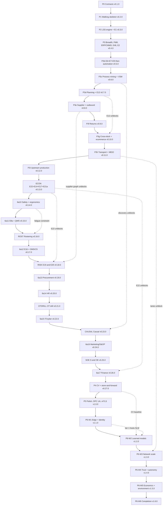

# Roadmap: full phase sequencing, dependency graph, gate registry

Status: design spec section. Authoritative for ordering. Not authoritative for subsystem design.

This section owns the answer to one question: in what order does twinflow get built, and what
forces that order. Every other spec section owns the internals of its subsystem. When this
section and a subsystem section disagree about _when_ something lands, this section wins. When
they disagree about _what_ something is, the subsystem section wins.

---

## 1. Scope

This section places, sequences, and gates every requirement in the source prompt. It covers:

**Numbered components (all of them, for placement only):**
1, 1b, 2, 2b, 3, 4, 5, 6, 6a, 6a2, 6a3, 6a4, 6a5, 6a6, 6a7, 6a8, 6a9, 6a10, 6a11, 6a12, 6a13,
6a14, 6a15, 6a16, 6a17, 6b, 6c, 7, 8, 9.

**Bleeding-edge tier.** The source carries 48 numbered E-entries, E1 through E48. E26 alone
carries seven lettered sub-items, which this section places independently. The placed identifier
set is so the 47 E-items other than E26, plus E26(a) through E26(g), for 54 placed requirement
IDs covering 48 numbered source entries. Both numbers are asserted by the coverage proof so
neither can drift:

E1, E2, E3, E4, E5, E6, E7, E8, E9, E10, E11, E12, E13, E14, E15, E16, E17, E18, E19, E20, E21,
E22, E23, E24, E25, E26 (sub-items a through g placed independently), E27, E28, E29, E30, E31,
E32, E33, E34, E35, E36, E37, E38, E39, E40, E41, E42, E43, E44, E45, E46, E47, E48.

**Engineering craft tier (all 12):**
C1, C2, C3, C4, C5, C6, C7, C8, C9, C10, C11, C12.

**Adoption and scale tier (all 6):**
A1, A2, A3, A4, A5, A6.

**Reference-architecture fidelity paragraph:**
items (a) layer map and ISA-95/Purdue level assignment, (b) Purdue network segmentation in
compose, (c) historian naming, (d) alarm prioritisation and rationalisation, (e) OPC UA bridge,
plus the committed browser-native 3D factory view (tracked here as RA-3D).

**Constraints paragraph (source line 155), each atom given an ID so it can be placed and gated:**

| ID     | Constraint                                                                                | Placed at                                          |
| ------ | ----------------------------------------------------------------------------------------- | -------------------------------------------------- |
| CON-1  | Fully local, no cloud account, optional environment variable for a hosted LLM             | P0 policy, gated from P1 by VAL-GATE-QS-001        |
| CON-2  | An open-source license file in the repository root                                        | P0, VAL-GATE-LIC-001                               |
| CON-3  | GitHub Actions CI running tests and lint                                                  | P0, VAL-GATE-CI-001                                |
| CON-4  | Conventional commits                                                                      | P0, VAL-GATE-CC-001                                |
| CON-5  | IP hygiene: zero client artefacts, employer code, internal documents, or proprietary data | P0, VAL-GATE-IPH-001                               |
| CON-6  | ROADMAP.md as the living backlog, ideas only ever reordered, never deleted                | P0, VAL-GATE-RMAP-001                              |
| CON-7  | The author's stated phase order P1 through P6 and the sensor-category-to-phase mapping    | Section 5.4, VAL-GATE-RMAP-001                     |
| CON-8  | Every phase leaves the repo shippable and the five-minute quickstart intact               | Section 5.3, VAL-GATE-QS-001 and VAL-GATE-DEMO-001 |
| CON-9  | A per-phase tagged release with a CHANGELOG section                                       | P0, VAL-GATE-REL-001                               |
| CON-10 | GitHub Issues as the public face of ROADMAP.md                                            | P0, VAL-GATE-RMAP-001                              |
| CON-11 | mkdocs-material documentation site                                                        | P3, VAL-GATE-DOCSITE-001                           |

CON-2 carries one recorded deviation from the source. Source line 155 names MIT. The project's
licensing decision is Apache-2.0 with a commercial option, recorded in `LICENSING.md` and
`CLA.md`, and doctrine ruling D-14 depends on it. The requirement is not cut and not weakened:
the repository carries a license file, and VAL-GATE-LIC-001 asserts its exact bytes. Only the
license identifier changes, and C11's allowlist reads "Apache-2.0-compatible" throughout this
section for the same reason.

**Locked architecture decisions (source line 28), placed for the first time here:**

| ID     | Decision                                                         | Placed at                                       |
| ------ | ---------------------------------------------------------------- | ----------------------------------------------- |
| ARCH-1 | Discrete-event simulation library                                | P0 recorded in ARCHITECTURE.md, used from P1    |
| ARCH-2 | Local MQTT broker                                                | P1 garage tier, P3 growth tier                  |
| ARCH-3 | Storage layer with a Delta Lake table on the batch path          | P1 historian contract, P3 growth, P5 enterprise |
| ARCH-4 | Anomaly-detection baselines, statistical first, learned second   | P3 with the PdM layer                           |
| ARCH-5 | Agent framework, thin and inspectable, with a local model option | P1 with component 7                             |

ARCH-3 is the one of the five that Law 1 governs. A table format is a storage contract, so the
Delta path is fixed at the same tag as the historian rather than added later. Section 5.8 states
its staging.

**Owned artefacts:** `ROADMAP.md`, `roadmap.yaml`, `requirements.yaml`, `splits.yaml`,
`gates.yaml`, `docs/gates.md`, `docs/dependency-graph.md`, the GitHub milestone and issue
taxonomy, the phase-exit gate runner, and the package `twinflow-roadmap`.

**Explicitly not covered here:** the internal design of any subsystem, the content of any
VAL-GATE beyond its identifier, kind, named reference, asserted tolerance, stated noise floor,
and falsification condition, and the wording of ARCHITECTURE.md.

---

## 2. Package: `twinflow-roadmap`

**Location:** `tools/roadmap/` in the uv workspace. **Distribution name:** `twinflow-roadmap`.
**Import name:** `twinflow_roadmap`. **Console script:** `twinflow-roadmap`.

**Purpose.** Programme management as code. It parses a machine-readable roadmap, proves the
dependency graph is a valid DAG, proves every requirement in the source prompt is placed exactly
once, renders `ROADMAP.md` and the Mermaid dependency graph, synchronises GitHub milestones and
issues, and runs the phase-exit gate suite.

This satisfies A1 on its own terms: a reader who wants only "roadmap as code with a
requirement-coverage proof and GitHub sync" runs `pip install twinflow-roadmap` and gets it with
no simulation dependencies. Its only runtime dependencies are `pydantic`, `pyyaml`,
`networkx`, `jinja2`, and `typer`. `gh` is invoked as a subprocess and is optional; without it,
sync runs in offline diff mode.

**Depends on:** nothing else in the monorepo. It is a leaf. This is deliberate. The roadmap tool
must run on a checkout that does not yet build.

**Public API surface (`twinflow_roadmap/__init__.py`):**

```python
Roadmap.load(path: Path) -> Roadmap
Roadmap.validate() -> list[ValidationError]        # cycles, unknown refs, orphan gates
Roadmap.coverage(requirements: Requirements) -> CoverageReport
Roadmap.graph() -> networkx.DiGraph
Roadmap.topological_waves() -> list[list[WorkPackage]]
Roadmap.render_markdown(template: str | None = None) -> str
Roadmap.render_mermaid(scope: str | None = None) -> str
GateRegistry.load(path: Path) -> GateRegistry
GateRegistry.for_phase(phase_id: str) -> list[Gate]
GitHubSync(repo: str, dry_run: bool = True).plan(roadmap) -> SyncPlan
GitHubSync.apply(plan: SyncPlan) -> SyncResult
```

**CLI surface, all wired into the justfile as the single task entry point (C10):**

| Command                       | What it does                                                                                                                                               |
| ----------------------------- | ---------------------------------------------------------------------------------------------------------------------------------------------------------- |
| `just roadmap validate`       | DAG acyclicity, reference integrity, gate integrity, exit non-zero on any error                                                                            |
| `just roadmap coverage`       | Proves every ID in `requirements.yaml` is placed; prints unplaced IDs                                                                                      |
| `just roadmap render`         | Regenerates `ROADMAP.md`, `docs/gates.md`, and `docs/dependency-graph.md`, then fails if `git diff --exit-code` reports a change on those three paths only |
| `just roadmap sync --dry-run` | Prints the GitHub milestone and issue diff                                                                                                                 |
| `just roadmap sync --apply`   | Applies it through `gh`, refused outside an allowed apply context (6.5)                                                                                    |
| `just roadmap drift`          | CI job: fails if GitHub and `roadmap.yaml` disagree                                                                                                        |
| `just roadmap graph-lint`     | Re-parses the rendered Mermaid and asserts it matches the `roadmap.yaml` graph and is acyclic                                                              |
| `just gate phase-exit P3d`    | Runs every gate the phase-exit invariant requires                                                                                                          |
| `just gate list`              | Prints the gate registry with phase, kind, reference, tolerance, and status                                                                                |

`just roadmap render` names the three generated paths explicitly because the release ritual runs
it after a step that writes README. Scoping the cleanliness check to the three roadmap artefacts
is what keeps step 8 of 5.11 from failing on step 5's intended write.

---

## 3. Domain model

Five entities. All are Pydantic models, all serialise to and from `roadmap.yaml` and
`requirements.yaml`, all validate at load with line-numbered errors per C5.

### 3.1 `Requirement`

The atoms of the source prompt. Extracted once, verbatim, and frozen.

| Field         | Type                                                                                    | Notes                                                                                                                  |
| ------------- | --------------------------------------------------------------------------------------- | ---------------------------------------------------------------------------------------------------------------------- |
| `id`          | `str`                                                                                   | `1`, `1b`, `6a12`, `E26e`, `C7`, `A3`, `RA-b`, `RA-3D`                                                                 |
| `tier`        | `Literal["component","bleeding_edge","craft","adoption","reference_arch","constraint"]` |                                                                                                                        |
| `title`       | `str`                                                                                   | Short label                                                                                                            |
| `source_line` | `int`                                                                                   | Line number in the source prompt, for traceability                                                                     |
| `quote`       | `str`                                                                                   | The clause that defines it, verbatim, so the spec cannot drift from the ask                                            |
| `splittable`  | `bool`                                                                                  | True where this section splits the item across phases: component 9, E4, E5, E8, E10, E21, E25, E26, E35, E36, E43, E46 |

**Invariants.**

- `id` is unique across the file.
- `requirements.yaml` is append-only. A requirement is never deleted. There is no `status:
cut` value in the enum, by construction.
- Every `id` referenced by any work package exists here.
- **A split label is never a requirement ID.** `requirements.yaml` holds source atoms only, each
  with a `source_line` and a verbatim `quote`. `E4a` has no source line and no verbatim clause,
  because the source has only E4. Split labels live in `splits.yaml` (6.3) and reach a work
  package through `Coverage.note`, never through `Coverage.id`. This is what lets the append-only
  diff check stay strict while nine requirements still land in two or three phases each.

### 3.2 `WorkPackage`

The unit of build, the unit of a GitHub issue, and the unit of a commit series.

| Field          | Type                                                  | Notes                                                                             |
| -------------- | ----------------------------------------------------- | --------------------------------------------------------------------------------- |
| `id`           | `str`                                                 | `WP-P3b-03`. Structure is `WP-<phase_id>-<nn>` (6.1)                              |
| `title`        | `str`                                                 | Imperative, one line                                                              |
| `phase`        | `str`                                                 | One of the phase IDs enumerated in 6.1                                            |
| `wave`         | `int`                                                 | Ordering inside a phase; equal waves may run in parallel                          |
| `covers`       | `list[Coverage]`                                      | See below. A bare string is a load error, because a string cannot carry `partial` |
| `depends_on`   | `list[str]`                                           | WorkPackage IDs                                                                   |
| `unblocks`     | `list[str]`                                           | Derived, not authored; rendered for readability                                   |
| `deliverables` | `list[str]`                                           | Concrete artefacts: module path, config key, CLI command, doc page                |
| `gates`        | `list[str]`                                           | Gate IDs this WP must make pass                                                   |
| `brick`        | `str \| None`                                         | Which installable package it lands in (A1)                                        |
| `release`      | `str`                                                 | The tag that ships it                                                             |
| `github_issue` | `int \| None`                                         | Filled by sync                                                                    |
| `status`       | `Literal["planned","in_progress","done","reordered"]` | No `cancelled`, no `wontfix`                                                      |

**`Coverage`, the element type of `covers`.**

| Field     | Type          | Notes                                                                                    |
| --------- | ------------- | ---------------------------------------------------------------------------------------- |
| `id`      | `str`         | A requirement ID that exists in `requirements.yaml`. Never a split label                 |
| `partial` | `bool`        | Default false. True means a later work package also covers this ID                       |
| `note`    | `str \| None` | Required when `partial` is true. Names the split label from `splits.yaml`, such as `E4a` |

A split is written `{id: E4, partial: true, note: "E4a historian contract"}`. The last work
package covering an ID carries `partial: false`, which is what the coverage invariant in 7.2
checks. This is the type that makes the never-cut proof mechanical rather than asserted.

**Invariants.**

- `depends_on` forms a DAG. Cycles are a load error, not a warning.
- A WP's `phase` must not precede the phase of anything in `depends_on`. Within a phase, `wave`
  must be strictly greater than every dependency's wave in the same phase.
- `status: reordered` requires a `moved_to` field naming the new phase and a `reason` string.
  This is the only way an item leaves a phase, and it is how the "never deleted, only reordered"
  rule is mechanised.
- Every `gates` entry exists in the gate registry.

### 3.3 `Phase`

| Field                   | Type        | Notes                                                                                         |
| ----------------------- | ----------- | --------------------------------------------------------------------------------------------- |
| `id`                    | `str`       |                                                                                               |
| `name`                  | `str`       |                                                                                               |
| `delivers`              | `str`       | One paragraph, plain                                                                          |
| `depends_on_phases`     | `list[str]` | Phase IDs only. Resolved against `phases[]`                                                   |
| `requires_requirements` | `list[str]` | Requirement IDs only. Resolved against `requirements.yaml`                                    |
| `unblocks`              | `list[str]` | Derived                                                                                       |
| `release_tag`           | `str`       | `v0.4.0`                                                                                      |
| `exit_gates`            | `list[str]` | Derived, not authored: every gate whose `first_phase` is this phase, plus every standing gate |
| `quickstart_budget_s`   | `int`       | Default 300                                                                                   |
| `demo_budget_s`         | `int`       | Default 600                                                                                   |

Two dependency fields, not one, because the source's own ordering arguments mix the two
namespaces freely: P3d needs phase P3c and requirement E9; 6a10 needs phase ECON and requirement
E6. One list holding both leaves the validator guessing which namespace a token belongs to, and
a token that is legal in both namespaces resolves silently to the wrong one.

**Invariants.**

- Phases form a total order for release purposes even where the DAG allows parallelism. Parallel
  work is expressed by waves inside a phase, never by two open phases, because two open phases
  means two release branches and the repo is public from Phase 1.
- `exit_gates` is generated from `gates.yaml`, never authored in `phases[]`. The phase table in
  5.4 renders from the same derivation. Authoring the two separately is what let the gate lists
  and the gate registry disagree, so the mechanism removes the possibility rather than checking
  for it afterwards.
- A phase ID never ends in a hyphen followed by two digits, so `WP-<phase_id>-<nn>` splits
  unambiguously at its final segment.

### 3.4 `Gate`

| Field           | Type                                                                 | Notes                                                                                  |
| --------------- | -------------------------------------------------------------------- | -------------------------------------------------------------------------------------- |
| `id`            | `str`                                                                | `VAL-GATE-NIST-003`                                                                    |
| `kind`          | `Literal["validation","ground_truth","invariant","budget","policy"]` | See the kind table below                                                               |
| `status`        | `Literal["declared","specified","implemented"]`                      | Lifecycle, see below                                                                   |
| `reference`     | `str \| None`                                                        | Named external published source, with edition or version and a locator                 |
| `reference_url` | `str \| None`                                                        | Must resolve, link-checked in CI                                                       |
| `truth_source`  | `str \| None`                                                        | The generating process and seed set, for `ground_truth` only                           |
| `null_model`    | `str \| None`                                                        | The stated null a `ground_truth` gate must beat                                        |
| `noise_floor`   | `str \| None`                                                        | The measured dispersion of the quantity, required for any gate over a stochastic value |
| `falsified_by`  | `str`                                                                | The observation that fails this gate, in one sentence                                  |
| `assertion`     | `str \| None`                                                        | The literal thing asserted, including tolerance                                        |
| `test_path`     | `str \| None`                                                        | Path to the test that implements it                                                    |
| `first_phase`   | `str`                                                                | Where it starts being enforced                                                         |
| `standing`      | `bool`                                                               | True means it runs at every later phase exit too                                       |
| `owner_section` | `str`                                                                | The spec section that fills `assertion` and `test_path`. One owner per gate            |

**The five kinds, and what each one owes.** Splitting `validation` from `ground_truth` is
doctrine ruling D-11 applied: a non-empty string check passes for the string "the twin itself",
which is exactly the failure the reference field exists to prevent.

| Kind           | Required fields                                                          | What it may claim                                                                 |
| -------------- | ------------------------------------------------------------------------ | --------------------------------------------------------------------------------- |
| `validation`   | `reference`, `reference_url`, `assertion`, `falsified_by`                | Agreement with an artefact published outside this repository                      |
| `ground_truth` | `truth_source`, `null_model`, `noise_floor`, `assertion`, `falsified_by` | Recovery of a structure the simulation generated, scored against a stated null    |
| `invariant`    | `assertion`, `falsified_by`                                              | An internal consistency property that holds by construction or the build is wrong |
| `budget`       | `assertion`, `noise_floor`, `falsified_by`                               | A measured resource ceiling on a named runner                                     |
| `policy`       | `assertion`, `falsified_by`                                              | A repository state that a script can read                                         |

**The status lifecycle.** `gates.yaml` declares every gate ID at Phase 0, which is what forces
subsystem sections to specify their gates one phase ahead. A declared gate has no test on disk
yet, so the on-disk check cannot apply to it.

| Status        | Set when                                                      | Checks that apply                                                      |
| ------------- | ------------------------------------------------------------- | ---------------------------------------------------------------------- |
| `declared`    | The ID and `first_phase` exist, nothing else                  | Unique ID, `first_phase` resolves                                      |
| `specified`   | `assertion`, `falsified_by`, and the kind's fields are filled | The kind's required-field set                                          |
| `implemented` | `test_path` points at a test that exists                      | Everything above, plus `test_path` exists and `reference_url` resolves |

**Invariants.**

- `kind == "validation"` with an empty `reference` or an empty `reference_url` is a load error at
  status `specified` or later. This repository is never its own reference (D-11).
- `kind == "ground_truth"` with an empty `null_model` is a load error at status `specified` or
  later. A ground-truth gate with no null cannot fail honestly.
- A gate referenced by a work package in the current or the next phase must be at least
  `specified`. `just roadmap validate` fails otherwise.
- A gate's exit-gate membership is derived from `first_phase` and `standing`, never authored
  twice.

### 3.5 `Release`

| Field                 | Type        | Notes                                                                           |
| --------------------- | ----------- | ------------------------------------------------------------------------------- |
| `tag`                 | `str`       | semver, per C9                                                                  |
| `phase`               | `str`       |                                                                                 |
| `changelog_section`   | `str`       | Must exist in CHANGELOG.md                                                      |
| `loads_recorded_runs` | `list[str]` | C6 compatibility table: which recorded run formats this release still replays   |
| `loads_configs`       | `list[str]` | Same for facility.yaml versions                                                 |
| `headline_metric`     | `dict`      | The README's measured number, its value, its seed, and the run that produced it |

**Invariant.** `headline_metric.seed` must appear in the recorded run index. A README number
that cannot be traced to a seeded run fails the release gate. This is the roadmap-level
expression of E26(f).

---

## 4. Events

This package is an operations-plane component, not a simulation component, so its events live in
`/schemas/ops/` inside the same registry (C3) rather than a second registry. Same versioning
policy, same additive-only rule, same CI contract tests.

### 4.1 Published

**`ops.gate.evaluated.v1`**

```yaml
gate_id: string # VAL-GATE-EHB-001
phase_id: string
release_tag: string | null
kind: enum[validation, ground_truth, invariant, budget, policy]
outcome: enum[pass, fail, waived]
observed: number | null # the measured value
expected: number | null # the published reference value
tolerance: string # e.g. "rel<=5e-4", "LRE>=7", "coverage>=91/100"
noise_floor: number | null # the measured dispersion the tolerance sits above
null_model: string | null # the null a ground_truth gate must beat
falsified_by: string # the observation that fails this gate
reference: string | null
reference_url: string | null
truth_source: string | null
run_seed: integer | null
ci_run_url: string
ts_wall: timestamp
```

`kind`, `noise_floor`, `null_model`, `falsified_by`, `reference_url`, and `truth_source` are carried on the event because the
`docs/gates.md` renderer and the release dashboard both publish them. A gate whose evidence is
not visible in the artefact a reader opens is a gate nobody audits.

Consumers: the release dashboard page in the docs site, the `docs/gates.md` renderer, and the
README badge generator.

**`ops.release.tagged.v1`**

```yaml
tag: string
phase_id: string
commit_sha: string
quickstart_seconds: number
demo_seconds: number
headline_metric:
  { name: string, value: number, unit: string, seed: integer, run_id: string }
gates_passed: [string]
gates_waived: [{ gate_id: string, reason: string, expires: date }]
recorded_run_formats_supported: [string]
ts_wall: timestamp
```

**`ops.roadmap.drift.v1`**

```yaml
kind: enum[cycle, unplaced_requirement, github_divergence, orphan_gate, banned_label, phase_order_violation]
detail: string
offending_ids: [string]
ts_wall: timestamp
```

**`ops.workpackage.reordered.v1`**

```yaml
wp_id: string
from_phase: string
to_phase: string
reason: string
requirement_ids: [string]
approved_by: string
ts_wall: timestamp
```

This is the only event that records scope movement. There is no corresponding
`ops.workpackage.cancelled` event type, and a CI policy test asserts that no such type is ever
added to the registry.

### 4.2 Consumed

- `ops.ci.job.completed.v1` from the CI reporter, to populate gate outcomes.
- Nothing from the simulation plane. The roadmap tool never imports a simulation package.

---

## 5. Behaviour: the sequencing argument

### 5.1 Four laws that generate the whole order

Every placement decision below follows from one of four laws. Where a placement looks like a
judgement call, it is one of these four applied to a specific clause of the source.

**Law 1: contracts before content.** Anything that constrains the _shape_ of recorded data,
generated code, or published numbers must land before the first byte of that data is recorded.
Retrofitting a contract does not merely cost rework, it invalidates every artefact produced
before it: recorded runs, golden files, the E1 replay bundle, the README's headline number, and
every eval answer. The source already commits to this in C3 ("additive-only evolution within a
major version") and C1 ("identical seed plus config yields byte-identical event logs"). A late
contract change is a major version bump, and a major bump on a public repo at v0.4 reads as a
design that was not thought through.

**Law 2: an item moves ahead of anything whose definition text names it.** The source contains
its own dependency graph in prose. When line 53 says "the yard optimization of E12 becomes
load-bearing here", E12 is a dependency of 6a5 and no argument is needed. Section 5.5 lists
every such sentence found in the source and the move it forces.

**Law 3: an item moves ahead of anything that consumes its output type.** Weaker than Law 2 and
used only where the consumption is unambiguous. Example: 1b's what-if must report an "energy"
delta (line 33), and energy KPIs are E7, so E7 precedes 1b even though line 33 does not name E7.

**Law 4: when two items genuinely need each other, do not reorder, insert a seam.** Section 5.6
lists the nine circular dependencies in the source and the named interface that breaks each
one. The seam is always the _earlier_ item shipping a trivial implementation behind an
interface, and the later item replacing it. Both halves are tracked as work packages, so the
temporary implementation cannot be forgotten.

### 5.2 Why Phase 0 exists

The author's stated order starts at P1, the walking skeleton. Six items in the craft and
adoption tiers cannot live inside P1 because P1 produces the first recorded run, and all six
constrain what a recorded run _is_.

- **C1 determinism.** The seed manifest, splittable RNG topology, and per-subsystem child seed
  derivation determine the byte content of every event log. Introduce it at P2 and every P1
  recording is unreproducible, so every P1 golden file, the P1 README number, and the P1 demo
  script are all rebuilt. The CI lint that bans `time.time`, `datetime.now`, `random.*`, and raw
  sockets outside the kernel package is cheapest when the codebase is 2000 lines and impossible
  to enforce retroactively without an audit of every module. C1 lands at P0 in the two-tier form
  doctrine ruling D-05 sets: byte-identical on the pinned reference runner, value-equivalent
  across the rest of the matrix within a tolerance derived from measured divergence. The scope of
  the claim is itself a P0 contract, because the weaker tier requires a divergence measurement
  that has to run from the first recorded run onward to have a history. The numeric encoding of
  event payloads is locked at the same tag and for the same reason: every float-valued payload
  field is serialised as the shortest decimal string that round-trips to the same IEEE-754
  binary64 value, which makes the serialisation a function of the value alone. That fixes what
  the hash covers. It does not make cross-platform arithmetic identical, which is why D-05's
  second tier exists and why this section never claims byte-identity off the reference runner.
- **The CI reference runner.** Six budgets and two gates in this section are stated "on the
  reference runner", so the runner is a contract, not an environment detail. P0 declares it as a
  named runner image with a pinned digest, recorded in `ci_budget.yaml` and in the provenance
  sidecar of every recorded run. It is the platform on which D-05's byte-identical tier holds,
  the platform VAL-GATE-QS-001 and VAL-GATE-PERF-001 measure against, and the platform whose
  digest change is a deliberate, changelogged event rather than a silent drift in every budget.
- **C2 sim clock.** Every timestamp in every event carries sim time with a recorded wall-clock
  mapping. A timestamp semantics change is a schema major bump.
- **C3 schema registry.** The registry is the mechanism by which packages avoid importing each
  other's internals. Build two packages that import each other first and the boundary never
  recovers. The registry also owns the cross-language codegen path (Python plus Rust), which
  component 2's Rust device agent needs, and owns the reserved-field registry described in 5.9.
  What the Rust binding must contain is decided here rather than at P3, because the codegen
  contract cannot be reopened once schemas are frozen. The Rust agent is a production-mode
  participant and does not join the single-process deterministic scheduler, so the binding
  carries no scheduler hooks. It does carry the stochastic-stream contract that doctrine ruling
  D-06 requires: the agent derives its stream from the run seed and its device id through the
  same name-addressed derivation the Python side uses, specified byte for byte in
  `docs/design/variability-and-faults.md`, and a cross-language conformance test asserts that
  both implementations produce identical draws for the same stream name and seed. Deciding this
  at P0 is what makes R33's contract test buildable at P3 instead of a schema change at P3.
- **C5 config validation.** The source lists the configs it governs: "facility.yaml, sensor
  catalog, spec limits, metrics layer". The metrics layer appearing in that list is the reason
  E26(b) is a Phase 0 item and not a Phase 6 item (see R04 in 5.5).
- **C10 monorepo tooling.** uv workspace layout, the justfile, the CI matrix, path filters, and
  the stated CI wall-time budget. Restructuring a workspace after nine packages exist is a week
  of churn that produces a commit history that reads as a rewrite, which contradicts the "natural
  commit history that tells the story of the build" requirement.
- **A1 package topology.** The brick boundaries and the import-boundary lint. Same argument as
  C3, from the packaging side.

Four more items join Phase 0 for the same reason even though the brief did not name them:

- **C4 test tiers.** The golden-file infrastructure and the per-tier runtime budgets. If golden
  files start at P2, there are no goldens for the P1 capability report or dashboard state, and
  the first regression in P1 code is invisible.
- **C9 versioning and automated releases.** The v0.1.0 tag must come out of the same pipeline as
  v1.0.0 or the release history is inconsistent on inspection, which is exactly the inspection
  the source says hiring managers do ("a repo with v0.3.0 and release notes reads as a
  maintained product").
- **C11 dependency hygiene.** pip-audit, cargo-audit, the Apache-2.0-compatible license allowlist, and
  SBOM generation. Adding a license allowlist after 60 dependencies exist means a triage session;
  adding it at 6 dependencies means it never becomes a problem.
- **E26(b) governed metrics layer.** See R04.
- **CON-2 the license file.** A repository's license governs every byte committed to it from the
  first commit. Adding it at P1 leaves the P0 history under no license, which is the one defect
  a legal review finds instantly. `LICENSE` carries the Apache-2.0 text verbatim, `NOTICE` and
  `LICENSING.md` carry the commercial option, and VAL-GATE-LIC-001 asserts the exact bytes.
- **CON-3 GitHub Actions CI and CON-4 conventional commits.** The platform is GitHub Actions, and
  the workflows live in `.github/workflows/`. Commit-message shape is a history property, and
  history cannot be relinted. `commitlint` runs inside `just check` and on every pull request
  title, which is the C10 justfile contract applied to C9's version computation: the release
  pipeline derives the semver bump from conventional-commit types, so a non-conforming history
  produces a wrong version rather than an untidy log.
- **CON-5 IP hygiene.** The one constraint with legal consequences, and the one that cannot be
  fixed after publication because the repository is public from Phase 1 and a pushed commit is
  permanent. P0 ships the pre-commit banned-terms hook, whose term list lives in a git-ignored
  local file so the names never enter the public repository, plus the weaker generic CI check.
  VAL-GATE-IPH-001 is standing from v0.1.0. The dashboard and replay section owns the hook's
  implementation; this section owns its position.
- **CON-1 fully local.** No cloud account, no API key, no outbound network in the default path.
  This is a P0 policy because it constrains every adapter default and every quickstart step
  written after it. It is gated from P1 by VAL-GATE-QS-001, which runs the quickstart in a
  container with no network route to anything outside the compose network and with no LLM
  environment variable set.

Plus one seam that is a Phase 0 item on a determinism argument:

- **The ENVIRONMENT driver registry (E40's seam).** E40 requires "one correlated weather state
  moving demand by category, lane transit, yard operations, HVAC energy load, and slip risk
  simultaneously". Correlated means one shared state and one RNG child stream, which is a C1
  concern. The registry ships in Phase 0 with a single null driver. Each later phase that
  introduces a weather-sensitive subsystem registers a sensitivity hook at that time, and E40's
  Phase 6 work package only wires the weather process to hooks that already exist. Without the
  registry, E40 in Phase 6 is a retrofit across eleven subsystems.

  The seam only works if a hook's child stream does not depend on how many hooks registered
  before it. Positional derivation would shift every later subsystem's stream each time a phase
  adds a hook, silently invalidating every earlier golden file, which is the retrofit the seam
  exists to prevent. Derivation is so name-addressed, as settled in
  `docs/design/variability-and-faults.md` section A.1: the spawn key is
  `blake2b(stream_name, digest_size=16, person=b"twinflow-rng")` and the generator is `PCG64`
  seeded from a `SeedSequence` over `(base_seed, replication_index)` and that spawn key. A P0
  test registers a synthetic hook, re-derives every existing stream, and asserts every digest is
  byte-identical, so hook order cannot become load-bearing by accident.

**Phase 0's own exit condition is weaker than every later phase**, and the spec says so rather
than pretending otherwise. There is no product at v0.1.0, so there is no five-minute quickstart
and no ten-minute demo. Phase 0 exits when `just check` is green, `just roadmap validate` and
`just roadmap coverage` pass, the determinism harness proves a two-run hash match on a toy
process, and the release pipeline has produced v0.1.0 unattended. From v0.2.0 onward the full
exit invariant applies without exception.

### 5.3 The phase-exit invariant

Every phase from P1 onward ends at a tagged release, and the tag is refused unless all of the
following pass. These are standing gates: they are re-run at every subsequent phase exit, not
just the one that introduced them.

| Gate                  | Kind         | Assertion                                                                                                                                                                                                                                                                                                                                |
| --------------------- | ------------ | ---------------------------------------------------------------------------------------------------------------------------------------------------------------------------------------------------------------------------------------------------------------------------------------------------------------------------------------- |
| `VAL-GATE-QS-001`     | budget       | The five-minute quickstart, executed from a clean container with no route off the compose network and no LLM environment variable set, completes in under 300 seconds wall clock on the pinned reference runner, and its final assertion is a live dashboard serving non-empty state (CON-1)                                             |
| `VAL-GATE-DEMO-001`   | budget       | The ten-minute scripted demo runs headless and green in under 600 seconds on the pinned reference runner, with each scripted beat asserting on an observable, not on a sleep                                                                                                                                                             |
| `VAL-GATE-DET-001`    | invariant    | Two runs at the same seed and config on the pinned reference runner produce byte-identical event logs (C1, D-05 tier 1)                                                                                                                                                                                                                  |
| `VAL-GATE-DET-002`    | invariant    | Across every other CI matrix leg, the same seed and config produce identical business events, and every continuous field agrees within the tolerance derived from the divergence measured at the previous tag. The observed maximum divergence is reported whatever it is (D-05 tier 2)                                                  |
| `VAL-GATE-SCH-001`    | invariant    | Producer and consumer contract tests pass, and the schema differ reports no field removal or type narrowing within a major version (C3)                                                                                                                                                                                                  |
| `VAL-GATE-CFG-001`    | invariant    | Every shipped config validates; every invalid fixture produces a line-numbered, suggestion-bearing error (C5)                                                                                                                                                                                                                            |
| `VAL-GATE-A11Y-001`   | validation   | axe-core reports zero critical or serious violations, the demo path is completable by keyboard alone, severity is encoded by shape and text and not by colour alone, and reduced-motion is honoured (C12)                                                                                                                                |
| `VAL-GATE-SEC-001`    | policy       | pip-audit and cargo-audit clean or waived with an expiry date, license allowlist satisfied, SBOM attached to the release (C11)                                                                                                                                                                                                           |
| `VAL-GATE-LIC-001`    | validation   | `LICENSE` is byte-identical to the Apache License 2.0 text published at apache.org, `NOTICE` exists and is non-empty, and `LICENSING.md` states the commercial option (CON-2)                                                                                                                                                            |
| `VAL-GATE-IPH-001`    | policy       | The banned-terms pre-commit hook is installed and its CI counterpart runs on every pull request; the generic organisation-name check reports zero unreviewed hits across the tree (CON-5)                                                                                                                                                |
| `VAL-GATE-CC-001`     | policy       | Every commit since the previous tag parses as a conventional commit, and the semver bump the pipeline computed from those types equals the tag being cut (CON-4, C9)                                                                                                                                                                     |
| `VAL-GATE-CI-001`     | policy       | Every job in the GitHub Actions matrix declared in `ci_budget.yaml` ran for this commit, none was skipped by a path filter that the filter test does not cover, and lint and tests are both present in the run set (CON-3)                                                                                                               |
| `VAL-GATE-DOC-001`    | policy       | The docs link check passes, the first three lines of README carry the E1 replay URL and exactly one metric marker that resolves to a `headline_metric` in `ops.release.tagged.v1`, and the prose gate reports zero errors. The docs site build is asserted by VAL-GATE-DOCSITE-001 from v0.4.0, since no site exists before CON-11 lands |
| `VAL-GATE-REL-001`    | policy       | CHANGELOG has a section for this tag, semver bump matches the C9 policy for package APIs, REST/MCP contracts, event schemas, and facility.yaml, and the C6 compatibility table lists which recorded runs and configs this release loads                                                                                                  |
| `VAL-GATE-RMAP-001`   | policy       | `roadmap validate`, `roadmap coverage`, `roadmap graph-lint`, and `roadmap drift` all pass; zero requirement IDs unplaced; zero issues carrying a `req:` label closed as not planned; the `wontfix` label does not exist in the repo (CON-6, CON-7, CON-10)                                                                              |
| `VAL-GATE-E1-001`     | invariant    | From v0.3.0 onward: the E1 replay bundle is re-recorded from this tag's code, the static viewer loads it, and the bundle's agent transcript passes the grounding checker                                                                                                                                                                 |
| `VAL-GATE-AGT-001`    | ground_truth | From v0.3.0 onward: the E27 eval suite runs, accuracy and abstention rate are recorded in the release notes, and accuracy above the abstention threshold is at least 0.98                                                                                                                                                                |
| `VAL-GATE-PERF-001`   | budget       | From v0.4.0 onward: the A4 load harness on the pinned reference runner reproduces the curve published at the previous tag, every point inside three times the run-to-run standard deviation measured over the ten calibration runs recorded at v0.4.0, and the knee is restated in the README                                            |
| `VAL-GATE-RELBUD-001` | budget       | The release ritual of 5.11 completes inside the release wall-time ceiling recorded in `ci_budget.yaml`. The ceiling is the sum of the step budgets that 7.5 enforces individually plus the measured duration of the steps that carry no independent budget, re-derived whenever the runner digest changes                                |

`VAL-GATE-QS-001` and `VAL-GATE-DEMO-001` take their ceilings from the source rather than from
this section: line 70 requires a "five-minute docker compose quickstart" and line 15 requires a
system the author can demo in ten minutes. Neither number is chosen here, which is why neither
carries a derivation. Both publish the measured wall time and its run-to-run standard deviation
on the reference runner alongside the pass, so a run that clears its budget by one second reads
as marginal rather than as green.

Two other gates state a tolerance that is measured rather than chosen, and both say so in the
same shape. `VAL-GATE-DET-002` derives its continuous-field tolerance from the divergence
observed at the previous tag, and reports the observed maximum whatever it is, per D-05.
`VAL-GATE-PERF-001` derives its band from the run-to-run standard deviation of the load harness
on the reference runner, measured over ten calibration runs recorded when A4 first ships at
v0.4.0 and re-measured whenever the runner digest changes. Before v0.4.0 the gate has no
calibration and does not run, which is why it carries a `first_phase` of P3 and a start tag
rather than being standing from v0.1.0. A standing gate whose band is defined nowhere passes
because nothing can fail it, and on a shared runner it fails for reasons that have nothing to do
with the code.

`VAL-GATE-DOC-001` no longer asserts that the README "opens with the pitch", which no script can
decide. It asserts what the source actually requires and what a script can read: line 74's "link
it in the first three lines of the README", and one metric marker resolving to the release
event's `headline_metric`.

Two consequences of this invariant deserve to be stated plainly because they shape the whole
build. First, **the demo grows but never breaks**: adding 6a13 procurement does not get to break
the P1 receiving demo, so every phase re-runs every earlier demo beat. Second, **the README
number is regenerated, not edited**: the headline metric is produced by a seeded run at tag time
and written into the README by the release pipeline, so it can never drift from the code.

### 5.4 Phase table

Release numbering: one minor version per phase, with v1.0.0 landing at the end of P5 because
that is where the public artefact set is complete and the package APIs, REST/MCP contracts, and
event schemas stabilise enough for C9's compatibility promises to mean something.

Phase IDs are drawn from one namespace and requirement IDs from another, so the dependency
column is split in two. A phase named after its headline requirement carries a phase ID that is
not a requirement ID: the risk phase is `RISK`, not `E19+E20`, which no identifier grammar can
express, and the four single-requirement phases are `ROST`, `OTDRILL`, `CAUSAL`, and `SOE`.

The gate column is generated from `gates.yaml` by the same derivation that fills
`Phase.exit_gates`, and every range is expanded literally. An abbreviation such as
"NIST-001..004" is what hid a phase mismatch, so the renderer refuses to emit one. Standing
gates are not repeated per row; they run at every phase exit from their `first_phase` onward.

| Phase                                       | Tag        | Delivers                                                                                                                                                                                                                                                                                                                                                                                                                                                                                                 | Depends on (phases)   | Requires (requirements) | Unblocks                             | Phase-specific VAL-GATEs                                                                                                                       |
| ------------------------------------------- | ---------- | -------------------------------------------------------------------------------------------------------------------------------------------------------------------------------------------------------------------------------------------------------------------------------------------------------------------------------------------------------------------------------------------------------------------------------------------------------------------------------------------------------- | --------------------- | ----------------------- | ------------------------------------ | ---------------------------------------------------------------------------------------------------------------------------------------------- |
| **P0 Contracts**                            | v0.1.0     | C1, C2, C3, C4, C5, C9, C10, C11, A1, A2a facility.yaml schema, E26(b), ENVIRONMENT seam, the pinned reference runner, ARCH-1, CON-1, CON-2, CON-3, CON-4, CON-5, CON-6, CON-9, CON-10, `twinflow-roadmap`, `requirements.yaml`, `splits.yaml`, `gates.yaml`                                                                                                                                                                                                                                             | nothing               | nothing                 | everything                           | DET-001, DET-002, SCH-001, CFG-001, SEC-001, LIC-001, IPH-001, CC-001, CI-001, REL-001, RMAP-001                                               |
| **P1 Walking skeleton**                     | v0.2.0     | Component 1 (one station), component 2 (one RFID portal, one temp sensor, UNS topics), E3 Sparkplug payload, E4a event-sourced historian on DuckDB plus a local Delta table (ARCH-3), component 7 (one tool, ARCH-5), E5a autonomy metadata, E26(d), component 8 stub with C12, component 9a README skeleton, A2b micro-fulfillment profile, A3a garage compose with Purdue segmentation (ARCH-2), A6a REST, C8, RA (a)(b)(c) carrying **E36a**, the compute-tier taxonomy and the latency-budget column | P0                    | nothing                 | everything downstream                | QS-001, DEMO-001, A11Y-001, DOC-001, RELBUD-001, SPARK-001, TIER-001                                                                           |
| **P2 The judge**                            | v0.3.0     | Component 5 core (SPC, capability, MSA, hypothesis, findings stream, capability report), component 6 twin-vs-reality sync, component 7 killer what-if tool, **E46a read-zone geometry and read-probability model**, E26(a)(c)(f), E27 v1, E45 cost counters, C6, C7, component 9b measured headline, demo GIF, and the E1 link, then **E1** as the closing work package                                                                                                                                  | P1                    | nothing                 | P3 and everything after; E2          | NIST-001, NIST-002, NIST-003, EHB-001, EHB-002, EHB-005, MSA-001, MSA-002, MTB-001, MTB-002, MTB-003, WE-001, SIM-001, RF-001, AGT-001, E1-001 |
| **P3 Breadth and the business loop**        | v0.4.0     | E2 + E43c1 red team (opening), component 2b catalog (industrial and environmental categories), component 2 Rust agent, component 3 fleet and PdM (ARCH-4), component 6b ERP/CMMS, **E46b antenna what-ifs and read-rate-by-portal charts**, E43a model registry, E35a EPCIS vocabulary, E10a DPP naming, E4b counterfactual replay, RA (d) alarm rationalisation, A2c CONFIGURING.md, A3b growth tier, A4 harness with its ten calibration runs, A6b webhooks, E26(e)(g), CON-11 mkdocs-material site    | P2                    | nothing                 | P3b onward                           | NIST-004, EHB-003, SPARK-002, RF-002, PDM-001, EPCIS-001, WEBHOOK-001, CONFTUT-001, DOCSITE-001, INJ-001, PERF-001                             |
| **P3b Automation and robotics**             | v0.5.0     | **E6, E7, E9 first**, then component 1b (AMR fleet, palletizer, ASRS, sortation, slotting), electrical and power sensor category, warehouse and logistics sensor category, component 7 `compare_scenarios`, A2d 3PL profile                                                                                                                                                                                                                                                                              | P3                    | nothing                 | 3c onward, E11, E12, E23             | ENG-001, OPT-001                                                                                                                               |
| **P3c Process mining and VSM**              | v0.6.0     | Component 5 process mining under `twinflow-procmine`, written here under Apache-2.0 per doctrine ruling D-14 (discovery, conformance, variants, rework, cycle-time contribution), auto-generated current and future state VSM, E25a export framework and the RL scenario-corpus exporter, A5 v1                                                                                                                                                                                                          | P3b                   | nothing                 | E28, E33, E24, E11                   | PM-001, PM-002, PM-003, VSM-001                                                                                                                |
| **P3d Planning**                            | v0.7.0     | Component 6a (demand signal, forecasting arena with interval contract, inventory optimisation, ABC/XYZ, SIOP feedback into truck scheduling), **E12 yard and dock optimisation (tail)**                                                                                                                                                                                                                                                                                                                  | P3c                   | E9                      | 3e onward, 3g, E15, E16, E23, E31    | FCST-001, FCST-002, INV-001, YARD-001                                                                                                          |
| **P3e Supplier and outbound**               | v0.8.0     | Component 6a2 supplier network and scorecards, component 6a3 outbound shipping                                                                                                                                                                                                                                                                                                                                                                                                                           | P3d                   | nothing                 | 3f, 3g, 3h, E19, E41                 | SUP-001, OTIF-001                                                                                                                              |
| **P3f Returns**                             | v0.9.0     | Component 6a4 returns and reverse logistics                                                                                                                                                                                                                                                                                                                                                                                                                                                              | P3e                   | nothing                 | 6a11, E39                            | RET-001                                                                                                                                        |
| **P3g Cross-dock and e-commerce**           | v0.10.0    | Component 6a5 cross-docking, component 6a6 e-commerce fulfilment                                                                                                                                                                                                                                                                                                                                                                                                                                         | P3e                   | E12                     | 6a12, E45                            | XDOCK-001, CART-001                                                                                                                            |
| **P3h Transport and MEIO**                  | v0.11.0    | Component 6a7 transportation network, component 6a8 MEIO (two echelons), fleet and cold-chain sensor category                                                                                                                                                                                                                                                                                                                                                                                            | P3g                   | nothing                 | ECON, E17, E20, E33, E38             | MEIO-001, MEIO-002, GLEC-001, COLD-001                                                                                                         |
| **P3i Upstream production**                 | v0.12.0    | Component 6a9 hybrid factory, ISA-88 recipes, golden batch, equipment OEE and six big losses, SMED, finite-capacity scheduling, source SPC, yield through genealogy, process and chemical sensor category                                                                                                                                                                                                                                                                                                | P3h                   | nothing                 | 6a10 onward, E16 CTP, E37            | OEE-001, BATCH-001, SMED-001                                                                                                                   |
| **ECON Economics prerequisites**            | v0.13.0    | **E22 financial twin**, **E14 tariffs**, **E17 carbon**, **E21a decision register and authority matrix**                                                                                                                                                                                                                                                                                                                                                                                                 | P3i                   | nothing                 | every 6a1x layer, E20, E38, E39, E45 | FIN-001, TAR-001, CBAM-001, GOV-001                                                                                                            |
| **6a10 Safety and ergonomics**              | v0.14.0    | Component 6a10, safety and structural sensor categories, fatigue feedback                                                                                                                                                                                                                                                                                                                                                                                                                                | ECON                  | E6                      | E23, 6a14, E38, E39                  | NIOSH-001, RULA-001, HEIN-001, ERG-SEAM-001                                                                                                    |
| **6a11 QMS and compliance**                 | v0.15.0    | **E8a SOP corpus first**, then component 6a11 (NCR, CAPA, acceptance sampling, CoA, COPQ, audit trail, mock recall drill), E43c2 full red-team corpus                                                                                                                                                                                                                                                                                                                                                    | 6a10, P3f             | nothing                 | E24, E35b, E37, E43                  | EHB-004, Z14-001, CAPA-001, RECALL-001, INJ-002                                                                                                |
| **ROST Rostering**                          | v0.16.0    | E23 labour rostering optimisation                                                                                                                                                                                                                                                                                                                                                                                                                                                                        | 6a10, P3d             | nothing                 | 6a12, 6a14                           | ROST-001                                                                                                                                       |
| **6a12 Order management and service**       | v0.17.0    | **E16 ATP/CTP first**, then component 6a12 (order lifecycle, segmentation, service operation, WISMO, perfect order)                                                                                                                                                                                                                                                                                                                                                                                      | ROST, P3g, P3i        | nothing                 | 6a13, 6a16, E15, E38                 | ATP-001, ORDER-001, PERFORD-001                                                                                                                |
| **RISK Risk illumination and stress**       | v0.18.0    | E19 n-tier illumination, E20 reverse stress testing                                                                                                                                                                                                                                                                                                                                                                                                                                                      | P3e, ECON             | E9                      | 6a13, E33, E38                       | NTIER-001, RST-001                                                                                                                             |
| **6a13 Procurement**                        | v0.19.0    | Component 6a13 procure-to-pay, eRFX, contracts, spend analytics, maverick spend, forward-buy                                                                                                                                                                                                                                                                                                                                                                                                             | ECON, RISK, 6a12      | E14, E17, E19, E20, E22 | 6a17, E37, E41                       | P2P-001, SPEND-001                                                                                                                             |
| **6a14 HR and workforce**                   | v0.20.0    | Component 6a14 hiring, onboarding curves, skills matrix, cross-training, attrition, absenteeism predictor replacing the E23 stub                                                                                                                                                                                                                                                                                                                                                                         | ROST, 6a10            | nothing                 | 6a16, 6a17, E39                      | HR-001, ABSENT-SEAM-001                                                                                                                        |
| **OTDRILL OT drill**                        | v0.21.0    | E18 adversarial chaos scenarios on the Purdue stack, shipping with the minimal static runbook CD9's seam requires                                                                                                                                                                                                                                                                                                                                                                                        | P3                    | RA-b                    | 6a15                                 | OTSEC-001                                                                                                                                      |
| **6a15 IT and cyber ops**                   | v0.22.0    | Component 6a15 ITSM, SRE observability and error budgets, vulnerability economics, IEC 62443 zones, SIEM analog, backup drills, and the ITSM-managed runbook that replaces E18's static one                                                                                                                                                                                                                                                                                                              | OTDRILL, ECON         | E21a                    | E43, E44                             | DORA-001, RPO-001, ZONE-001                                                                                                                    |
| **CAUSAL Causal inference**                 | v0.23.0    | E30 causal graph, estimation, refutation, discovery scored against known truth                                                                                                                                                                                                                                                                                                                                                                                                                           | P3c, ECON             | nothing                 | 6a16, E33                            | CAU-001, CAU-002                                                                                                                               |
| **6a16 Marketing, sales ops, S&OP**         | v0.24.0    | Component 6a16 promotions, cannibalisation, pipeline and forecast bias, NPI cold start, five-step S&OP cycle, decision packet                                                                                                                                                                                                                                                                                                                                                                            | CAUSAL, 6a12, 6a14    | E21a                    | E15, 6a17                            | SOP-001, FVA-001, PROMO-001                                                                                                                    |
| **SOE Sales and operations execution**      | v0.25.0    | E15 weekly execution tick, exception queues, bounded corrective actions measured against the untouched plan                                                                                                                                                                                                                                                                                                                                                                                              | 6a16                  | nothing                 | 6a17                                 | SOE-001                                                                                                                                        |
| **6a17 Finance and accounting**             | v0.26.0    | Component 6a17 event-driven GL, standard costing and variance decomposition, inventory accounting, ABC cost-to-serve, FP&A, capex governance, simulated close, controls                                                                                                                                                                                                                                                                                                                                  | ECON, 6a13, 6a14, SOE | E22                     | E37, E38, E41, E45                   | GL-001, VAR-001, ABC-001, NPV-001                                                                                                              |
| **P4 Vision and edge resilience**           | v0.27.0    | Component 4 CV auditing, **E8b clause citation**, component 6c store-and-forward, QoS, retained messages                                                                                                                                                                                                                                                                                                                                                                                                 | 6a17                  | nothing                 | E29, E36                             | CV-001, SNF-001                                                                                                                                |
| **P5 Polish and protocol**                  | **v1.0.0** | Component 9c README final with the limitations section, demo GIF refresh, capability report artefact, RA(e) OPC UA bridge, mTLS from the internal CA, A5 final, A2b and A2d proven against the demo, A3c Helm chart, A6c GraphQL, C9 stable API promise                                                                                                                                                                                                                                                  | P4                    | nothing                 | P6                                   | MTLS-001, OPCUA-001, ADOPT-001                                                                                                                 |
| **P6-W1 Edge and identity**                 | v1.1.0     | **E36b** bandwidth-saved measurement and graceful-degradation demo over the E36a tier annotations, E44 device lifecycle, E32 edge SLM, E47 hardware in the loop, E34 voice                                                                                                                                                                                                                                                                                                                               | P5                    | nothing                 | E45                                  | EDGE-001, OTA-001, SLM-001, HIL-001                                                                                                            |
| **P6-W2 Learned models**                    | v1.2.0     | E11 RL dispatch, E28 surrogate, E29 VLM copilot, E31 FM bakeoff and conformal, E33 GNN, E43b drift and champion-challenger, E27 incident memory                                                                                                                                                                                                                                                                                                                                                          | P6-W1                 | E25a                    | E42                                  | RL-001, SURR-001, VLM-001, CONF-001, GNN-001, DRIFT-001                                                                                        |
| **P6-W3 Network scale**                     | v1.3.0     | E13 multi-site and federated learning, A2e enterprise network profile, MEIO third echelon follow-up, E42 network design, E41 VMI and VAS, E37 PLM and ECO                                                                                                                                                                                                                                                                                                                                                | P6-W2                 | nothing                 | P6-W4                                | MULTI-001, FED-001, NETDES-001, VMI-001, ECO-001, RECALL-002                                                                                   |
| **P6-W4 Trust, autonomy, authoring**        | v1.4.0     | E35b hash-chained ledger with party signatures, E10b verifiable DPP, E5b L3 autonomy guardrails, E21b role agents under a supervisor, E24 generative SOPs                                                                                                                                                                                                                                                                                                                                                | P6-W3                 | nothing                 | P6-W5                                | LEDGER-001, AUTON-001, MAS-001, SOPGEN-001                                                                                                     |
| **P6-W5 Economics, reporting, environment** | v1.5.0     | E39 ESG/CSRD, E38 insurance, E45 AI FinOps, E48 runbooks and config compliance audits, E40 weather implementation, RA-3D three.js view                                                                                                                                                                                                                                                                                                                                                                   | P6-W4                 | nothing                 | P6-W6                                | ESG-001, INS-001, FINOPS-001, RUNBOOK-001, WX-001                                                                                              |
| **P6-W6 Completion and proof**              | v1.6.0     | E25b full dataset corpus with cards, A4 final published curves, full requirement-coverage proof, capability report regenerated across every subsystem                                                                                                                                                                                                                                                                                                                                                    | P6-W5                 | nothing                 | none                                 | DATA-001, COVER-001                                                                                                                            |

Five phases changed identity here and one changed position. `E23`, `E18`, `E30`, and `E15` were
phase IDs that were also requirement IDs, which made a dependency list ambiguous in both
directions; they are now `ROST`, `OTDRILL`, `CAUSAL`, and `SOE`, and the requirement IDs
continue to name requirements only. The fifth is the risk phase, which had no expressible ID at
all: `E19+E20` matches no identifier grammar, and it is now `RISK`. The Mermaid node names in
5.7 are the phase IDs themselves, with two documented exceptions: a `6a1x` phase carries an `A`
prefix and a `P6-Wn` phase is written `Wn`, because a Mermaid node identifier cannot begin with
a digit or carry a hyphen. `just roadmap graph-lint` applies that one mapping, compares the
rendered diagram against `roadmap.yaml` node for node, and fails on any node it cannot map. The enterprise facility profile moved from P5 and P6-W5, where it appeared
twice under two letters, to P6-W3 alone, because A2e's third profile is a network of sites and
E13 is what supplies the second site. P5 proves the two profiles that exist at that
tag, and the enterprise profile is proved by RECALL-002 at P6-W3.

### 5.4.1 Intra-phase wave assignments

Waves are the section's stated mechanism for parallelism, so every phase whose internal ordering
is load-bearing states its waves here rather than leaving them only in `roadmap.yaml`. A wave
number is strictly greater than every dependency's wave in the same phase, which 7.2 checks. A
phase absent from this table runs all its work packages at wave 1.

| Phase | Wave 1                                             | Wave 2                                        | Wave 3                                      | Wave 4                          |
| ----- | -------------------------------------------------- | --------------------------------------------- | ------------------------------------------- | ------------------------------- |
| P2    | Component 5 core, E46a, E26(a)(c)(f), E45 counters | Component 6 sync, component 7 what-if, E27 v1 | C6, C7, component 9b                        | E1                              |
| P3    | E2, C7 threat-model refresh, E43c1                 | Component 2b, component 2 Rust agent, E46b    | Component 3, component 6b, E43a, E35a, E10a | E4b, A4, A2c, A6b, mkdocs       |
| P3b   | E6, E7, E9                                         | Component 1b, sensor categories               | `compare_scenarios`, A2d                    | none                            |
| P3c   | `twinflow-procmine` discovery and conformance      | Variants, rework, cycle-time contribution     | VSM current and future state                | E25a and the RL corpus exporter |
| P3d   | Demand signal, forecasting arena                   | Interval contract, inventory optimisation     | ABC/XYZ, SIOP feedback                      | E12                             |
| ECON  | E22                                                | E14, E17                                      | E21a                                        | none                            |
| 6a11  | E8a                                                | NCR, CAPA, acceptance sampling                | CoA, COPQ, audit trail, recall drill, E43c2 | none                            |
| 6a12  | E16                                                | Order lifecycle, segmentation                 | Service operation, WISMO, perfect order     | none                            |
| RISK  | E19                                                | E20                                           | none                                        | none                            |
| P6-W1 | E36b measurement, E44                              | E32, E34                                      | E47                                         | none                            |
| P6-W2 | E43b, E27 incident memory                          | E11, E28, E33                                 | E29, E31                                    | none                            |
| P6-W3 | E13                                                | A2e, MEIO third echelon, E41, E37             | E42                                         | none                            |
| P6-W4 | E35b                                               | E10b                                          | E5b, E21b, E24                              | none                            |
| P6-W6 | E25b                                               | A4 final curves                               | Coverage proof, capability report           | none                            |

Four of these rows exist because a reader would otherwise have to infer the ordering from prose.
E20 sits behind E19 because R13 quotes source line 92: E20 "searches for combinations that break
service or cash thresholds", and the combinations it searches come from E19's n-tier map. E10b
sits behind E35b because E10b is defined as the DPP "upgraded to cryptographically verifiable
via E35b". E5b and E21b sit behind the ledger for the same reason, since both consume the signed
decision record. E42 sits behind E13 because network-design candidates are instantiated as
facility.yaml configs and stress-tested across sites, and E13 supplies the sites.

### 5.5 The resequencing register

Fifty-four moves, carrying the identifiers R01 through R51, where R10, R14, and R16 each carry
an `a` row and a `b` row because one source clause forces two separate moves. Every identifier
in that span appears exactly once, and `just roadmap validate` asserts that the register's row
count equals the number of `ops.workpackage.reordered.v1` records in `roadmap.yaml`, so a row
cannot be dropped from the rendered table without failing the build.

Each row names the clause that forces it. `->` means "moved from the author's stated position
to". Every move is recorded in `roadmap.yaml` as an `ops.workpackage.reordered.v1` record with
its reason, so the repo's own history shows the reasoning rather than hiding it.

**Agreed in the brief, restated with the source citation:**

| #    | Move                                 | Forcing clause                                                                                                                                                                                       |
| ---- | ------------------------------------ | ---------------------------------------------------------------------------------------------------------------------------------------------------------------------------------------------------- |
| R01  | C1, C2, C3, C5, C10, A1 -> **P0**    | Law 1. C1's "identical seed plus config yields byte-identical event logs" and C3's "additive-only evolution within a major version" both become false claims if introduced after the first recording |
| R08  | E1 -> **end of P2**                  | Line 74: "the single highest-visibility feature". It needs an event log (P1) and findings plus an agent transcript (P2), and nothing else                                                            |
| R10a | E6 -> **head of P3b**, ahead of 6a10 | Line 58's ergonomics layer scores operators who must already exist; line 33's automation what-ifs must report "operator-impact deltas"                                                               |
| R14a | E14 -> **ECON**, ahead of 6a13       | Line 61: "forward-buy ahead of an announced price increase or tariff scenario (E14 integration)"                                                                                                     |
| R16a | E23 -> **v0.16.0**, ahead of 6a14    | Line 62: "absenteeism and no-show prediction feeding the rostering optimizer (E23)"                                                                                                                  |
| R20  | E30 -> **v0.23.0**, ahead of 6a16    | Line 64: "marketing-mix ROI measured honestly by the causal layer (E30)"                                                                                                                             |

**Found by reading the source, Law 2 (the source names the dependency):**

| #    | Move                                                                               | Forcing clause                                                                                                                                                                                                                                                          |
| ---- | ---------------------------------------------------------------------------------- | ----------------------------------------------------------------------------------------------------------------------------------------------------------------------------------------------------------------------------------------------------------------------- |
| R12  | E12 -> **tail of P3d**, ahead of 6a5 in P3g                                        | Line 53: "the yard optimization of E12 becomes load-bearing here"                                                                                                                                                                                                       |
| R13  | E22 -> **ECON**, ahead of 6a11, 6a12, 6a13, 6a17, E20, E38                         | Line 65: 6a17 is "the layer that graduates the financial twin (E22) from an overlay into a functioning finance department". Line 61: "payment feeding the financial twin's cash cycle". Line 92: E20 searches for combinations that "break service or cash thresholds"  |
| R17  | E16 -> **head of 6a12**                                                            | Line 60: "allocate against ATP/CTP"                                                                                                                                                                                                                                     |
| R18  | E19 and E20 -> **v0.18.0**, ahead of 6a13                                          | Line 61: "quote the savings from volume tiers, the concentration risk from the n-tier map, the resilience cost from reverse stress testing"                                                                                                                             |
| R19  | E18 -> **v0.21.0**, ahead of 6a15                                                  | Line 63: 6a15 "makes the OT-cyber drill (E18) a continuously exercised capability rather than a one-off", and "the ransomware tabletop (E18) now runs against a system that has an incident-response runbook"                                                           |
| R15  | E21a decision register -> **ECON**, ahead of 6a15, 6a16, 6a17                      | Line 63: "the audit trail feeding the decision-governance register". Line 64: "the decision is logged to the governance register". Line 123: "automated retraining triggers with human approval at the governance register"                                             |
| R26  | E36 -> **P6-W1**, ahead of E32                                                     | Line 116: "The edge SLM milestone (E32) deploys at tier 1"                                                                                                                                                                                                              |
| R27  | E13 -> **P6-W3**, ahead of E42, and its own position moves from last to before E42 | Line 122: network-design candidates are "INSTANTIATED as facility.yaml configs and stress-tested operationally", which requires more than one site. Line 56: "forward positions once E13 adds sites"                                                                    |
| R16b | E23 also -> ahead of **6a12**                                                      | Line 60: "service agents as a staffed resource with queues, handle times, and their own rostering"                                                                                                                                                                      |
| R23  | E35a EPCIS vocabulary -> **P3**, at genealogy creation                             | Line 115: "Emit the events in GS1 EPCIS 2.0 format". A private vocabulary translated later changes every recorded genealogy event and the recall drill's shape                                                                                                          |
| R41  | E44 -> ahead of **E47**                                                            | Line 127: the physical device joins "enrolling through the same zero-touch provisioning"                                                                                                                                                                                |
| R14b | E17 -> **ECON**, ahead of 6a13 and 6a17                                            | Line 89: "carbon priced into landed cost so sourcing decisions feel regulation". Line 61 ranks sourcing on tariff-adjusted landed cost, and line 65 decomposes margin into freight and tariff, so the carbon term must exist before either layer computes a landed cost |

**Found by reading the source, Law 3 (output type consumption):**

| #    | Move                                                                        | Argument                                                                                                                                                                                                                                                                                                                                                                                                                                                                                                                                                                                                                                |
| ---- | --------------------------------------------------------------------------- | --------------------------------------------------------------------------------------------------------------------------------------------------------------------------------------------------------------------------------------------------------------------------------------------------------------------------------------------------------------------------------------------------------------------------------------------------------------------------------------------------------------------------------------------------------------------------------------------------------------------------------------- |
| R10b | E7 -> **head of P3b**                                                       | Line 33 requires 1b's what-ifs to answer with "throughput, cost, energy, and operator-impact deltas". Energy KPIs are E7 (line 80), sourced from motor-current sensors. Ship 1b first and the what-if output schema gains a field later, which changes every recorded scenario comparison                                                                                                                                                                                                                                                                                                                                               |
| R11  | E9 -> **head of P3b**                                                       | Line 33's slotting is "optimized on velocity, cube, affinity, and ergonomics", which is a search over assignments. Component 7's `compare_scenarios` ranking is the same harness. Two ad hoc searches now, or one optimiser package (`twinflow-optimize`) reused by E12, E20, E42, and slotting                                                                                                                                                                                                                                                                                                                                         |
| R02  | E3 Sparkplug -> **P1**                                                      | It is the wire format. Locked decision already fixes Sparkplug B v3.0.0 as the payload. Introducing it at P6 means every recorded run before then is in a different format, breaking E1's replay bundles, E4's counterfactual replay, E25's dataset exports, and C6's compatibility table                                                                                                                                                                                                                                                                                                                                               |
| R03  | E4a event-sourced historian -> **P1**                                       | An append-only log with per-run config capture is a storage contract. Build the historian as current-state tables and E4, E1, E25, and 6a11's audit-trail integrity are all impossible without re-recording every run                                                                                                                                                                                                                                                                                                                                                                                                                   |
| R04  | E26(b) governed metrics layer -> **P0**                                     | C5 (line 136) lists "metrics layer" among the configs that must validate against a published schema at load, which places it at the config layer, before any consumer. Independently: component 1 computes takt, cycle time, WIP, utilisation, and OEE from P1. If those are computed inline and later moved into a MetricFlow-style YAML, every published number changes definition and every earlier artefact is wrong                                                                                                                                                                                                                |
| R05  | E26(d) structured outputs -> **P1**                                         | Free under the locked Pydantic AI decision. Every tool call schema-constrained from the first tool means no tool ever has an unvalidated call path                                                                                                                                                                                                                                                                                                                                                                                                                                                                                      |
| R06  | E26(a)(c)(f) -> **P2**                                                      | E1 publishes an agent transcript to the public web at v0.3.0. A public transcript containing an ungrounded number is the exact failure the accuracy stack exists to prevent, and the README claim in line 106 cannot be made retroactively about a transcript already published                                                                                                                                                                                                                                                                                                                                                         |
| R07  | E27 -> **before** E26(e) and E26(g)                                         | Line 105: the abstention threshold is found by measuring "self-consistency agreement on the eval suite". The measurement must exist before the threshold does. The author's numbering has E26 before E27                                                                                                                                                                                                                                                                                                                                                                                                                                |
| R09  | C7 SECURITY.md -> **P2**; E2 MCP and E43c1 -> **head of P3**, in that order | C7 (line 138) requires "a threat-model note for the MCP/REST surface documenting the SQL/Python sandbox boundary". The boundary it documents is E26(a)'s sandbox, which lands at P2, so C7 lands with the boundary it describes and is refreshed at P3 when the surface opens. E43 (line 123) names "an instruction smuggled into a device name, SOP document, or supplier record", which is exactly the risk MCP exposure to third-party clients creates, so the red-team suite opens with the surface                                                                                                                                 |
| R24  | E46 RF physics -> **split across P2 and P3** (see R49)                      | RFID reads are the twin's primary observation from P1. P2 runs a Gage R&R on a measurement process (line 41); if the read process has no physical model, the MSA study measures an abstraction, so the read-zone geometry and read-probability model land at P2. 6b (line 66) reconciles ASN counts against observed reads, and the discrepancy is only interesting when missed and cross reads have a physical origin. Line 126 puts read-rate-by-portal control charts in the fleet-health layer, which is P3, and the antenna-placement what-if is a fleet-health question, so both land at P3                                       |
| R25  | E43a model registry -> **P3**                                               | Line 36 requires "a learned model only if it beats the baseline on labeled synthetic incidents, and report both", which is a champion-challenger comparison with recorded lineage. The first such comparison happens in P3, so the registry must exist there or the comparison is a notebook                                                                                                                                                                                                                                                                                                                                            |
| R29  | C12 dashboard accessibility -> **P1**                                       | Retrofitting keyboard order, ARIA live regions, and shape-plus-text severity encoding is a dashboard rewrite. The source's own argument ("color-only alarm severity is a classic control-room failure") is a design constraint, not a polish item                                                                                                                                                                                                                                                                                                                                                                                       |
| R30  | C6 migration story -> **P2**                                                | E1 puts recorded runs on the public web at v0.3.0. From that tag the CHANGELOG compatibility table has recordings to promise compatibility with, so the migration framework must exist at the same tag                                                                                                                                                                                                                                                                                                                                                                                                                                  |
| R31  | C9 automated release -> **P0**                                              | The first tag must come out of the same pipeline as the last, or the release history is inconsistent under the inspection line 15 says reviewers do                                                                                                                                                                                                                                                                                                                                                                                                                                                                                     |
| R32  | A6a REST -> **P1**                                                          | The dashboard reads through it. Build the dashboard against internal calls and inserting an API later rewrites every dashboard test, and 6a12's "first-contact resolution depending on whether the agent-facing tools can actually see order state (which the twin's own API provides)" depends on that API being the real one                                                                                                                                                                                                                                                                                                          |
| R33  | Rust device agent -> **P3**, after C3 codegen, production mode only         | The locked dual-mode DST decision means simulation mode is one Python process with a deterministic scheduler. A Rust binary cannot participate in that process. The Rust agent runs in production mode and is contract-tested against the Python device model using shared golden vectors generated from the schema registry, so both implementations are proven to produce identical Sparkplug payloads for identical inputs. The codegen contract this rests on, including doctrine ruling D-06's cross-language RNG derivation, is fixed at P0 (5.2), which is what makes the P3 contract test buildable rather than a schema change |
| R28  | E40 seam -> **P0**, hooks per phase, implementation P6-W5                   | One correlated exogenous state driving demand, transit, yard, HVAC, and slip risk simultaneously is an RNG-correlation problem (C1), which makes the driver registry a kernel seam                                                                                                                                                                                                                                                                                                                                                                                                                                                      |
| R37  | Forecast interval contract -> **P3d**, E31 challengers stay in P6           | Line 111: conformal intervals are consumed by "the inventory optimizer". If the optimiser is built against point forecasts, its interface changes at E31. Ship the interface carrying point plus interval plus coverage metadata at P3d, populated by statsforecast's native intervals, and E31 swaps the producer                                                                                                                                                                                                                                                                                                                      |
| R38  | E45 token and cost counters -> **P2**, router and P&L stay in P6            | Line 125 trends cost per answered question on a control chart. A trend needs history, so counters start with the first agent that answers a question                                                                                                                                                                                                                                                                                                                                                                                                                                                                                    |
| R22  | E8a SOP corpus -> **head of 6a11**                                          | Line 59 maps "audit checklists as versioned code mapped to ISO 9001-class clauses"; line 96's E24 revises SOPs "version-controlled in the QMS analog". The corpus and citation-id scheme precede both                                                                                                                                                                                                                                                                                                                                                                                                                                   |
| R21  | E15 -> **after 6a16, before 6a17**                                          | E15 diffs "plan versus simulated actuals" and the plan of record is 6a16's consensus number. Placed before 6a17 so variance decomposition can attribute a variance to an S&OE corrective action                                                                                                                                                                                                                                                                                                                                                                                                                                         |
| R42  | E25a export framework -> **P3c**, with a standing registration rule         | Line 97's first named product is "event logs with injected anomalies for process-mining benchmarks", which needs P3c. From P3c onward, every phase that introduces a labelled phenomenon registers an exporter and a dataset card in the same work package, so the corpus grows continuously instead of being reconstructed at P6                                                                                                                                                                                                                                                                                                       |
| R34  | RL scenario-corpus exporter -> **P3c**, ahead of E11                        | Line 84 requires E11 to be "benchmarked honestly against the rule-based dispatcher on identical scenarios". Identical scenarios are a corpus, and line 97 names "randomized scenario corpora for RL curricula" as an E25 product, so the corpus is E11's real prerequisite. Under R42's standing registration rule the exporter registers with the AMR fleet at P3b and ships inside the export framework at P3c. E11 stays at P6-W2 with that prerequisite named                                                                                                                                                                       |

**Splits (one requirement, two or more phases, no scope lost):**

| #   | Requirement | Split                                                                                                                                                                                                                                                                                                                                                                                                                                                                                                                                           |
| --- | ----------- | ----------------------------------------------------------------------------------------------------------------------------------------------------------------------------------------------------------------------------------------------------------------------------------------------------------------------------------------------------------------------------------------------------------------------------------------------------------------------------------------------------------------------------------------------- |
| R39 | E4          | **E4a** append-only event-sourced historian contract and per-run config snapshot (P1); **E4b** counterfactual replay engine, "rerun yesterday with the second portal installed", and time-travel debugging of a finding (P3, once `run_whatif` and the bi-directional connector exist)                                                                                                                                                                                                                                                          |
| R40 | E5          | **E5a** autonomy tier declared as metadata on every agent tool plus the who-or-what-changed-the-line audit event (P1); **E5b** L3 auto-apply inside guardrails with rollback (P6-W4, needs E21a and the accepted-what-if config flow)                                                                                                                                                                                                                                                                                                           |
| R43 | E8          | **E8a** SOP corpus, retrieval, and clause citation IDs (head of 6a11); **E8b** CV violation binds to the clause it breaks (P4, when the CV auditor exists)                                                                                                                                                                                                                                                                                                                                                                                      |
| R35 | E10         | **E10a** genealogy fields named and documented against EU ESPR DPP vocabulary (P3); **E10b** DPP upgraded to cryptographically verifiable via E35b (P6-W4)                                                                                                                                                                                                                                                                                                                                                                                      |
| R44 | E21         | **E21a** decision register schema, authority tiers, append-only, counterfactual-auditable (ECON); **E21b** role agents negotiating under a supervisor with budgets (P6-W4)                                                                                                                                                                                                                                                                                                                                                                      |
| R45 | E25         | **E25a** export framework, dataset card schema, license recording (P3c); **E25b** full corpus across every labelled phenomenon (P6-W6, fed continuously)                                                                                                                                                                                                                                                                                                                                                                                        |
| R46 | E26         | **(b)** P0; **(d)** P1; **(a)(c)(f)** P2; **(e)(g)** P3 with standing recalibration at every later tag                                                                                                                                                                                                                                                                                                                                                                                                                                          |
| R47 | E35         | **E35a** EPCIS 2.0 event vocabulary at genealogy creation (P3); **E35b** hash chain, Merkle tree, per-party signatures, customer-side verification (P6-W4)                                                                                                                                                                                                                                                                                                                                                                                      |
| R48 | E43         | **E43a** model registry with versions and lineage (P3); **E43b** drift monitors and champion-challenger promotion (P6-W2); **E43c** AI red-team suite, itself split by R50                                                                                                                                                                                                                                                                                                                                                                      |
| R36 | Component 9 | **9a** README skeleton with the pitch, the architecture diagram, and the quickstart (P1); **9b** measured headline, demo GIF of the what-if flow ending in the statistical verdict, and the E1 replay link in the first three lines (P2); **9c** limitations section and the GIF refresh (P5). Line 70 composes component 9 from a measured headline and a verdict that component 5 produces at P2, and line 74 puts the E1 link in the first three lines, so a P1 README that claimed either would be claiming an artefact that does not exist |
| R49 | E46         | **E46a** read-zone geometry and read-probability model as a function of tag orientation, pallet speed, and interference (P2, feeding the Gage R&R of line 41); **E46b** antenna-placement what-if, missed and cross-read generation at fleet scale, and read-rate-by-portal control charts (P3, line 126's fleet-health layer)                                                                                                                                                                                                                  |
| R50 | E43c        | **E43c1** red-team suite over the vectors that exist at P3, device names and finding evidence text, with tool-permission escalation and exfiltration probes (P3); **E43c2** the same suite re-run over the full corpus once SOP documents (E8a, 6a11) and supplier records (6a2, P3e) exist (6a11). Line 123 names all four vectors, and two of them have no data to plant a payload in before 6a11                                                                                                                                             |
| R51 | E36         | **E36a** compute-placement tier taxonomy and the latency-budget column in RA-a's layer map, with every function annotated as it lands (P1, extended per phase); **E36b** bandwidth-saved measurement, decision latency per tier, and the graceful-degradation demo (P6-W1). Line 116 makes the tier annotation a shape constraint on every subsystem, and Law 1 forbids annotating thirty subsystems at v1.1.0                                                                                                                                  |

**Items with no forward dependency found, confirmed in place:**
E24, E28, E29, E31 challengers, E33, E34, E37, E38, E39, E41, E42, E44, E47, E48, E5b, E21b,
E35b. Each carries its prerequisite list in `roadmap.yaml` even though its position did not
move. E11 is not on this list: it has a forward dependency on the scenario corpus, and R34
records the move that resolves it.

**One item pulled forward on the author's own rule.** Line 72 sanctions "pull one forward when
it is nearly free during an earlier phase". E34 (voice) needs only the agent and a local STT/TTS
pair, so it sits in P6-W1 next to the air-gapped edge work where its "works without internet"
argument is strongest, rather than at position 34.

### 5.6 Circular dependency register and the seams that break them

| #   | Cycle                                                                                                  | Seam                                                                                                          | Early half                                                                                                                                                                            | Late half                                                                                                                                                                                                                           |
| --- | ------------------------------------------------------------------------------------------------------ | ------------------------------------------------------------------------------------------------------------- | ------------------------------------------------------------------------------------------------------------------------------------------------------------------------------------- | ----------------------------------------------------------------------------------------------------------------------------------------------------------------------------------------------------------------------------------- |
| CD1 | E23 rostering needs predicted absenteeism; 6a14 HR produces it                                         | `AbsenteeismModel` protocol                                                                                   | E23 ships `ConfiguredRateAbsenteeism` reading `workforce.absenteeism_rate` from facility.yaml                                                                                         | 6a14 ships `BehaviouralAbsenteeism` driven by overtime, strain, and schedule stability, and the E23 gate re-runs                                                                                                                    |
| CD2 | 1b slotting optimises on ergonomics; 6a10 defines the ergonomic index                                  | `ErgonomicScore` protocol                                                                                     | P3b ships `HeightWeightPenalty`, a static rule                                                                                                                                        | 6a10 ships `NioshLiftingIndexScore`, and a regression test asserts the slotting ranking changes and records by how much                                                                                                             |
| CD3 | 6a12 service agents need rostering; E23 needs a workforce; 6a14 supplies hiring                        | Roster supplied as data                                                                                       | E23 lands first with a static headcount from config                                                                                                                                   | 6a14 replaces the headcount source with the hiring pipeline                                                                                                                                                                         |
| CD4 | E20 needs cash thresholds; E22 defines them; 6a17 refines the accounts                                 | `FinancialThresholds` config block                                                                            | E22 defines thresholds in ECON                                                                                                                                                        | 6a17 derives them from the GL and re-runs RST-001                                                                                                                                                                                   |
| CD5 | E27 evals use the twin as ground truth, so a twin change moves the answer                              | Every eval question pins seed plus config hash plus twin version                                              | P2                                                                                                                                                                                    | A twin change that moves an eval answer is an intentional golden update with a CHANGELOG entry and a diff of the affected questions. CI distinguishes "agent regressed" from "twin changed" by re-running the previous twin version |
| CD6 | E43 registry needs models; models need a registry                                                      | Registry first, empty                                                                                         | P3 registry ships with the PdM baseline registered as model zero                                                                                                                      | Every later model registers at creation; a CI check fails if a model artefact exists outside the registry                                                                                                                           |
| CD7 | 6a8 MEIO wants forward positions; E13 supplies extra sites                                             | Echelon count is data                                                                                         | P3h MEIO ships with supplier and DC echelons and a gate at two echelons                                                                                                               | P6-W3 adds forward positions and re-runs MEIO-001 at three echelons                                                                                                                                                                 |
| CD8 | E30 causal needs interventions to estimate; 6a16 promotions are the headline intervention              | Treatment registry                                                                                            | E30 lands with the interventions that already exist: applied what-ifs, supplier disruptions, staffing changes                                                                         | 6a16 registers promotions as an additional treatment and CAU-001 re-runs with the promo DAG                                                                                                                                         |
| CD9 | E18 measures "recovery versus the runbook" (line 90); 6a15 delivers the ITSM-managed runbook (line 63) | `Runbook` document contract: ordered steps, owner, expected duration, and a recovery-point objective per step | OTDRILL ships a minimal static runbook in the chaos catalog, version-controlled as markdown against the same contract, so E18's recovery measurement has something to measure against | 6a15 replaces it with the ITSM-managed runbook carrying change approval and an error budget, and OTSEC-001 re-runs against the replacement with both recovery times reported side by side                                           |

### 5.7 Dependency graph

Phase-level view. Work-package-level edges live in `roadmap.yaml` and render into
`docs/dependency-graph.md`.



E13 supplying the sites that E42 instantiates is an edge inside P6-W3, not between phases, so it
is expressed as a wave constraint in 5.4.1 rather than as a self-loop on the phase node. A phase
graph containing a self-loop is not a DAG, and 7.2's `graph_is_acyclic` invariant admits no third
outcome, so `just roadmap graph-lint` re-parses this rendered block and checks it against
`roadmap.yaml`. A hand-edited diagram cannot diverge from the graph it claims to draw.

### 5.8 Component, craft, and adoption placement

**Numbered components.**

| ID         | Phase(s)                                                                                                                                                           | Note on staging                                                                                                                                    |
| ---------- | ------------------------------------------------------------------------------------------------------------------------------------------------------------------ | -------------------------------------------------------------------------------------------------------------------------------------------------- |
| 1          | P1 (one station), P2 (takt, cycle time, WIP, utilisation, OEE, bottleneck), P3c (VSM summary)                                                                      | The metrics resolve through E26(b) from first computation                                                                                          |
| 1b         | P3b, after E6, E7, E9                                                                                                                                              | Slotting's ergonomic term is CD2's seam                                                                                                            |
| 2          | P1 (2 devices, UNS, Sparkplug), P3 (50+ devices, all failure modes, Rust agent)                                                                                    | Rust agent production-mode only, R33                                                                                                               |
| 2b         | P3 (industrial, environmental), P3b (electrical, warehouse/logistics), P3h (transport/fleet, cold chain), P3i (process/chemical), 6a10 (safety, structural)        | Matches the author's own category-to-subsystem mapping in line 155                                                                                 |
| 3          | P3                                                                                                                                                                 | Registry, FMEA SOD scoring, MTTD, degraded flagging, PdM trends                                                                                    |
| 4          | P4                                                                                                                                                                 | With E8b clause citation                                                                                                                           |
| 5          | P2 (SPC, capability, MSA, hypothesis, findings, capability report), P3c (process mining, VSM)                                                                      | The findings stream schema is a P2 contract every later layer publishes into                                                                       |
| 6          | P2                                                                                                                                                                 | Divergence as a finding requires the findings stream                                                                                               |
| 6a         | P3d                                                                                                                                                                |                                                                                                                                                    |
| 6a2, 6a3   | P3e                                                                                                                                                                |                                                                                                                                                    |
| 6a4        | P3f                                                                                                                                                                |                                                                                                                                                    |
| 6a5, 6a6   | P3g                                                                                                                                                                | 6a5 requires E12                                                                                                                                   |
| 6a7, 6a8   | P3h                                                                                                                                                                | 6a8 at two echelons, third at P6-W3                                                                                                                |
| 6a9        | P3i                                                                                                                                                                |                                                                                                                                                    |
| 6a10..6a17 | v0.14.0..v0.26.0 in the order given, with ECON, E23, E16, E19, E20, E18, E30, E15 interleaved                                                                      | Section 5.4                                                                                                                                        |
| 6b         | P3                                                                                                                                                                 | ERP stub, ASN reconciliation, genealogy, CMMS work orders with deferral cost                                                                       |
| 6c         | P4                                                                                                                                                                 |                                                                                                                                                    |
| 7          | P1 (one tool), P2 (`get_findings`, `run_whatif`, `run_capability_report`, `explain_finding`), P3 (`get_fleet_health`, `get_bottleneck`), P3b (`compare_scenarios`) | Standing rule: every new tool ships with its MCP binding, its autonomy tier, its schema, and at least one eval question, enforced by a parity test |
| 8          | P1 stub, then every phase adds its panel; RA-3D at P6-W5                                                                                                           | C12 gate applies from the stub                                                                                                                     |
| 9          | P1 (9a skeleton), P2 (9b headline, GIF, E1 link), P5 (9c limitations and GIF refresh), regenerated at every tag                                                    | R36. The headline number is produced by the release pipeline, never hand-edited                                                                    |

**Craft tier.**

| ID  | Phase                                  | Argument                                                                                                                                               |
| --- | -------------------------------------- | ------------------------------------------------------------------------------------------------------------------------------------------------------ |
| C1  | P0                                     | R01                                                                                                                                                    |
| C2  | P0                                     | R01                                                                                                                                                    |
| C3  | P0                                     | R01, plus cross-language codegen for R33                                                                                                               |
| C4  | P0 harness, invariants added per phase | Named invariants: monotone clock (P0), material conservation (P1), genealogy closure (P3), ledger balance (ECON)                                       |
| C5  | P0                                     | R01                                                                                                                                                    |
| C6  | P2                                     | R30                                                                                                                                                    |
| C7  | P2, before E2                          | R09                                                                                                                                                    |
| C8  | P1                                     | The repo is public from Phase 1, so CONTRIBUTING, code of conduct, governance note, and good-first-issue labels exist before the first outside visitor |
| C9  | P0                                     | R31                                                                                                                                                    |
| C10 | P0                                     | R01                                                                                                                                                    |
| C11 | P0                                     | Cheapest at 6 dependencies                                                                                                                             |
| C12 | P1                                     | R29                                                                                                                                                    |

**Adoption tier.**

| ID | Staging                                                                                                                                                                                                                                                                                                |
| -- | ------------------------------------------------------------------------------------------------------------------------------------------------------------------------------------------------------------------------------------------------------------------------------------------------------ |
| A1 | P0 topology and import-boundary lint; every phase adds its brick with its own README, tests, and pip install path; the "use just this part" table in the flagship README is regenerated at every tag from package metadata                                                                             |
| A2 | A2a facility.yaml schema (P0); A2b micro-fulfillment profile (P1); A2c CONFIGURING.md, gated by CONFTUT-001 (P3); A2d mid-market 3PL profile (P3b); A2e enterprise network profile (P6-W3, needs E13). P5 asserts that every profile shipped at that tag runs the demo, which at v1.0.0 is A2b and A2d |
| A3 | P1 garage tier (single compose, DuckDB plus a local Delta table on the batch path per ARCH-3, Mosquitto); P3 growth tier (Postgres, EMQX, Delta on object storage); P5 enterprise Helm chart with the adapter stubs named in the source                                                                |
| A4 | P3 harness and first curve; re-run at every tag from v0.4.0 as `VAL-GATE-PERF-001`; final published curves with the stated knee at P6-W6                                                                                                                                                               |
| A5 | P3c v1 (enough modules exist to map maturity stages); final at P5                                                                                                                                                                                                                                      |
| A6 | A6a REST (P1); A6b MCP server (E2), webhooks gated by WEBHOOK-001, and EPCIS export with E35a (all P3); A6c GraphQL (P5)                                                                                                                                                                               |

**Reference-architecture fidelity.**

| ID                                                                       | Phase                       | Note                                                                                                                                                                                         |
| ------------------------------------------------------------------------ | --------------------------- | -------------------------------------------------------------------------------------------------------------------------------------------------------------------------------------------- |
| RA-a layer map with ISA-95 and Purdue levels and real-world counterparts | P1, extended at every phase | The table carries E36a's compute-tier and latency-budget columns from P1. A CI check asserts every package in the workspace appears in the layer map with all four columns filled (TIER-001) |
| RA-b Purdue segmentation in compose                                      | P1                          | A test asserts no device container is reachable from the IT segment, run as part of QS-001                                                                                                   |
| RA-c historian naming                                                    | P1                          | Naming is a contract; renaming later churns every doc and API path                                                                                                                           |
| RA-d alarm prioritisation, dedupe, severity ranking, shelving            | P3                          | Flood risk starts when 50+ devices publish into SPC                                                                                                                                          |
| RA-e OPC UA to MQTT bridge                                               | P5                          | Author placed it in P5; no earlier dependent found                                                                                                                                           |
| RA-3D browser-native 3D view                                             | P6-W5                       | Driven by the same live state feed as the 2D view, so it depends on that feed being stable, which P5 delivers                                                                                |

### 5.9 Reserved-field registry

C3's additive-only rule means a field known to be needed later can be reserved now as optional
and populated later without a major version bump. Reserving is not scope deferral, it is the
mechanism that lets a later phase land without breaking recorded runs. Every reservation names
the work package that fills it, and CI fails if a reserved field is still unpopulated after its
filling work package is marked done.

| Schema               | Reserved field                                         | Reserved at | Filled by                                   |
| -------------------- | ------------------------------------------------------ | ----------- | ------------------------------------------- |
| `genealogy.event`    | `item_revision`                                        | P3          | E37 (P6-W3)                                 |
| `genealogy.event`    | `custody_signature`                                    | P3          | E35b (P6-W4)                                |
| `genealogy.event`    | `embedded_kgco2e`, `emission_factor_ref`               | P3          | E17 (ECON)                                  |
| `finding`            | `failure_signature_id`                                 | P2          | E48 (P6-W5)                                 |
| `finding`            | `sop_clause_ids`                                       | P2          | E8a (6a11), E8b (P4)                        |
| `finding`            | `carbon_kgco2e`                                        | P2          | E17 (ECON)                                  |
| `whatif.result`      | `energy_delta_kwh`                                     | P2          | E7 (P3b)                                    |
| `whatif.result`      | `operator_impact`                                      | P2          | E6 (P3b)                                    |
| `whatif.result`      | `capex_request_id`                                     | P2          | 6a17                                        |
| `device.record`      | `desired_state`, `reported_state`                      | P3          | E44 (P6-W1)                                 |
| `device.record`      | `is_physical`                                          | P3          | E47 (P6-W1)                                 |
| `inventory.position` | `owner_party`                                          | P3d         | E41 (P6-W3)                                 |
| `forecast.result`    | `interval_lower`, `interval_upper`, `nominal_coverage` | P3d         | E31 (P6-W2) populates a calibrated producer |
| `agent.answer`       | `model_id`, `token_cost_usd`                           | P2          | E45 (P6-W5) uses them for routing           |
| `run.manifest`       | `environment_driver_state`                             | P0          | E40 (P6-W5)                                 |

The emissions pair on `genealogy.event` is reserved at P3 rather than added at ECON because
inheritance accumulates on the genealogy edge, not on the finding. E17 requires "cradle-to-gate
kgCO2e inherited through the genealogy graph" (line 89), and a graph whose edges were recorded
without the field cannot be re-traversed for runs that already exist. Reserving both fields at
genealogy creation is what lets ECON populate them without touching a recorded run, which is the
whole purpose of the mechanism.

### 5.10 GitHub milestone and issue structure

The source requires "GitHub Issues used as the public face of ROADMAP.md so the backlog itself
demonstrates program management" and "a ROADMAP.md as the living backlog where every idea (mine,
yours, future additions) is recorded as a milestone with its dependencies; ideas are only ever
reordered, never deleted". The structure below makes both mechanically true rather than
aspirational.

**Single source of truth.** `roadmap.yaml`. `ROADMAP.md` is generated from it and committed.
GitHub is a projection of it. A human never edits `ROADMAP.md` and never creates a roadmap issue
by hand. `just roadmap sync` reconciles.

**Milestones.** One GitHub milestone per phase, titled with the phase ID, the name, and the
target tag, for example `P3d Planning (v0.7.0)`. The milestone description is generated and
contains: what the phase delivers, its `depends_on` phases with links to their milestones, what
it unblocks, its full VAL-GATE list, and the phase-exit invariant checklist. Milestones are
closed by the release pipeline, not by hand, and only after `just gate phase-exit <phase>` is
green.

**Issues.** One issue per work package. The generated body contains, in order:

1. The requirement IDs it covers, each rendered as a blockquote of the verbatim source clause
   from `requirements.yaml`, so anyone reading the issue sees the original ask, not a paraphrase.
2. Deliverables as a task list, one checkbox per artefact (module path, config key, CLI command,
   doc page).
3. `Depends on: #12, #31` and `Blocks: #44`, rendered as GitHub references so the timeline shows
   the graph.
4. The VAL-GATEs this work package must make pass, each with its named reference and tolerance.
5. The brick it lands in and its `pip install` line.
6. A "definition of done" that always ends with the phase-exit invariant reminder.

**Sub-issues.** Where a work package has more than five deliverables, each deliverable becomes a
GitHub sub-issue of the work package issue, so the parent shows a progress bar. The sync tool
creates and reparents these idempotently.

**Labels, all generated and enforced:**

| Prefix             | Example                                                               | Meaning                                                                |
| ------------------ | --------------------------------------------------------------------- | ---------------------------------------------------------------------- |
| `phase:`           | `phase:P3d`                                                           | Phase membership, one per issue                                        |
| `req:`             | `req:E12`, `req:6a13`, `req:C7`                                       | One per covered requirement, many per issue                            |
| `tier:`            | `tier:bleeding-edge`, `tier:craft`, `tier:adoption`, `tier:component` |                                                                        |
| `brick:`           | `brick:twinflow-lss`                                                  | Which installable package                                              |
| `gate:`            | `gate:VAL-GATE-EHB-001`                                               | Which gate it satisfies                                                |
| `wave:`            | `wave:2`                                                              | Parallelism inside a phase                                             |
| `moved`            |                                                                       | Applied when a work package is reordered, with the reason in a comment |
| `good first issue` |                                                                       | C8                                                                     |
| `help wanted`      |                                                                       | C8                                                                     |

**Banned by policy, checked in CI.** The `wontfix` label does not exist in the repository, and
`just roadmap drift` fails if it is created. No issue carrying a `req:` label may be closed as
"not planned". Reordering is expressed by editing `roadmap.yaml`, which moves the issue to a
different milestone, adds the `moved` label, and posts a comment containing the reason string.
This is the enforcement mechanism for "ideas are only ever reordered, never deleted", and it is
visible to anyone browsing the repo, which is the point.

**Projects board.** One GitHub Project (v2) with a Roadmap view grouped by milestone and a Board
view grouped by status. Fields: Phase, Wave, Brick, Gate count, Requirement count. Populated by
sync, never hand-edited.

**Drift detection.** `just roadmap drift` runs in CI on every push to main and on a weekly
schedule. It fails on: an issue whose milestone disagrees with `roadmap.yaml`, an issue whose
`req:` labels disagree with `covers`, a closed issue whose gates are not present in the CI
config, a requirement ID with no issue, a cycle in the graph, a work package placed in a phase
earlier than one of its dependencies, and the existence of a banned label.

### 5.11 The release ritual

Executed by the release workflow at every phase exit, in this order. Any failure aborts before
the tag is pushed.

1. `just check` (lint, type, unit tier, kernel-purity lint for C1).
2. `just test property` (C4 tier 2, within its runtime budget).
3. `just test e2e` (C4 tier 3, seeded, golden-file comparison of the capability report, VSM, and
   financial statements once those exist).
4. `just gate phase-exit <phase>` (standing gates plus this phase's VAL-GATEs).
5. Regenerate the README headline metric from a seeded run; write the value, unit, seed, and run
   ID into README and into `ops.release.tagged.v1`.
6. Re-record the E1 replay bundle from this tag; publish to GitHub Pages; assert the static
   viewer loads it and its transcript passes the grounding checker.
7. Re-run the A4 load harness; update the scaling curve and the stated knee.
8. Regenerate `ROADMAP.md`, `docs/gates.md`, and `docs/dependency-graph.md`, then assert that
   `git diff --exit-code` reports no change on those three paths. The check names the three
   paths and no others. README is written by step 5 on purpose, so a whole-tree cleanliness
   check would fail every release on its own intended output. README has its own check instead:
   the headline value, unit, seed, and run ID written into it must equal the `headline_metric`
   carried by `ops.release.tagged.v1` for this tag.
9. Build SBOM, run license allowlist check, build all bricks, publish to PyPI.
10. Write the CHANGELOG section, including the C6 compatibility table rows.
11. Tag, create the GitHub release, close the milestone, open the next milestone. These are
    milestone-lifecycle operations, the one class of GitHub mutation the release workflow may
    apply without a human (6.5). Issue mutation stays behind an explicit human `--apply`.
12. Publish `ops.release.tagged.v1`, including the measured ritual duration that
    `VAL-GATE-RELBUD-001` reads.

The ritual runs on the pinned reference runner under the release wall-time budget of 7.5, which
is a different budget from the pull-request budget and is stated separately. Steps 6 and 7 are
release-only work: re-recording the E1 bundle and re-running the A4 harness never run on a pull
request, which is why one number cannot cover both jobs.

---

## 6. Configuration

### 6.1 `roadmap.yaml`

Lives at the repo root next to `ROADMAP.md`. Validated against `/schemas/ops/roadmap.v1.json` at
load, per C5, with line-numbered errors.

```yaml
version: 1
phases:
  - id: P3d
    name: Planning
    delivers: >
      Demand signal, forecasting arena with the interval contract, inventory
      optimisation, ABC/XYZ segmentation, SIOP feedback into truck scheduling,
      and E12 yard and dock optimisation.
    depends_on_phases: [P3c]
    requires_requirements: [E9]
    release_tag: v0.7.0
    quickstart_budget_s: 300
    demo_budget_s: 600
    # exit_gates is derived from gates.yaml, never authored here.
work_packages:
  - id: WP-P3d-04
    title: Optimise inbound slotting and dock-door assignment against the twin
    phase: P3d
    wave: 4
    covers:
      - { id: E12, partial: false }
    depends_on: [WP-P3b-01, WP-P3d-03]
    deliverables:
      - packages/twinflow-optimize/src/twinflow_optimize/yard.py
      - facility.yaml key yard.dock_assignment_policy
      - just whatif yard-schedule
      - docs/whatifs/yard-scheduling.md
    gates: [VAL-GATE-YARD-001]
    brick: twinflow-optimize
    release: v0.7.0
    status: planned
```

| Key                              | Type             | Validation                                                                                                                                                                                 |
| -------------------------------- | ---------------- | ------------------------------------------------------------------------------------------------------------------------------------------------------------------------------------------ |
| `version`                        | `int`            | Must equal 1; a change is a schema major bump                                                                                                                                              |
| `phases[].id`                    | `str`            | Unique. The phase identifier grammar is stated below this table, not inside a cell, because a regex containing alternation cannot be written inside a Markdown cell without terminating it |
| `phases[].depends_on_phases`     | `list[str]`      | Each must resolve against `phases[].id`; no cycles                                                                                                                                         |
| `phases[].requires_requirements` | `list[str]`      | Each must resolve against `requirements.yaml`; never a phase ID                                                                                                                            |
| `phases[].release_tag`           | `str`            | Valid semver, strictly increasing across the phase order                                                                                                                                   |
| `phases[].exit_gates`            | `list[str]`      | Derived from `gates.yaml`. Authoring it is a load error, so the phase table and the registry cannot drift apart                                                                            |
| `phases[].quickstart_budget_s`   | `int`            | 1..600, default 300                                                                                                                                                                        |
| `phases[].demo_budget_s`         | `int`            | 1..900, default 600                                                                                                                                                                        |
| `work_packages[].id`             | `str`            | Unique. The work-package identifier grammar is stated below this table                                                                                                                     |
| `work_packages[].covers`         | `list[Coverage]` | A bare string is a load error. Each `covers[].id` must exist in `requirements.yaml`; each `covers[].note` must name a split label defined in `splits.yaml`                                 |
| `work_packages[].depends_on`     | `list[str]`      | Each must exist; DAG; phase order respected; wave order respected inside a phase                                                                                                           |
| `work_packages[].deliverables`   | `list[str]`      | Non-empty; each must be a path, a config key, a command, or a doc page (validated by prefix)                                                                                               |
| `work_packages[].gates`          | `list[str]`      | Each must exist in `gates.yaml` at status `specified` or better                                                                                                                            |
| `work_packages[].brick`          | `str \| null`    | Must match a package name in the uv workspace                                                                                                                                              |
| `work_packages[].status`         | `enum`           | `planned`, `in_progress`, `done`, `reordered`. No other value exists                                                                                                                       |
| `work_packages[].moved_to`       | `str`            | Required when `status == "reordered"`                                                                                                                                                      |
| `work_packages[].reason`         | `str`            | Required when `status == "reordered"`, minimum 20 characters                                                                                                                               |

**The phase identifier grammar.** A phase ID matches one of `P0`, `P1`, `P2`, `P3`, `P3b`
through `P3i`, `P4`, `P5`, `P6-W1` through `P6-W6`, `ECON`, `6a10` through `6a17`, `RISK`,
`ROST`, `OTDRILL`, `CAUSAL`, and `SOE`. The schema carries that closed set as an enumeration,
not as a pattern, and the choice is deliberate: a pattern admitting `E\d+` lets a requirement ID
pass as a phase ID, and a validator reading a dependency list then cannot tell which namespace a
token belongs to. Adding a phase becomes a schema edit and a reviewed diff, which is the correct
cost of adding a release.

**The work-package identifier grammar.** A work-package ID matches
`^WP-(P6-W[1-6]|[A-Za-z0-9]+)-\d{2}$`. The alternation exists because the six `P6-Wn` phases are
the only phase IDs carrying a hyphen, and their branch is tried first, so `WP-P6-W6-01` parses
as phase `P6-W6` and ordinal `01`. The invariant in 3.3 that no phase ID ends in a hyphen
followed by two digits is what makes the final segment unambiguous.

### 6.2 `requirements.yaml`

Append-only. One entry per requirement ID. Contains `id`, `tier`, `title`, `source_line`,
`quote`, `splittable`. Validation: unique IDs, non-empty quote, `source_line` within the source
document's range, and a diff check in CI asserting that no entry was removed or its `quote`
altered relative to the previous commit.

The file holds source atoms only. `E4a` is not an entry here, because the source has only `E4`
and a split label has neither a source line nor a verbatim clause. That restriction is what lets
the diff check stay absolute.

### 6.3 `splits.yaml`

Generated, not authored. One entry per split label, mapping the label to its source requirement
ID and to the work package that covers it. It is the file that reconciles nine split
requirements against an append-only requirements file that never learns their labels.

```yaml
E4a:
  requirement: E4
  work_package: WP-P1-06
  title: Append-only event-sourced historian contract and per-run config snapshot
E4b:
  requirement: E4
  work_package: WP-P3-11
  title: Counterfactual replay engine and time-travel debugging of a finding
```

Validation: every `requirement` resolves against `requirements.yaml` and carries
`splittable: true` there; every `work_package` resolves against `roadmap.yaml`; every label
referenced by a `Coverage.note` appears here; and for each source requirement, exactly one
covering work package carries `partial: false`.

### 6.4 `gates.yaml`

One entry per gate, and every gate ID in this section is declared here at Phase 0. Validation is
scoped by the `status` lifecycle of 3.4, because a gate declared at P0 has no test on disk and
no assertion yet, and a checker that demanded both at P0 would make the declare-everything-early
mechanism impossible to satisfy.

| Status        | What is validated                                                                                                                   |
| ------------- | ----------------------------------------------------------------------------------------------------------------------------------- |
| `declared`    | ID unique, `first_phase` resolves against `roadmap.yaml`, `standing` present                                                        |
| `specified`   | Everything above, plus `assertion` and `falsified_by` non-empty, plus the kind's required-field set from the kind table in 3.4      |
| `implemented` | Everything above, plus `test_path` exists on disk, plus `reference_url` resolves under the CI link check for `kind == "validation"` |

Two further rules hold at every status. Every gate is referenced by at least one work package or
is marked `standing: true`, so a gate cannot exist that nothing runs. A gate referenced by a
work package in the current or the next phase must be at status `specified` or better, which is
the mechanism that forces each subsystem section to specify its gates one phase ahead of
implementing them.

### 6.5 `.roadmap-sync.yaml`

```yaml
repo: <owner>/twinflow
project_number: 1
milestone_title_template: "{phase_id} {name} ({release_tag})"
issue_title_template: "[{phase_id}] {title}"
banned_labels: [wontfix]
create_sub_issues_over: 5
dry_run_default: true
allowed_apply_contexts: [release-workflow]
```

Validation: `repo` matches `^[\w.-]+/[\w.-]+$`; `banned_labels` must contain `wontfix`;
`dry_run_default` must be `true`; and `allowed_apply_contexts` must not contain any context
other than `release-workflow`.

`plan` classifies every operation it emits into one of two classes, and the class decides who
may apply it.

| Class                 | Operations                                                                     | Who may apply                                                                   |
| --------------------- | ------------------------------------------------------------------------------ | ------------------------------------------------------------------------------- |
| `milestone_lifecycle` | Create a milestone, close a milestone, set a milestone due date or description | The release workflow, unattended, since 5.11 step 11 requires exactly this      |
| `issue_mutation`      | Create, edit, relabel, reparent, comment on, move, or close an issue           | A human running `just roadmap sync --apply` from a checkout, never a CI trigger |

A blanket "CI can never apply" assertion is what contradicted the release ritual, so the scope
is named instead of asserted away. Three tests hold the line: `test_drift_job_runs_with_apply_disabled`
asserts the drift job's invocation carries `dry_run=True`; `test_release_context_cannot_mutate_issues`
asserts an `issue_mutation` operation raised inside the release context is refused with an error
naming the operation; and `test_apply_outside_allowed_context_is_refused` asserts an `--apply`
with no context and no interactive checkout exits non-zero without contacting the tracker.

---

## 7. Testing

### 7.1 Unit tests

`tools/roadmap/tests/`

- `test_load_valid_roadmap` parses the shipped `roadmap.yaml` with zero errors.
- `test_cycle_detection` builds a three-node cycle and asserts a `CycleError` naming all three
  work packages in the cycle, not just one.
- `test_phase_order_violation` places a work package in P2 with a dependency in P3 and asserts a
  specific error type and message naming both.
- `test_wave_order_violation` places two work packages in the same phase with equal waves and a
  dependency between them, asserts failure.
- `test_unknown_requirement_reference` asserts the error names the offending ID and the work
  package.
- `test_validation_gate_without_reference` asserts a `kind: validation` gate with an empty
  `reference` is a load error. This is the mechanised form of the hard rule that statistical
  claims name their source.
- `test_status_enum_has_no_cancellation_value` asserts the literal set of allowed status values
  is exactly `{planned, in_progress, done, reordered}`. If someone adds `cancelled`, this fails.
- `test_reordered_requires_reason` asserts `status: reordered` without `moved_to` and a 20+
  character `reason` is a load error.
- `test_render_is_deterministic` renders twice and asserts byte equality.
- `test_sync_plan_is_idempotent` runs `plan` against a fixture tracker state twice and asserts
  the second plan is empty.
- `test_banned_label_detection` asserts a fixture containing `wontfix` fails drift.
- `test_closed_not_planned_with_req_label_fails` asserts an issue closed as not planned carrying
  a `req:` label fails drift.
- `test_work_package_id_accepts_wave_phase` asserts `WP-P6-W6-01` parses to phase `P6-W6` and
  ordinal `01`, and that `WP-P6-W6-1` and `WP--01` are both load errors.
- `test_phase_id_rejects_requirement_id` asserts `E19`, `E19+E20`, and `RA-b` are all rejected as
  phase IDs, and that `RISK`, `ROST`, `OTDRILL`, `CAUSAL`, and `SOE` are accepted.
- `test_covers_rejects_bare_string` asserts `covers: [E4]` is a load error naming the field, and
  that `covers: [{id: E4, partial: true, note: "E4a historian contract"}]` loads.
- `test_partial_coverage_requires_note` asserts `partial: true` with no `note` is a load error.
- `test_split_label_is_not_a_requirement_id` asserts `covers[].id = E4a` is a load error, and
  that `E4a` resolves through `splits.yaml`.
- `test_declared_gate_needs_no_test_path` asserts a gate at status `declared` loads with empty
  `assertion` and `test_path`, and that the same gate at status `implemented` fails when
  `test_path` does not exist on disk.
- `test_gate_referenced_by_next_phase_must_be_specified` asserts a work package in the next phase
  referencing a `declared` gate fails `just roadmap validate`, naming the gate and the phase.
- `test_ground_truth_gate_without_null_model` asserts a `kind: ground_truth` gate with an empty
  `null_model` is a load error, the ground-truth counterpart of the validation-reference check.
- `test_exit_gates_cannot_be_authored` asserts that a `phases[].exit_gates` key present in
  `roadmap.yaml` is a load error, so the derived list has exactly one source.
- `test_register_row_count_matches_reordered_records` asserts the rendered resequencing register
  has one row per `ops.workpackage.reordered.v1` record and that the identifier set has no hole.
- `test_rendered_mermaid_has_no_self_loop` renders the phase graph, re-parses it, and asserts
  `networkx.is_dag` on the result. A self-loop fails it.
- `test_requirements_append_only_over_git_history` walks the real commit history of
  `requirements.yaml` and asserts that no entry was removed and no `quote` altered between
  consecutive commits. It is a deterministic assertion over one corpus, so it lives here rather
  than in 7.2.

### 7.2 Property-based invariants (Hypothesis)

Each is named as the invariant, not as the test. Every entry generates its own inputs, which is
what separates this tier from 7.1.

| Invariant                                                 | Statement                                                                                                                                                                                                                | What generates the input                                                         |
| --------------------------------------------------------- | ------------------------------------------------------------------------------------------------------------------------------------------------------------------------------------------------------------------------ | -------------------------------------------------------------------------------- |
| `graph_is_acyclic`                                        | For any generated roadmap that loads successfully, `networkx.is_dag` holds. The loader either rejects or produces a DAG, and there is no third outcome                                                                   | Arbitrary work packages and dependency edges, including edges that close a cycle |
| `topological_order_respects_phase_order`                  | For every edge `u -> v`, `phase_index(u) <= phase_index(v)`, and when the two are equal, `wave(u) < wave(v)`                                                                                                             | Arbitrary phase and wave assignments over a generated edge set                   |
| `every_requirement_placed_exactly_once_or_marked_partial` | The union of the `covers[].id` values equals the ID set of `requirements.yaml`; any ID appearing more than once carries `partial: true` on every occurrence except the last, and `partial: false` on the last            | Arbitrary coverage assignments, including duplicates with and without the flag   |
| `append_only_checker_rejects_every_deletion`              | For any generated pair of requirement files where the second is the first plus appended entries, the checker accepts; for any pair where an entry was removed or a `quote` altered, the checker rejects and names the ID | Generated file pairs, so the property covers edits that have not happened yet    |
| `render_round_trips`                                      | Parsing the rendered `ROADMAP.md` back through the parser yields the same work-package IDs, phases, and dependency edges as the source YAML                                                                              | Arbitrary valid roadmaps                                                         |
| `sync_plan_is_a_pure_function_of_state`                   | For any roadmap and any tracker state, `plan` called twice returns equal plans, and `apply(plan)` followed by `plan` returns an empty plan                                                                               | Arbitrary tracker states, including partially synced ones                        |
| `gate_ids_are_stable`                                     | A gate ID present in any released tag's `gates.yaml` is present in every later `gates.yaml`. Gates are never renamed, because release notes cite them                                                                    | Arbitrary sequences of gate-registry edits                                       |
| `no_work_package_is_orphaned`                             | Every work package belongs to a declared phase, and every phase holds at least one work package                                                                                                                          | Arbitrary roadmaps, including ones with an empty phase                           |
| `monotone_release_tags`                                   | Parsed semver tags are strictly increasing along the phase order, and a major component increments only where a C9 trigger is present in the same release record                                                         | Arbitrary tag sequences paired with generated release records                    |

`monotone_release_tags` needs a decision procedure, so the C9 triggers it reads are enumerated
here rather than referred to. A major bump is permitted, and only permitted, when the release
record for that tag carries at least one of: a package public symbol removed or renamed; a REST
or MCP contract field removed or a type narrowed; an event schema major version incremented; or
a `facility.yaml` key removed or renamed. Absent all four, a major bump fails the property. This
is the same trigger list that `VAL-GATE-REL-001` checks against the actual diff, so the property
and the gate cannot disagree.

The append-only rule appears here as a property over generated file pairs and in 7.1 as a
deterministic walk of the real git history. The two are different claims. The property proves
the checker is correct for edits nobody has made yet; the history test proves no edit so far has
violated it. Calling the history walk a property would have hidden that it proves nothing about
future commits until they exist.

### 7.3 Seeded end-to-end scenarios

| Scenario                          | Procedure                                                                                                | Assertion                                                                                                                                                                             |
| --------------------------------- | -------------------------------------------------------------------------------------------------------- | ------------------------------------------------------------------------------------------------------------------------------------------------------------------------------------- |
| `E2E-RMAP-01 cold sync`           | Sync the full roadmap into an empty fixture tracker                                                      | The exact count of milestones, issues, sub-issues, and labels created matches the expected count, and every issue body carries the verbatim source quote for each covered requirement |
| `E2E-RMAP-02 reorder`             | Move one work package from P6-W5 to P3 in `roadmap.yaml` with a reason, then re-sync                     | The issue changed milestone, gained the `moved` label, gained a comment carrying the reason string, and was never closed                                                              |
| `E2E-RMAP-03 attempted deletion`  | Remove a requirement from `requirements.yaml`                                                            | CI fails, and the failure names the removed ID and the commit that removed it                                                                                                         |
| `E2E-RMAP-04 phase exit`          | Run `just gate phase-exit P1` against a fixture repo where QS-001 exceeds its budget by one second       | The tag is refused, and the failure names the gate, the budget, and the measured value                                                                                                |
| `E2E-RMAP-05 full coverage proof` | Run `just roadmap coverage` against the shipped `requirements.yaml`, `splits.yaml`, and `roadmap.yaml`   | Zero unplaced IDs, and both counts printed: 54 placed requirement IDs in the bleeding-edge tier, covering the source's 48 numbered E-entries                                          |
| `E2E-RMAP-06 sync apply refusal`  | Run `just roadmap sync --apply` with an `issue_mutation` operation in the plan under the release context | The operation is refused, the error names it, and no tracker call is made                                                                                                             |

`E2E-RMAP-05` prints two numbers because one number was ambiguous. The bleeding-edge tier holds
47 E-items other than E26, plus E26(a) through E26(g), for 54 placed identifiers, and those 54
identifiers cover the 48 numbered E-entries the source writes. The proof also covers all 30
numbered components, all 12 C-items, all 6 A-items, the 11 CON-items, the 5 ARCH decisions, the
5 reference-architecture items, and RA-3D. Every one of those counts is asserted, so a silent
drop shows up as a count mismatch rather than as a missing line nobody reads.

### 7.4 VAL-GATE registry

This registry is authoritative for gate identity, kind, named reference, asserted tolerance, and
first phase. The subsystem sections own how each is computed. Gates marked standing re-run at
every later phase exit from their first phase onward.

Three rules govern every row. They are doctrine ruling D-11 in force here, not a summary of it.
A `validation` gate names an artefact published outside this repository, with edition and
locator, and its tolerance is never tighter than the precision that artefact prints. A
`ground_truth` gate names the generating process and the seed set it recovers, plus the null it
must beat, because a recovery score with no null cannot fail honestly. A quantity with no valid
external reference is recorded as an open question in section 9 and is never recorded as a
passing gate.

**Standing gates, defined in 5.3, with the tag their enforcement starts at:** QS-001 (v0.2.0),
DEMO-001 (v0.2.0), DET-001 (v0.1.0), DET-002 (v0.1.0), SCH-001 (v0.1.0), CFG-001 (v0.1.0),
A11Y-001 (v0.2.0), SEC-001 (v0.1.0), LIC-001 (v0.1.0), IPH-001 (v0.1.0), CC-001 (v0.1.0),
CI-001 (v0.1.0), DOC-001 (v0.2.0), REL-001 (v0.1.0), RELBUD-001 (v0.2.0), RMAP-001 (v0.1.0),
E1-001 (v0.3.0), AGT-001 (v0.3.0), PERF-001 (v0.4.0).

**Numerical core, NIST Statistical Reference Datasets.** StRD is NIST Standard Reference
Database 140, DOI 10.18434/T43G6C, published at `https://www.itl.nist.gov/div898/strd/`, whose
data content was last revised in 2003. Its certified values are computed in extended precision
and published to 15 significant digits, which is why the assertions below are stated as a log
relative error rather than as a fraction of a printed value. StRD covers univariate summary
statistics, analysis of variance, and linear and nonlinear regression. It does not cover control
charts or capability, which is why the SPC gates cite a different source. All four gates are
`kind: validation`.

| Gate                | Dataset set                                                                                                          | Assertion                                                                                                                                                                                                                                 | Falsified by                                                                       | Phase |
| ------------------- | -------------------------------------------------------------------------------------------------------------------- | ----------------------------------------------------------------------------------------------------------------------------------------------------------------------------------------------------------------------------------------- | ---------------------------------------------------------------------------------- | ----- |
| `VAL-GATE-NIST-001` | Univariate summary: Lottery, Lew, Mavro, Michelso, NumAcc1-4, PiDigits                                               | Log relative error of mean, standard deviation, and lag-1 autocorrelation against certified values is at least 13 digits for all sets except NumAcc4, where at least 10 is asserted and the shortfall is documented in the test docstring | Any listed set whose LRE falls below its stated floor                              | P2    |
| `VAL-GATE-NIST-002` | One-way ANOVA: SiRstv, SmLs01-09, AtmWtAg                                                                            | LRE of the F statistic and of between and within mean squares is at least 10 for the low-difficulty sets and at least 8 for SmLs07-09                                                                                                     | Any listed set whose LRE falls below its stated floor                              | P2    |
| `VAL-GATE-NIST-003` | Linear regression: Norris, Pontius, NoInt1, NoInt2, Filip, Longley, Wampler1-5                                       | LRE of every estimated coefficient and of the residual standard deviation is at least 7 on Filip and at least 10 on all others, with the solver documented as QR or SVD, never normal equations                                           | Any coefficient below its floor, or a solver change to normal equations            | P2    |
| `VAL-GATE-NIST-004` | Nonlinear regression: Misra1a, Chwirut1-2, Gauss1-3, Thurber, BoxBOD, Rat42, Rat43, MGH09, MGH10, Bennett5, Eckerle4 | Run from StRD start values 1 and 2; LRE of every parameter is at least 4 from start 2, and the result from start 1 is recorded even where it fails to converge, with the failure documented rather than hidden                            | Any parameter below LRE 4 from start 2, or a start-1 failure that the report omits | P3    |

**SPC and capability, NIST/SEMATECH e-Handbook of Statistical Methods, chapter 6, "Process or
Product Monitoring and Control", published at
`https://www.itl.nist.gov/div898/handbook/pmc/pmc.htm`.** This, not StRD, is the SPC reference,
because StRD certifies no control-chart or capability quantity. The e-Handbook prints its worked
results as rounded printed values, typically to four significant figures: its capability example
in section 6.1.6 prints Cpk as 0.6667 and Cpl as 1.3333. A relative tolerance of 1e-9 against a
value printed to four figures is not a stricter test, it is an unsatisfiable one, so each gate
below carries two tolerances and reports both.

The printed tolerance checks agreement with the published example to half a unit in the last
printed place of each published value. The estimator tolerance checks the quantities underneath
the example, where a certified value exists, against StRD at LRE 10 or better. Recording both
makes the difference between them visible, so a reader is not left to assume that one loose
number was a rounding error nobody checked. All five gates are `kind: validation`.

| Gate               | Locator and worked example                                              | Printed tolerance                                                                                                                                    | Estimator tolerance                                                                                                    | Phase |
| ------------------ | ----------------------------------------------------------------------- | ---------------------------------------------------------------------------------------------------------------------------------------------------- | ---------------------------------------------------------------------------------------------------------------------- | ----- |
| `VAL-GATE-EHB-001` | 6.3.2 "What are Variables Control Charts?", X-bar and R and individuals | Centre line and both control limits match every digit the handbook prints, to half a unit in the last place, using the published unbiasing constants | The sample mean and sample standard deviation underneath the limits are checked against StRD univariate sets at LRE 13 | P2    |
| `VAL-GATE-EHB-002` | 6.1.6 "What is Process Capability?", capability worked example          | Cp, Cpk, Pp, Ppk, sigma level, and DPMO match every printed digit to half a unit in the last place                                                   | The mean and standard deviation feeding each index are checked against StRD at LRE 13                                  | P2    |
| `VAL-GATE-EHB-003` | 6.3.4 "What are Multivariate Control Charts?", Hotelling T squared      | The T squared statistic and its upper control limit match every printed digit to half a unit in the last place                                       | The covariance inverse is checked against a QR-based reference solve at LRE 10                                         | P3    |
| `VAL-GATE-EHB-004` | 6.2 "Test Product for Acceptability: Lot Acceptance Sampling", OC curve | OC curve points at the published (p, Pa) pairs match every printed digit to half a unit in the last place                                            | The binomial and hypergeometric tail probabilities are checked against exact rational arithmetic at LRE 12             | 6a11  |
| `VAL-GATE-EHB-005` | 6.3.2.4 "EWMA Control Charts", worked EWMA example                      | The EWMA statistic and its variance-adjusted limits match every printed digit to half a unit in the last place                                       | The recursion is checked against a closed-form expansion of the same weights at LRE 12                                 | P2    |

Each of the five is falsified the same way: any published digit that disagrees at the printed
tolerance, or any underlying estimator below its stated LRE floor. A gate that passes the
printed check while failing the estimator check reports both, because agreeing with a rounded
printout is not evidence that the estimator is right.

**Measurement system analysis.** The AIAG Measurement Systems Analysis Reference Manual, 4th
edition, is a paid standard and is not redistributable. The fixture encodes only the study's
data values, and the test docstring cites the manual by edition and by the caption of the table
it reproduces rather than reprinting the table. This section names AIAG as the source and does
not state its numbers as independently established fact, because the primary text is behind a
paywall and this repository has not retrieved it.

| Gate               | Kind         | Reference and assertion                                                                                                                                                                                                                                                                                                                             | Phase |
| ------------------ | ------------ | --------------------------------------------------------------------------------------------------------------------------------------------------------------------------------------------------------------------------------------------------------------------------------------------------------------------------------------------------- | ----- |
| `VAL-GATE-MSA-001` | validation   | AIAG MSA 4th edition, the long-form ANOVA Gage R and R worked study, repeatability error term. The full ANOVA table and the %Study Var, %Tolerance, and ndc figures match every digit the manual prints, to half a unit in the last printed place                                                                                                   | P2    |
| `VAL-GATE-MSA-002` | validation   | AIAG MSA 4th edition, Appendix A convention, operator-by-part interaction error term, cross-checked against R `SixSigma::ss.rr(errorTerm="interaction")` on the same data. Both error-term results are printed side by side in the capability report, so the choice is visible rather than hidden, and both match their source to the printed place | P2    |
| `VAL-GATE-SIM-001` | ground_truth | See the ground-truth table below                                                                                                                                                                                                                                                                                                                    | P2    |

**Minitab documentation examples.** Small datasets encoded in the test suite with the specific
documentation page cited in the docstring, and no bulk redistribution. All three are
`kind: validation`, and each asserts agreement to half a unit in the last digit the cited page
prints.

| Gate               | Reference                                                    | Assertion                                                                                                                                                  | Phase |
| ------------------ | ------------------------------------------------------------ | ---------------------------------------------------------------------------------------------------------------------------------------------------------- | ----- |
| `VAL-GATE-MTB-001` | Minitab p-chart documentation example                        | Proportions, centre line, and the variable control limits match every printed digit to half a unit in the last place                                       | P2    |
| `VAL-GATE-MTB-002` | Minitab Pareto chart documentation example                   | Category ordering matches exactly, and cumulative percentages match every printed digit to half a unit in the last place                                   | P2    |
| `VAL-GATE-MTB-003` | Minitab two-sample t and Mann-Whitney documentation examples | Statistic, degrees of freedom, p-value, and confidence interval match to the printed place, and the assumption checker selects the same test the page used | P2    |

**Rule sets.** `VAL-GATE-WE-001` is `kind: validation`. Its reference is two published
documents, cited separately because they are two different rule sets that the industry
routinely conflates. Nelson's eight tests are published in Lloyd S. Nelson, "The Shewhart
Control Chart - Tests for Special Causes", Journal of Quality Technology 16(4), 237-239,
October 1984, DOI 10.1080/00224065.1984.11978921. The four zone rules are attributed to the
Western Electric Statistical Quality Control Handbook, which this section names as the source
and does not quote, since its text has not been retrieved here.

| Gate              | Assertion                                                                                                                                                                                     | Falsified by                                                                         | Phase |
| ----------------- | --------------------------------------------------------------------------------------------------------------------------------------------------------------------------------------------- | ------------------------------------------------------------------------------------ | ----- |
| `VAL-GATE-WE-001` | For each of the 8 Nelson tests and each of the 4 Western Electric zone rules, a hand-constructed minimal series triggers exactly that rule and no other, and a near-miss series triggers none | Any series that triggers a second rule, or a near-miss series that triggers any rule | P2    |

**Process mining.** Doctrine ruling D-14 places `twinflow-procmine` inside this repository under
Apache-2.0, because PM4Py and `pm4pyminimal` are AGPL-3.0 at version 2.7.23.3, verified against
the package index, and AGPL section 13 reaches a served dashboard, MCP server, and HTTP API.
Owning the miner is what makes `VAL-GATE-PM-003` possible: PM4Py stays available as a
development-only oracle, compared against in CI without being distributed or served, which gives
the discovery and conformance gates a real external reference under D-11 that a self-written
miner otherwise could not have. That arrangement is subject to the owner's legal read before
release, recorded as an open question in section 9.

| Gate              | Kind       | Assertion                                                                                                                                                                                                                                                                                                                               | Falsified by                                                                        | Phase |
| ----------------- | ---------- | --------------------------------------------------------------------------------------------------------------------------------------------------------------------------------------------------------------------------------------------------------------------------------------------------------------------------------------- | ----------------------------------------------------------------------------------- | ----- |
| `VAL-GATE-PM-003` | validation | On the shipped noise-free log and on each of the ten noise levels of PM-002, the directly-follows graph, the discovered Petri net's place and transition sets, and the token-replay fitness computed by `twinflow-procmine` equal those computed by PM4Py 2.7.23.3 running as a CI-only oracle, fitness to a relative tolerance of 1e-9 | Any structural difference in the discovered net, or a fitness difference above 1e-9 | P3c   |

**Protocol and format conformance.** All four are `kind: validation`. The Sparkplug reference is
version 3.0.0, which is the current release recorded at
`https://projects.eclipse.org/projects/iot.sparkplug`, retrieved 2026-08-09.

| Gate                 | Reference                                                           | Assertion                                                                                                                                          | Phase |
| -------------------- | ------------------------------------------------------------------- | -------------------------------------------------------------------------------------------------------------------------------------------------- | ----- |
| `VAL-GATE-SPARK-001` | Eclipse Sparkplug B v3.0.0 TCK, edge node profile                   | The TCK edge-node profile passes with zero failures against a device publishing NBIRTH, DBIRTH, NDATA, and NDEATH with metric aliasing             | P1    |
| `VAL-GATE-SPARK-002` | Eclipse Sparkplug B v3.0.0 TCK, host application profile            | The host profile passes with zero failures                                                                                                         | P3    |
| `VAL-GATE-EPCIS-001` | GS1 EPCIS 2.0 JSON schema and JSON-LD context                       | Every published genealogy document validates against the published schema and resolves against the published context                               | P3    |
| `VAL-GATE-OPCUA-001` | OPC UA specification part 4 services subset exercised by the bridge | The bridge's browse and read responses validate against an independent OPC UA client library, and every bridged node maps to exactly one UNS topic | P5    |

**Domain-specific published references.** All rows here are `kind: validation`. Two of them
carry a retrieval note in place of a clean citation, and the note is part of the row: a confident
sentence about a source nobody could open is the failure this registry exists to catch.

| Gate                 | Reference                                                                                                                                                                                                                                                                                                                        | Assertion                                                                                                                                                                                                                       | Phase |
| -------------------- | -------------------------------------------------------------------------------------------------------------------------------------------------------------------------------------------------------------------------------------------------------------------------------------------------------------------------------- | ------------------------------------------------------------------------------------------------------------------------------------------------------------------------------------------------------------------------------- | ----- |
| `VAL-GATE-NIOSH-001` | NIOSH Applications Manual for the Revised NIOSH Lifting Equation, publication 94-110 (1994, United States government work). The publisher's site refused automated retrieval on 2026-08-09 with HTTP 403, so the edition is named here from the citation and not from retrieved text                                             | Recommended Weight Limit and Lifting Index match every published worked example to half a unit in the last printed place                                                                                                        | 6a10  |
| `VAL-GATE-RULA-001`  | McAtamney and Corlett, "RULA: a survey method for the investigation of work-related upper limb disorders", Applied Ergonomics 24(2), 91-99, 1993, DOI 10.1016/0003-6870(93)90080-S; and Hignett and McAtamney, "Rapid Entire Body Assessment (REBA)", Applied Ergonomics 31(2), 201-205, 2000, DOI 10.1016/S0003-6870(99)00039-3 | Grand scores match the published worked postures exactly, since both scores are integers and admit no tolerance                                                                                                                 | 6a10  |
| `VAL-GATE-Z14-001`   | ANSI/ASQ Z1.4 sample size code letters and single sampling plans, for the specific lot sizes and AQLs the demo exercises                                                                                                                                                                                                         | Code letter, sample size, and Ac and Re numbers match the published table exactly, and switching rules follow the published normal-tightened-reduced logic on a scripted lot sequence                                           | 6a11  |
| `VAL-GATE-GLEC-001`  | The transport emission-factor edition named in `gates.yaml`. The publisher's site refused automated retrieval on 2026-08-09 with HTTP 403, so no edition is asserted here. The gate stays at status `declared` until the edition and a published worked leg are recorded, per open question 3                                    | Computed per-leg kgCO2e reproduces a published worked leg to half a unit in the last printed place, for each modelled mode. A hand calculation written alongside the code is not a reference and is not accepted                | P3h   |
| `VAL-GATE-CBAM-001`  | The published CBAM declaration field set                                                                                                                                                                                                                                                                                         | Every generated declaration carries every required field and validates against the declaration schema, and embedded emissions inherited through genealogy sum to the sum of contributing legs to 1e-9                           | ECON  |
| `VAL-GATE-MEIO-002`  | Graves and Willems, "Optimizing Strategic Safety Stock Placement in Supply Chains", Manufacturing and Service Operations Management 2(1), 68-83, 2000, DOI 10.1287/msom.2.1.68.23267, as corrected by the erratum at MSOM 5(2), 176-177, 2003, DOI 10.1287/msom.5.2.176.16074                                                    | The implemented guaranteed-service-time recursion reproduces a worked network published in that paper to the printed precision. The gate stays at status `declared` until a worked instance is transcribed, per open question 4 | P3h   |

The erratum is named because it corrects the original, and a gate that validated against the
uncorrected text would be validating against a known error.

**Ground-truth gates.** These recover a structure the simulation generated. Each names its
truth source, the null it must beat, and its measured noise floor, per doctrine ruling D-11.
None of them is a `validation` gate, and none of them writes "the twin itself" into a reference
field, which was the defect that made a non-empty string check meaningless.

Two of the rows below assert interval coverage over 100 seeds. The threshold is not chosen, it
is the exact one-sided binomial acceptance region: for n = 100 and a nominal 95 percent
interval, P(X <= 90) = 0.0282 and P(X <= 91) = 0.0631, so a one-sided exact binomial test at
alpha = 0.05 rejects at 90 or fewer and accepts at 91 or more. The gate asserts at least 91 of
100, and the test docstring carries the two probabilities so the number is reproducible.

| Gate                | Truth source                                                                                                                             | Null model                                                                                                                            | Noise floor                                                                                                                      | Assertion                                                                                                                                                                                                                                       | Phase  |
| ------------------- | ---------------------------------------------------------------------------------------------------------------------------------------- | ------------------------------------------------------------------------------------------------------------------------------------- | -------------------------------------------------------------------------------------------------------------------------------- | ----------------------------------------------------------------------------------------------------------------------------------------------------------------------------------------------------------------------------------------------- | ------ |
| `VAL-GATE-SIM-001`  | Repeated measures generated with injected operator variance, part variance, and repeatability, over the seed set recorded in the fixture | An interval of the same nominal width placed at the grand mean, which covers the injected truth at chance for the variance components | The seed-to-seed standard deviation of each estimated variance component, measured over the same 100 seeds and published         | The engine's 95 percent confidence interval for each variance component covers the injected truth in at least 91 of 100 runs, and the observed count is published whatever it is                                                                | P2     |
| `VAL-GATE-PM-001`   | The designed process model the twin executes, plus the seed set that produced the log                                                    | A flower model that accepts any ordering of the activity set, which scores fitness 1.0 and precision at chance                        | The seed-to-seed standard deviation of precision, measured over 100 noise-free logs and published                                | On a noise-free log, token-replay fitness and alignment-based fitness are both 1.0 to within 1e-12, since every trace is by construction a run of the model, and precision exceeds the flower model's precision by more than three noise floors | P3c    |
| `VAL-GATE-PM-002`   | The same designed model, with log noise injected at ten levels from 0 to 30 percent                                                      | The same flower model evaluated at each noise level                                                                                   | The seed-to-seed standard deviation of fitness at each level, measured over 20 seeds per level and published                     | The recovery curve is published, is monotone non-increasing within one noise floor per step, stays above the null at every level, and is regression-tested against a golden curve                                                               | P3c    |
| `VAL-GATE-MEIO-001` | The simulation run at the base-stock levels the analytic guaranteed-service-time model returns, over 50 seeds                            | Base-stock levels from a single-echelon newsvendor computation applied independently per echelon, which ignores pooling               | The seed-to-seed standard deviation of simulated fill rate at the analytic levels, measured over the same 50 seeds and published | Simulated fill rate is within 1.0 percentage point of target, that gap is smaller than the null's gap by more than three noise floors, and the analytic and simulated placements agree on which echelon holds the most stock                    | P3h    |
| `VAL-GATE-CAU-001`  | The causal DAG the simulation was generated from, with its node count and edge count recorded in the gate output                         | The distribution of structural Hamming distance over 1000 random DAGs with the same node count and the same edge count                | The seed-to-seed standard deviation of SHD across the discovery seeds, published alongside the distance                          | Structural Hamming distance between the discovered graph and the true graph on the core subgraph falls below the 5th percentile of the null distribution at the recorded density, and the distance is published whatever it is                  | CAUSAL |
| `VAL-GATE-CAU-002`  | The injected true effect size and the seed set                                                                                           | A placebo treatment drawn from the same marginal, whose true effect is zero by construction                                           | The seed-to-seed standard deviation of the estimated ATE, published                                                              | The 95 percent interval of the estimated ATE covers the injected effect in at least 91 of 100 seeds, and every DoWhy refutation test (placebo treatment, random common cause, data subset) passes at the criterion its own documentation states | CAUSAL |

`VAL-GATE-CAU-001` states its null as a distribution rather than as a fixed edge count because
a structural Hamming distance of 3 on a 12-node graph is a strong result at low edge density and
a weak one at high density, and the section that asserted 3 never stated the density. Computing
the null at the graph's own recorded density removes the need to pick a number at all.

**RF physics.** Both rows are `kind: validation` against a closed form, and the honesty note is
part of the gate, not a footnote to it.

| Gate              | Reference                                         | Assertion                                                                                                                                                                                                                                                                                                                                                                                                                                                | Phase |
| ----------------- | ------------------------------------------------- | -------------------------------------------------------------------------------------------------------------------------------------------------------------------------------------------------------------------------------------------------------------------------------------------------------------------------------------------------------------------------------------------------------------------------------------------------------- | ----- |
| `VAL-GATE-RF-001` | Friis transmission equation, free-space path loss | Computed received power matches the closed-form Friis result to a relative error of 1e-9 at 20 sample geometries, and read probability is monotone non-increasing in distance and monotone in tag orientation angle. There is no public certified UHF RFID read-rate dataset, so the physics core is validated against the closed form and the behaviour against invariants, and the registry says so rather than implying a dataset that does not exist | P2    |
| `VAL-GATE-RF-002` | The same closed form, applied per portal          | Read-rate-by-portal control charts computed at fleet scale reproduce the per-portal read probability implied by each portal's geometry to within the seed-to-seed standard deviation of the read count, measured over 30 seeds and published, and a portal whose antenna is re-aimed in a what-if moves its charted rate in the direction the geometry predicts                                                                                          | P3    |

**Invariant, budget, and policy gates.** These claim internal consistency, a measured resource
ceiling, or a repository state a script can read. None of them claims agreement with an outside
artefact, which is why none of them carries a reference field.

| Gate                       | Kind      | Assertion                                                                                                                                                                                                                                                                                                                                                                                                                                                                                                                                                               | Phase |
| -------------------------- | --------- | ----------------------------------------------------------------------------------------------------------------------------------------------------------------------------------------------------------------------------------------------------------------------------------------------------------------------------------------------------------------------------------------------------------------------------------------------------------------------------------------------------------------------------------------------------------------------- | ----- |
| `VAL-GATE-VSM-001`         | invariant | Value-added and non-value-added times on the generated VSM sum to the measured lead time to within 1e-9, and the future-state VSM built from an accepted what-if differs from current state only in the stations that what-if touched                                                                                                                                                                                                                                                                                                                                   | P3c   |
| `VAL-GATE-FIN-001`         | invariant | The GL trial balance sums to zero to the cent after every posting, and assets equal liabilities plus equity in every generated balance sheet                                                                                                                                                                                                                                                                                                                                                                                                                            | ECON  |
| `VAL-GATE-GL-001`          | invariant | Every GL posting traces to at least one source event ID, and every financially significant event produces at least one posting; no orphans in either direction                                                                                                                                                                                                                                                                                                                                                                                                          | 6a17  |
| `VAL-GATE-VAR-001`         | invariant | Standard cost variances decompose additively: the sum of price, mix, efficiency, absorption, and usage variances equals the total variance to the cent                                                                                                                                                                                                                                                                                                                                                                                                                  | 6a17  |
| `VAL-GATE-ENG-001`         | invariant | Energy in kWh integrated from motor current matches an independently computed analytic reference to 1e-9 on a constant-load fixture, and unit dimensions are checked by the metrics layer                                                                                                                                                                                                                                                                                                                                                                               | P3b   |
| `VAL-GATE-OPT-001`         | invariant | The optimiser reproduces its best configuration exactly when re-run at the same seed, and its reported best is never worse than the best evaluated trial                                                                                                                                                                                                                                                                                                                                                                                                                | P3b   |
| `VAL-GATE-GOV-001`         | invariant | Every autonomous action has a decision register entry with inputs, alternatives, authority tier, and outcome, and no action executes above its declared authority tier                                                                                                                                                                                                                                                                                                                                                                                                  | ECON  |
| `VAL-GATE-INJ-001`         | invariant | Zero successful indirect prompt injections across the P3 red-team corpus, whose vectors are device names and finding evidence text, the two that exist at this tag; zero tool-permission escalations; zero exfiltration successes                                                                                                                                                                                                                                                                                                                                       | P3    |
| `VAL-GATE-INJ-002`         | invariant | The same corpus re-run with the two remaining vectors of source line 123, SOP documents and supplier records, which first exist at 6a11 and P3e; zero successes across all four vectors                                                                                                                                                                                                                                                                                                                                                                                 | 6a11  |
| `VAL-GATE-RECALL-001`      | budget    | The recall drill returns the exact blast radius computed by an independent graph traversal of the genealogy, with zero false negatives, on the A2d 3PL profile, which is the largest profile that exists at this tag. The wall-time ceiling is measured rather than chosen: three standard deviations above the median of the first ten runs on that profile, recorded at 6a11, with the measured value published at every later tag. The source requires an answer "in seconds" (line 59), so a measured ceiling resolving above one minute fails on that clause alone | 6a11  |
| `VAL-GATE-RECALL-002`      | budget    | The same drill on the A2e enterprise profile, whose budget is recorded from the first ten runs on that profile and asserted at three times their standard deviation above their median, since no profile of that size exists before this tag                                                                                                                                                                                                                                                                                                                            | P6-W3 |
| `VAL-GATE-ERG-SEAM-001`    | invariant | With the static ergonomic score, slotting produces ranking R1; with the NIOSH score, ranking R2; the test asserts R1 differs from R2 and records the magnitude, proving the seam is load-bearing rather than decorative                                                                                                                                                                                                                                                                                                                                                 | 6a10  |
| `VAL-GATE-ABSENT-SEAM-001` | invariant | The same pattern for CD1: the rostering solution under the configured rate differs measurably from the solution under the behavioural predictor                                                                                                                                                                                                                                                                                                                                                                                                                         | 6a14  |
| `VAL-GATE-TIER-001`        | invariant | Every package in the uv workspace appears in RA-a's layer map with its ISA-95 level, its Purdue level, its E36a compute tier, and its latency budget filled; an unfilled cell fails                                                                                                                                                                                                                                                                                                                                                                                     | P1    |
| `VAL-GATE-CONFTUT-001`     | budget    | A scripted run of CONFIGURING.md against a fresh `facility.yaml` produces a configuration that loads, and the demo runs green against it inside the demo budget of 7.5 on the pinned reference runner, with the measured wall time and its run-to-run standard deviation over five runs published, so a run that passes by one second is visibly marginal rather than silently green                                                                                                                                                                                    | P3    |
| `VAL-GATE-DOCSITE-001`     | policy    | mkdocs-material builds in strict mode with zero warnings, every spec section is reachable from the site navigation, and the link check passes over the built site                                                                                                                                                                                                                                                                                                                                                                                                       | P3    |
| `VAL-GATE-WEBHOOK-001`     | invariant | Every webhook subscription receives every matching event exactly once under a broker restart, with delivery retried on failure and a dead-letter record written after the stated retry count                                                                                                                                                                                                                                                                                                                                                                            | P3    |
| `VAL-GATE-COVER-001`       | invariant | Every requirement ID is placed and every placed work package is `done`                                                                                                                                                                                                                                                                                                                                                                                                                                                                                                  | P6-W6 |

**Remaining gates, declared at Phase 0 and specified by their owning subsystem section one phase
ahead of their first phase:** PDM-001, FCST-001, FCST-002, INV-001, YARD-001, SUP-001, OTIF-001,
RET-001, XDOCK-001, CART-001, COLD-001, OEE-001, BATCH-001, SMED-001, TAR-001, HEIN-001,
CAPA-001, ROST-001, ATP-001, ORDER-001, PERFORD-001, NTIER-001, RST-001, P2P-001, SPEND-001,
HR-001, OTSEC-001, DORA-001, RPO-001, ZONE-001, SOP-001, FVA-001, PROMO-001, SOE-001, ABC-001,
NPV-001, CV-001, SNF-001, MTLS-001, ADOPT-001, EDGE-001, OTA-001, SLM-001, HIL-001, RL-001,
SURR-001, VLM-001, CONF-001, GNN-001, DRIFT-001, MULTI-001, FED-001, NETDES-001, VMI-001,
ECO-001, LEDGER-001, AUTON-001, MAS-001, SOPGEN-001, ESG-001, INS-001, FINOPS-001, RUNBOOK-001,
WX-001, DATA-001.

Each carries its ID, `first_phase`, `standing`, and owning section at v0.1.0, and nothing else.
`just roadmap validate` fails when a gate referenced by a work package in the current or the
next phase is still at status `declared`, which is what forces each subsystem section to specify
its gates one phase ahead of implementation.

**How the phase table's gate column is produced.** Every gate above carries a `first_phase`, and
`Phase.exit_gates` is the set of gates whose `first_phase` is that phase, plus every standing
gate whose start tag has passed. The gate column in 5.4 renders from that same derivation, and
the renderer expands every identifier literally. Writing "NIST-001..004" as a range is what hid
a phase mismatch between the table and this registry, so the renderer refuses to emit a range
and `test_exit_gates_cannot_be_authored` refuses a hand-written list.

### 7.5 Runtime budgets (C4 and C10)

Two budgets exist, not one, because a pull request and a release run different work. A single
number covering both fails arithmetic in under a minute: the release ritual alone spends 33.5
minutes on steps that already carry their own budgets, before it re-records the E1 bundle,
re-runs the A4 harness, builds the SBOM, builds every brick, and publishes.

**Per-job budgets, enforced on every pull request and again at release.**

| Tier                   | Budget                                                                | Enforced by                                                          |
| ---------------------- | --------------------------------------------------------------------- | -------------------------------------------------------------------- |
| Unit                   | 90 seconds total on the pinned reference runner                       | `just check` fails over budget                                       |
| Property               | 5 minutes total                                                       | Hypothesis profile `ci` with a deadline per test                     |
| End to end seeded      | 12 minutes total                                                      | `just test e2e`                                                      |
| Quickstart             | 300 seconds                                                           | VAL-GATE-QS-001                                                      |
| Demo                   | 600 seconds                                                           | VAL-GATE-DEMO-001                                                    |
| Pull-request wall time | 25 minutes for the default matrix leg, 45 minutes for the full matrix | Reported in the CI summary; a regression over budget fails the build |

**Release wall time.** The ceiling is derived, not chosen. It is the sum of the five per-job
budgets above, which is 2010 seconds or 33.5 minutes, plus the phase-exit gate suite and the
release-only steps that carry no independent budget: re-recording the E1 replay bundle,
re-running the A4 load harness, SBOM generation, the license allowlist check, building every
brick, and publishing. Each of those is measured at the tag where it first runs, its duration is
recorded in `ci_budget.yaml`, and the ceiling is the recorded sum plus 25 percent. The margin is
stated rather than hidden inside a round number, and it is re-derived whenever the reference
runner digest changes, because a runner change moves every measured duration at once.

| Tier                          | Budget                                                                                      | Enforced by            |
| ----------------------------- | ------------------------------------------------------------------------------------------- | ---------------------- |
| Release ritual wall time      | The recorded sum of its steps plus 25 percent, on the pinned reference runner               | VAL-GATE-RELBUD-001    |
| Release-only steps, first tag | Measured and recorded rather than asserted, since no prior measurement exists to bound them | The release ritual log |

A release that grows past its ceiling fails as a defect naming the step that grew, not as a
timeout. That is the same discipline the per-job budgets follow, applied one level up.

---

## 8. Phase placement of this section's own work

| Work package                                                                                                                                                                                                                                                                                                                  | Phase | Why here                                                                                                                                                                                                                                                                                                              |
| ----------------------------------------------------------------------------------------------------------------------------------------------------------------------------------------------------------------------------------------------------------------------------------------------------------------------------- | ----- | --------------------------------------------------------------------------------------------------------------------------------------------------------------------------------------------------------------------------------------------------------------------------------------------------------------------- |
| `WP-P0-12` `twinflow-roadmap` package, `requirements.yaml` extraction, `roadmap.yaml`, `gates.yaml` skeleton with every gate ID declared, `ROADMAP.md` and Mermaid renderers, coverage proof, DAG validation                                                                                                                  | P0    | The roadmap must exist before the first work package is claimed, and the coverage proof is what makes "nothing is ever cut" checkable rather than promised. `gates.yaml` declaring all gate IDs at P0 is what forces subsystem sections to fill their assertions one phase ahead                                      |
| `WP-P0-13` GitHub sync, milestone and issue templates, label taxonomy, banned-label policy, Projects board                                                                                                                                                                                                                    | P0    | The source requires Issues to be the public face of ROADMAP.md, and the repo is public from Phase 1, so the backlog must be presentable before the first outside visitor arrives                                                                                                                                      |
| `WP-P0-14` `just gate phase-exit`, the standing gate suite, and the release ritual workflow in `.github/workflows/release.yml`                                                                                                                                                                                                | P0    | v0.1.0 must be produced by the same pipeline as v1.6.0 (R31)                                                                                                                                                                                                                                                          |
| `WP-P0-15` Constraint gate runners: the commit-message lint behind `VAL-GATE-CC-001`, the GitHub Actions matrix presence check behind `VAL-GATE-CI-001`, the `LICENSE` byte check behind `VAL-GATE-LIC-001`, the banned-terms check behind `VAL-GATE-IPH-001`, and the no-network quickstart harness behind `VAL-GATE-QS-001` | P0    | The five constraints of source line 155 are asserted by the phase-exit gate runner, which this section owns. Placing the runners anywhere later leaves the P0 commit history unlinted, the P0 tree unlicensed, and the local-only claim unmeasured, and none of the three can be fixed after the repository is public |
| `WP-P0-16` The pinned reference runner: image digest, `ci_budget.yaml`, and the recorded-run provenance sidecar field that names it                                                                                                                                                                                           | P0    | Six budgets and two gates in this section are stated "on the reference runner", so the runner is a contract. It is also the platform D-05's byte-identical tier is defined on, and the artefact whose digest change must be a changelogged event rather than a silent budget drift                                    |
| `WP-P2-09` Release dashboard page in the docs site consuming `ops.gate.evaluated.v1` and `ops.release.tagged.v1`                                                                                                                                                                                                              | P2    | Needs the docs site and needs gates that actually produce outcomes                                                                                                                                                                                                                                                    |
| `WP-P3-14` Drift detection on a weekly schedule; `moved` label workflow                                                                                                                                                                                                                                                       | P3    | The first real reordering pressure arrives when P3b through P3i are being planned in detail                                                                                                                                                                                                                           |
| `WP-P6-W6-01` Final coverage proof, `VAL-GATE-COVER-001`, published dependency graph as a repo artefact                                                                                                                                                                                                                       | P6-W6 | The closing proof that every one of the source's requirements shipped                                                                                                                                                                                                                                                 |

The roadmap tool is a leaf package, so none of this blocks anything technically. It is placed in
P0 because it blocks everything _procedurally_: a work package that is not in `roadmap.yaml` has
no issue, no gates, and no place in a release, and the phase-exit gate refuses a tag whose
milestone has open issues.

---

## 9. Open questions

These are genuine ambiguities in the source or gaps in the evidence available for a gate. An
implementer will hit each one. None is resolved by invention here.

Two questions that earlier drafts left open are not on this list, because Law 1 does not permit
them to be open. Cross-platform determinism and the Rust agent's relationship to the
deterministic scheduler each decide the shape of recorded data or of generated code, so each is
recorded as a locked P0 decision in 5.2 instead. The determinism scope follows doctrine ruling
D-05 and is stated as two tiers rather than as one stronger claim; the Rust agent follows R33
and doctrine ruling D-06. A locked decision can be revisited by an author who disagrees, but it
cannot be deferred past the tag that freezes the schemas.

1. **"All ten are committed roadmap milestones for Phase 6" (line 72) precedes a list of 48
   items.** This reads as a drafting artefact from an earlier, shorter list. This section assumes
   all 48 are committed, which matches the constraints paragraph ("Phase 6 the full bleeding-edge
   list in its stated order, every item a committed milestone"). Confirm.

2. **E13's position.** The source lists E13 last, after E48, but its own text and lines 56 and
   122 make it a prerequisite for E42 and for MEIO's third echelon. This section moves it to
   P6-W3. If the author intended E13 last deliberately (for example, because multi-site is the
   grand finale), then E42 must move after it and the MEIO third-echelon follow-up must move with
   it. Either ordering is coherent; the current one is not.

3. **Which transport emission-factor edition `VAL-GATE-GLEC-001` cites.** The publisher's site
   refused automated retrieval on 2026-08-09 with HTTP 403, so no edition, version, or worked
   leg has been read here, and none is asserted. The gate stays at status `declared` until the
   edition and a published worked leg are recorded in `gates.yaml`. A hand calculation written
   next to the code is not an external reference: it proves the code agrees with whoever wrote
   the fixture. The E17 carbon capability ships regardless; only the gate's evidence is pending.

4. **A published worked instance for `VAL-GATE-MEIO-002`.** The guaranteed-service-time model is
   Graves and Willems (2000) with its 2003 erratum, and the citation is verified, but the paper
   body is behind a publisher paywall and no worked network has been transcribed here. Until one
   is, MEIO-002 stays at status `declared` and the shipping evidence for the MEIO layer is
   `VAL-GATE-MEIO-001`, which is a ground-truth comparison against the simulation with a stated
   null. Naming the paper as the reference for a numeric check nobody has opened would be the
   exact failure D-11 exists to prevent.

5. **ANSI/ASQ Z1.4 redistribution.** The standard is not freely redistributable. This section
   assumes only the specific sampling plans exercised by the demo are encoded, cited, and
   documented as a fair-use excerpt, in the same posture as the Minitab documentation examples.
   If that is not acceptable, VAL-GATE-Z14-001 must be replaced by a gate against a public-domain
   equivalent, and the acceptance-sampling capability still ships, validated differently.

6. **The legal read on PM4Py as a CI-only oracle.** Doctrine ruling D-14 keeps PM4Py out of the
   distributed and served code and uses it in CI only, which is what gives `VAL-GATE-PM-003` an
   external reference. Running an AGPL-3.0 tool inside a test job of an Apache-2.0 project is a
   different question from linking it, and this section is not the place that answers it. The
   ruling records that the arrangement needs the owner's own legal read before release. If the
   read comes back against it, PM-003 is replaced by a gate against a permissively licensed
   miner or by a transcribed published benchmark result, and `twinflow-procmine` still ships.

7. **Where E11's RL dispatcher gets its training budget.** The source requires an honest
   benchmark against the rule-based dispatcher on identical scenarios, which implies a fixed
   compute budget stated up front. No budget is given. This section places E11 in P6-W2 but does
   not set the budget. The AMR section must set it.

8. **What "the twin's own API" means for A6's GraphQL.** A6 names "a versioned REST/GraphQL API".
   This section places REST at P1 and GraphQL at P5. If GraphQL is meant to be the primary
   surface rather than an addition, it moves to P1 and the dashboard is built against it, which
   changes the P1 work package list.

9. **Whether ECON is a numbered phase or a wave inside P3i.** This section creates an
   ECON phase (v0.13.0) that the author's phase list does not contain, because E22, E14, E17, and
   E21a are prerequisites for six of the eight 6a1x layers and belong together. The alternative
   is to fold them into the head of 6a10's milestone. The dependency argument is identical either
   way; only the release numbering differs.

10. **E47's hardware dependency versus CI.** E47 requires a physical ESP32. CI cannot have one.
    This section assumes the hardware-in-the-loop code path ships with a loopback transport so
    CI covers the enrolment, publish, and OTA logic, and the physical demo is a recorded
    artefact with its own provenance note. Confirm that a recorded artefact satisfies the
    intent, since it is the only requirement in the source that a stranger cannot reproduce in
    five minutes.

11. **Sensor category placement for electrical and power.** Line 155 assigns categories to
    phases but does not name electrical and power. Line 35 ties it to energy KPIs and AMR
    charging physics, both of which are P3b. This section places it in P3b. Confirm.

12. **How aggressively to pull forward under line 72's "pull one forward when it is nearly
    free".** This section applies it once (E34). A stricter reading would pull E10a, E48, and
    E34 much earlier. The tension is between visible progress on high-wow items and keeping each
    phase's diff reviewable. This is a taste call the author makes once, and the
    `roadmap.yaml` reordering mechanism makes it cheap to revisit.
